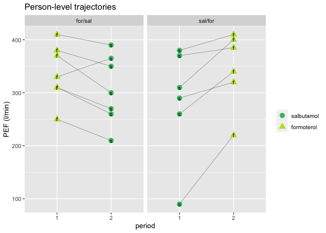
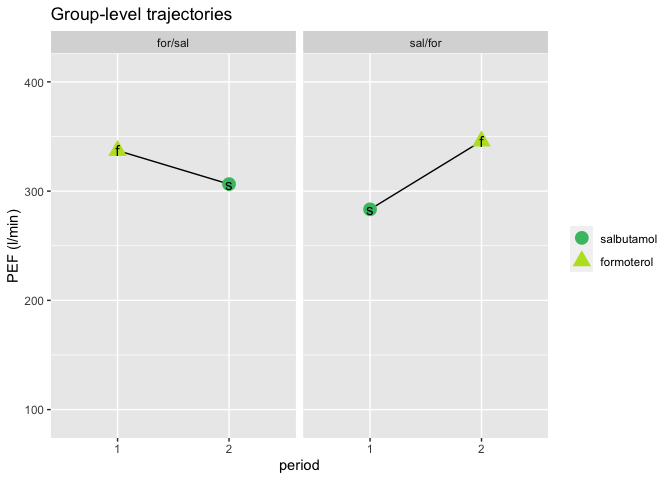
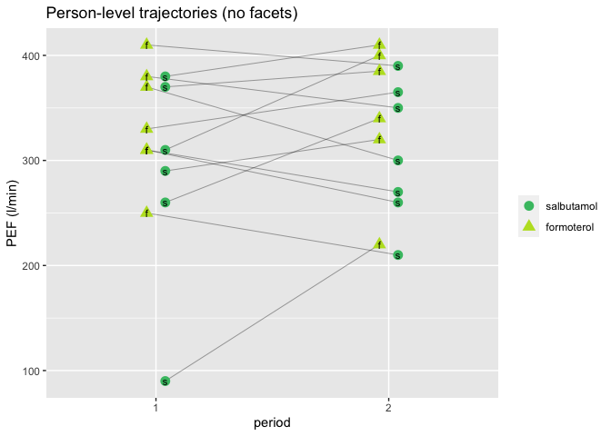
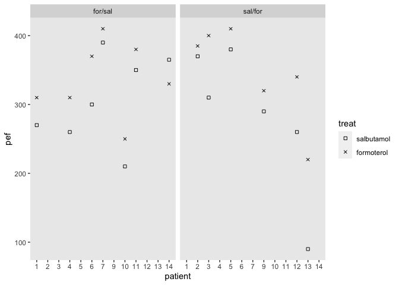
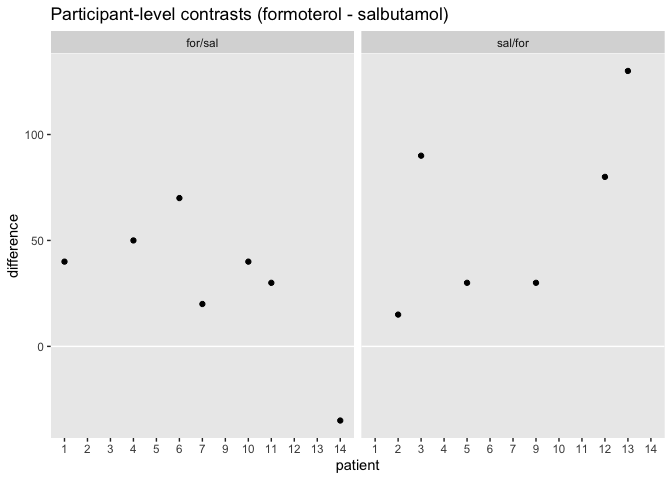
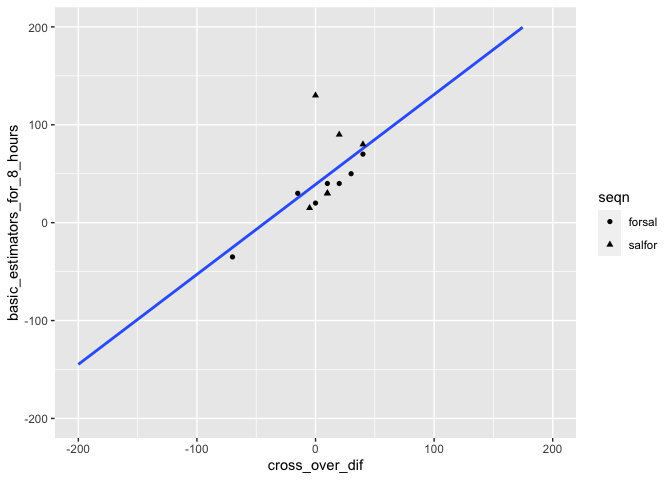

03: The AB/BA design with normal data
================
A Solomon Kurz
2023-11-20

## 3.1 An example

The chapter begins with:

> The simplest of all cross-over designs is the AB/BA cross-over.
> (p. 25)

We can find code for the example from
<http://www.senns.uk/CTiCR/CTICR2Programs.htm#R>.

``` r
# load packages
library(tidyverse)
library(flextable)
library(broom)
library(marginaleffects)
library(lme4)
library(broom.mixed)

# Input data
n1 <- 7 #number of patients first sequence
n2 <- 6 #number of patients second sequence
n <- n1 + n2

seqn <- factor((c(rep(1,n1), rep(2,n2), rep(1,n1), rep(2,n2))),
               labels = c("forsal","salfor")) #sequences

patient <- factor(rep(c("1","4","6","7","10","11","14","2","3","5","9","12","13"), 2),
                  levels = 1:14) 

# not in the original code, but here is sex
sex <- c("male", "female", "female", "male", "male", "female", "male", "male", "male", "female", "male", "male", "male")

period <- factor(c(rep("1", n), rep("2", n)))

treat <- factor(c(rep(2, n1), rep(1, n2), rep(1, n1), rep(2, n2)),
                labels = c("salbutamol", "formoterol"))

#Note: "formoterol" is coded second level of factor
pef <- c(310, 310,370,410,250,380,330,370,310,380,290,260,90,270,260,300,390,210,350,365,385,400,410,320,340,220)
base <- c(290,300,250,390,250,365,190,350,350,350,280,270,220,270,270,210,390,240,380,260,345,370,360,290,310,220)

d <- tibble(
  seqn = seqn,
  patient = patient,
  period = period,
  treat = treat,
  pef = pef,
  base = base
) %>% 
  arrange(period, as.double(as.character(patient))) %>% 
  mutate(sex = c(sex, sex))

# what?
head(d)
```

    ## # A tibble: 6 × 7
    ##   seqn   patient period treat        pef  base sex   
    ##   <fct>  <fct>   <fct>  <fct>      <dbl> <dbl> <chr> 
    ## 1 forsal 1       1      formoterol   310   290 male  
    ## 2 salfor 2       1      salbutamol   370   350 female
    ## 3 salfor 3       1      salbutamol   310   350 female
    ## 4 forsal 4       1      formoterol   310   300 male  
    ## 5 salfor 5       1      salbutamol   380   350 male  
    ## 6 forsal 6       1      formoterol   370   250 female

What might not be obvious with this arrangement is each `patient` has
two rows. This is easier to see with help from `arrange()`.

``` r
d %>% 
  arrange(patient, period) %>% 
  head()
```

    ## # A tibble: 6 × 7
    ##   seqn   patient period treat        pef  base sex   
    ##   <fct>  <fct>   <fct>  <fct>      <dbl> <dbl> <chr> 
    ## 1 forsal 1       1      formoterol   310   290 male  
    ## 2 forsal 1       2      salbutamol   270   270 male  
    ## 3 salfor 2       1      salbutamol   370   350 female
    ## 4 salfor 2       2      formoterol   385   345 female
    ## 5 salfor 3       1      salbutamol   310   350 female
    ## 6 salfor 3       2      formoterol   400   370 female

Here’s how to make a version of the little table at the bottom of page
35.

``` r
d %>% 
  mutate(period = str_c("period ", period),
         sequence = ifelse(seqn == "forsal", "for/sal", "sal/for")) %>% 
  distinct(sequence, period, treat) %>% 
  pivot_wider(names_from = period, values_from = treat) %>% 
  flextable() %>% 
  width(width = 1.2)
```

<div class="tabwid"><style>.cl-3de0fd04{}.cl-3dd6a796{font-family:'Helvetica';font-size:11pt;font-weight:normal;font-style:normal;text-decoration:none;color:rgba(0, 0, 0, 1.00);background-color:transparent;}.cl-3ddf5936{margin:0;text-align:left;border-bottom: 0 solid rgba(0, 0, 0, 1.00);border-top: 0 solid rgba(0, 0, 0, 1.00);border-left: 0 solid rgba(0, 0, 0, 1.00);border-right: 0 solid rgba(0, 0, 0, 1.00);padding-bottom:5pt;padding-top:5pt;padding-left:5pt;padding-right:5pt;line-height: 1;background-color:transparent;}.cl-3ddf6246{width:1.2in;background-color:transparent;vertical-align: middle;border-bottom: 1.5pt solid rgba(102, 102, 102, 1.00);border-top: 1.5pt solid rgba(102, 102, 102, 1.00);border-left: 0 solid rgba(0, 0, 0, 1.00);border-right: 0 solid rgba(0, 0, 0, 1.00);margin-bottom:0;margin-top:0;margin-left:0;margin-right:0;}.cl-3ddf6247{width:1.2in;background-color:transparent;vertical-align: middle;border-bottom: 0 solid rgba(0, 0, 0, 1.00);border-top: 0 solid rgba(0, 0, 0, 1.00);border-left: 0 solid rgba(0, 0, 0, 1.00);border-right: 0 solid rgba(0, 0, 0, 1.00);margin-bottom:0;margin-top:0;margin-left:0;margin-right:0;}.cl-3ddf6248{width:1.2in;background-color:transparent;vertical-align: middle;border-bottom: 1.5pt solid rgba(102, 102, 102, 1.00);border-top: 0 solid rgba(0, 0, 0, 1.00);border-left: 0 solid rgba(0, 0, 0, 1.00);border-right: 0 solid rgba(0, 0, 0, 1.00);margin-bottom:0;margin-top:0;margin-left:0;margin-right:0;}</style><table data-quarto-disable-processing='true' class='cl-3de0fd04'><thead><tr style="overflow-wrap:break-word;"><th class="cl-3ddf6246"><p class="cl-3ddf5936"><span class="cl-3dd6a796">sequence</span></p></th><th class="cl-3ddf6246"><p class="cl-3ddf5936"><span class="cl-3dd6a796">period 1</span></p></th><th class="cl-3ddf6246"><p class="cl-3ddf5936"><span class="cl-3dd6a796">period 2</span></p></th></tr></thead><tbody><tr style="overflow-wrap:break-word;"><td class="cl-3ddf6247"><p class="cl-3ddf5936"><span class="cl-3dd6a796">for/sal</span></p></td><td class="cl-3ddf6247"><p class="cl-3ddf5936"><span class="cl-3dd6a796">formoterol</span></p></td><td class="cl-3ddf6247"><p class="cl-3ddf5936"><span class="cl-3dd6a796">salbutamol</span></p></td></tr><tr style="overflow-wrap:break-word;"><td class="cl-3ddf6248"><p class="cl-3ddf5936"><span class="cl-3dd6a796">sal/for</span></p></td><td class="cl-3ddf6248"><p class="cl-3ddf5936"><span class="cl-3dd6a796">salbutamol</span></p></td><td class="cl-3ddf6248"><p class="cl-3ddf5936"><span class="cl-3dd6a796">formoterol</span></p></td></tr></tbody></table></div>

The wash-out period isn’t explicitly encoded in the data, but it’s
implied. Anyway, in this study salbutamol was a well-established
treatment for asthma, and formoterol was a promising alternative
treatment (p. 35). Participants were 13 children (7-14 y/o) with
moderate to sever asthma. The wash-oupt periods were at least one day.

I don’t love the way Senn presented the data in his plots. There are any
number of ways to show them. Here are two:

``` r
d %>%
  mutate(letter = str_extract(treat, "^.{1}"),
         sequence = ifelse(seqn == "forsal", "for/sal", "sal/for")) %>% 

  ggplot(aes(x = period, y = pef))  +
  geom_line(aes(group = patient),
            linewidth = 1/4, alpha = 1/2) +
  geom_point(aes(color = treat, shape = treat),
             size = 3.5) +
  geom_text(aes(label = letter),
            size = 3) +
  scale_color_viridis_d(NULL, option = "D", begin = .7, end = .9) +
  scale_shape(NULL) +
  labs(title = "Person-level trajectories",
       y = "PEF (l/min)") +
  facet_wrap(~ sequence)
```

<!-- -->

``` r
d %>%
  mutate(letter = str_extract(treat, "^.{1}"),
         sequence = ifelse(seqn == "forsal", "for/sal", "sal/for")) %>% 
  group_by(period, sequence, treat, letter) %>% 
  summarise(pef = mean(pef)) %>% 

  ggplot(aes(x = period, y = pef))  +
  geom_line(aes(group = sequence),
            linewidth = 1/2) +
  geom_point(aes(color = treat, shape = treat),
             size = 4.5) +
  geom_text(aes(label = letter),
            size = 4) +
  scale_color_viridis_d(NULL, option = "D", begin = .7, end = .9) +
  scale_shape(NULL) +
  ylim(range(d$pef)) +
  labs(title = "Group-level trajectories",
       y = "PEF (l/min)") +
  facet_wrap(~ sequence)
```

<!-- -->

With so few participants, it’s hard to get a sense of the overall
findings without resorting to the group averages (second plot).

Another way to look at the data is to nudge the values on the x-axis by
`treat` and drop the facets.

``` r
# for x-axis offsets
nudge_value <- 0.04

d %>%
  mutate(letter = str_extract(treat, "^.{1}"),
         sequence = ifelse(seqn == "forsal", "for/sal", "sal/for")) %>% 
  mutate(period = as.double(period)) %>% 
  mutate(period = ifelse(treat == "formoterol", period - nudge_value, period + nudge_value)) %>% 

  ggplot(aes(x = period, y = pef))  +
  geom_line(aes(group = patient),
            linewidth = 1/4, alpha = 1/2) +
  geom_point(aes(color = treat, shape = treat),
             size = 3.5) +
  geom_text(aes(label = letter, group = treat),
            size = 3) +
  scale_x_continuous(breaks = 1:2, expand = expansion(mult = 0.4)) +
  scale_color_viridis_d(NULL, option = "D", begin = .7, end = .9) +
  scale_shape(NULL) +
  labs(title = "Person-level trajectories (no facets)",
       y = "PEF (l/min)") +
  theme(panel.grid.minor.x = element_blank())
```

<!-- -->

Here’s a `flextable()`-based version of Table 3.1 (p. 36).

``` r
d %>% 
  mutate(period = str_c("period ", period),
         sequence = ifelse(seqn == "forsal", "for/sal", "sal/for"),
         patient = as.double(patient)) %>% 
  select(sequence, patient, period, pef) %>%
  pivot_wider(names_from = period, values_from = pef) %>% 
  mutate(difference = `period 1` - `period 2`,
         total = `period 1` + `period 2`) %>% 
  arrange(sequence, patient) %>% 
  as_grouped_data(groups = c("sequence")) %>% 
  flextable() %>% 
  padding(padding.top = 2, padding.bottom = 2, part = "all")
```

<div class="tabwid"><style>.cl-3e24a7e8{}.cl-3e21d982{font-family:'Helvetica';font-size:11pt;font-weight:normal;font-style:normal;text-decoration:none;color:rgba(0, 0, 0, 1.00);background-color:transparent;}.cl-3e230488{margin:0;text-align:left;border-bottom: 0 solid rgba(0, 0, 0, 1.00);border-top: 0 solid rgba(0, 0, 0, 1.00);border-left: 0 solid rgba(0, 0, 0, 1.00);border-right: 0 solid rgba(0, 0, 0, 1.00);padding-bottom:2pt;padding-top:2pt;padding-left:5pt;padding-right:5pt;line-height: 1;background-color:transparent;}.cl-3e230492{margin:0;text-align:right;border-bottom: 0 solid rgba(0, 0, 0, 1.00);border-top: 0 solid rgba(0, 0, 0, 1.00);border-left: 0 solid rgba(0, 0, 0, 1.00);border-right: 0 solid rgba(0, 0, 0, 1.00);padding-bottom:2pt;padding-top:2pt;padding-left:5pt;padding-right:5pt;line-height: 1;background-color:transparent;}.cl-3e230c1c{width:0.75in;background-color:transparent;vertical-align: middle;border-bottom: 1.5pt solid rgba(102, 102, 102, 1.00);border-top: 1.5pt solid rgba(102, 102, 102, 1.00);border-left: 0 solid rgba(0, 0, 0, 1.00);border-right: 0 solid rgba(0, 0, 0, 1.00);margin-bottom:0;margin-top:0;margin-left:0;margin-right:0;}.cl-3e230c26{width:0.75in;background-color:transparent;vertical-align: middle;border-bottom: 1.5pt solid rgba(102, 102, 102, 1.00);border-top: 1.5pt solid rgba(102, 102, 102, 1.00);border-left: 0 solid rgba(0, 0, 0, 1.00);border-right: 0 solid rgba(0, 0, 0, 1.00);margin-bottom:0;margin-top:0;margin-left:0;margin-right:0;}.cl-3e230c27{width:0.75in;background-color:transparent;vertical-align: middle;border-bottom: 0 solid rgba(0, 0, 0, 1.00);border-top: 0 solid rgba(0, 0, 0, 1.00);border-left: 0 solid rgba(0, 0, 0, 1.00);border-right: 0 solid rgba(0, 0, 0, 1.00);margin-bottom:0;margin-top:0;margin-left:0;margin-right:0;}.cl-3e230c28{width:0.75in;background-color:transparent;vertical-align: middle;border-bottom: 0 solid rgba(0, 0, 0, 1.00);border-top: 0 solid rgba(0, 0, 0, 1.00);border-left: 0 solid rgba(0, 0, 0, 1.00);border-right: 0 solid rgba(0, 0, 0, 1.00);margin-bottom:0;margin-top:0;margin-left:0;margin-right:0;}.cl-3e230c30{width:0.75in;background-color:transparent;vertical-align: middle;border-bottom: 1.5pt solid rgba(102, 102, 102, 1.00);border-top: 0 solid rgba(0, 0, 0, 1.00);border-left: 0 solid rgba(0, 0, 0, 1.00);border-right: 0 solid rgba(0, 0, 0, 1.00);margin-bottom:0;margin-top:0;margin-left:0;margin-right:0;}.cl-3e230c31{width:0.75in;background-color:transparent;vertical-align: middle;border-bottom: 1.5pt solid rgba(102, 102, 102, 1.00);border-top: 0 solid rgba(0, 0, 0, 1.00);border-left: 0 solid rgba(0, 0, 0, 1.00);border-right: 0 solid rgba(0, 0, 0, 1.00);margin-bottom:0;margin-top:0;margin-left:0;margin-right:0;}</style><table data-quarto-disable-processing='true' class='cl-3e24a7e8'><thead><tr style="overflow-wrap:break-word;"><th class="cl-3e230c1c"><p class="cl-3e230488"><span class="cl-3e21d982">sequence</span></p></th><th class="cl-3e230c26"><p class="cl-3e230492"><span class="cl-3e21d982">patient</span></p></th><th class="cl-3e230c26"><p class="cl-3e230492"><span class="cl-3e21d982">period 1</span></p></th><th class="cl-3e230c26"><p class="cl-3e230492"><span class="cl-3e21d982">period 2</span></p></th><th class="cl-3e230c26"><p class="cl-3e230492"><span class="cl-3e21d982">difference</span></p></th><th class="cl-3e230c26"><p class="cl-3e230492"><span class="cl-3e21d982">total</span></p></th></tr></thead><tbody><tr style="overflow-wrap:break-word;"><td class="cl-3e230c27"><p class="cl-3e230488"><span class="cl-3e21d982">for/sal</span></p></td><td class="cl-3e230c28"><p class="cl-3e230492"><span class="cl-3e21d982"></span></p></td><td class="cl-3e230c28"><p class="cl-3e230492"><span class="cl-3e21d982"></span></p></td><td class="cl-3e230c28"><p class="cl-3e230492"><span class="cl-3e21d982"></span></p></td><td class="cl-3e230c28"><p class="cl-3e230492"><span class="cl-3e21d982"></span></p></td><td class="cl-3e230c28"><p class="cl-3e230492"><span class="cl-3e21d982"></span></p></td></tr><tr style="overflow-wrap:break-word;"><td class="cl-3e230c27"><p class="cl-3e230488"><span class="cl-3e21d982"></span></p></td><td class="cl-3e230c28"><p class="cl-3e230492"><span class="cl-3e21d982">1</span></p></td><td class="cl-3e230c28"><p class="cl-3e230492"><span class="cl-3e21d982">310</span></p></td><td class="cl-3e230c28"><p class="cl-3e230492"><span class="cl-3e21d982">270</span></p></td><td class="cl-3e230c28"><p class="cl-3e230492"><span class="cl-3e21d982">40</span></p></td><td class="cl-3e230c28"><p class="cl-3e230492"><span class="cl-3e21d982">580</span></p></td></tr><tr style="overflow-wrap:break-word;"><td class="cl-3e230c27"><p class="cl-3e230488"><span class="cl-3e21d982"></span></p></td><td class="cl-3e230c28"><p class="cl-3e230492"><span class="cl-3e21d982">4</span></p></td><td class="cl-3e230c28"><p class="cl-3e230492"><span class="cl-3e21d982">310</span></p></td><td class="cl-3e230c28"><p class="cl-3e230492"><span class="cl-3e21d982">260</span></p></td><td class="cl-3e230c28"><p class="cl-3e230492"><span class="cl-3e21d982">50</span></p></td><td class="cl-3e230c28"><p class="cl-3e230492"><span class="cl-3e21d982">570</span></p></td></tr><tr style="overflow-wrap:break-word;"><td class="cl-3e230c27"><p class="cl-3e230488"><span class="cl-3e21d982"></span></p></td><td class="cl-3e230c28"><p class="cl-3e230492"><span class="cl-3e21d982">6</span></p></td><td class="cl-3e230c28"><p class="cl-3e230492"><span class="cl-3e21d982">370</span></p></td><td class="cl-3e230c28"><p class="cl-3e230492"><span class="cl-3e21d982">300</span></p></td><td class="cl-3e230c28"><p class="cl-3e230492"><span class="cl-3e21d982">70</span></p></td><td class="cl-3e230c28"><p class="cl-3e230492"><span class="cl-3e21d982">670</span></p></td></tr><tr style="overflow-wrap:break-word;"><td class="cl-3e230c27"><p class="cl-3e230488"><span class="cl-3e21d982"></span></p></td><td class="cl-3e230c28"><p class="cl-3e230492"><span class="cl-3e21d982">7</span></p></td><td class="cl-3e230c28"><p class="cl-3e230492"><span class="cl-3e21d982">410</span></p></td><td class="cl-3e230c28"><p class="cl-3e230492"><span class="cl-3e21d982">390</span></p></td><td class="cl-3e230c28"><p class="cl-3e230492"><span class="cl-3e21d982">20</span></p></td><td class="cl-3e230c28"><p class="cl-3e230492"><span class="cl-3e21d982">800</span></p></td></tr><tr style="overflow-wrap:break-word;"><td class="cl-3e230c27"><p class="cl-3e230488"><span class="cl-3e21d982"></span></p></td><td class="cl-3e230c28"><p class="cl-3e230492"><span class="cl-3e21d982">10</span></p></td><td class="cl-3e230c28"><p class="cl-3e230492"><span class="cl-3e21d982">250</span></p></td><td class="cl-3e230c28"><p class="cl-3e230492"><span class="cl-3e21d982">210</span></p></td><td class="cl-3e230c28"><p class="cl-3e230492"><span class="cl-3e21d982">40</span></p></td><td class="cl-3e230c28"><p class="cl-3e230492"><span class="cl-3e21d982">460</span></p></td></tr><tr style="overflow-wrap:break-word;"><td class="cl-3e230c27"><p class="cl-3e230488"><span class="cl-3e21d982"></span></p></td><td class="cl-3e230c28"><p class="cl-3e230492"><span class="cl-3e21d982">11</span></p></td><td class="cl-3e230c28"><p class="cl-3e230492"><span class="cl-3e21d982">380</span></p></td><td class="cl-3e230c28"><p class="cl-3e230492"><span class="cl-3e21d982">350</span></p></td><td class="cl-3e230c28"><p class="cl-3e230492"><span class="cl-3e21d982">30</span></p></td><td class="cl-3e230c28"><p class="cl-3e230492"><span class="cl-3e21d982">730</span></p></td></tr><tr style="overflow-wrap:break-word;"><td class="cl-3e230c27"><p class="cl-3e230488"><span class="cl-3e21d982"></span></p></td><td class="cl-3e230c28"><p class="cl-3e230492"><span class="cl-3e21d982">14</span></p></td><td class="cl-3e230c28"><p class="cl-3e230492"><span class="cl-3e21d982">330</span></p></td><td class="cl-3e230c28"><p class="cl-3e230492"><span class="cl-3e21d982">365</span></p></td><td class="cl-3e230c28"><p class="cl-3e230492"><span class="cl-3e21d982">-35</span></p></td><td class="cl-3e230c28"><p class="cl-3e230492"><span class="cl-3e21d982">695</span></p></td></tr><tr style="overflow-wrap:break-word;"><td class="cl-3e230c27"><p class="cl-3e230488"><span class="cl-3e21d982">sal/for</span></p></td><td class="cl-3e230c28"><p class="cl-3e230492"><span class="cl-3e21d982"></span></p></td><td class="cl-3e230c28"><p class="cl-3e230492"><span class="cl-3e21d982"></span></p></td><td class="cl-3e230c28"><p class="cl-3e230492"><span class="cl-3e21d982"></span></p></td><td class="cl-3e230c28"><p class="cl-3e230492"><span class="cl-3e21d982"></span></p></td><td class="cl-3e230c28"><p class="cl-3e230492"><span class="cl-3e21d982"></span></p></td></tr><tr style="overflow-wrap:break-word;"><td class="cl-3e230c27"><p class="cl-3e230488"><span class="cl-3e21d982"></span></p></td><td class="cl-3e230c28"><p class="cl-3e230492"><span class="cl-3e21d982">2</span></p></td><td class="cl-3e230c28"><p class="cl-3e230492"><span class="cl-3e21d982">370</span></p></td><td class="cl-3e230c28"><p class="cl-3e230492"><span class="cl-3e21d982">385</span></p></td><td class="cl-3e230c28"><p class="cl-3e230492"><span class="cl-3e21d982">-15</span></p></td><td class="cl-3e230c28"><p class="cl-3e230492"><span class="cl-3e21d982">755</span></p></td></tr><tr style="overflow-wrap:break-word;"><td class="cl-3e230c27"><p class="cl-3e230488"><span class="cl-3e21d982"></span></p></td><td class="cl-3e230c28"><p class="cl-3e230492"><span class="cl-3e21d982">3</span></p></td><td class="cl-3e230c28"><p class="cl-3e230492"><span class="cl-3e21d982">310</span></p></td><td class="cl-3e230c28"><p class="cl-3e230492"><span class="cl-3e21d982">400</span></p></td><td class="cl-3e230c28"><p class="cl-3e230492"><span class="cl-3e21d982">-90</span></p></td><td class="cl-3e230c28"><p class="cl-3e230492"><span class="cl-3e21d982">710</span></p></td></tr><tr style="overflow-wrap:break-word;"><td class="cl-3e230c27"><p class="cl-3e230488"><span class="cl-3e21d982"></span></p></td><td class="cl-3e230c28"><p class="cl-3e230492"><span class="cl-3e21d982">5</span></p></td><td class="cl-3e230c28"><p class="cl-3e230492"><span class="cl-3e21d982">380</span></p></td><td class="cl-3e230c28"><p class="cl-3e230492"><span class="cl-3e21d982">410</span></p></td><td class="cl-3e230c28"><p class="cl-3e230492"><span class="cl-3e21d982">-30</span></p></td><td class="cl-3e230c28"><p class="cl-3e230492"><span class="cl-3e21d982">790</span></p></td></tr><tr style="overflow-wrap:break-word;"><td class="cl-3e230c27"><p class="cl-3e230488"><span class="cl-3e21d982"></span></p></td><td class="cl-3e230c28"><p class="cl-3e230492"><span class="cl-3e21d982">9</span></p></td><td class="cl-3e230c28"><p class="cl-3e230492"><span class="cl-3e21d982">290</span></p></td><td class="cl-3e230c28"><p class="cl-3e230492"><span class="cl-3e21d982">320</span></p></td><td class="cl-3e230c28"><p class="cl-3e230492"><span class="cl-3e21d982">-30</span></p></td><td class="cl-3e230c28"><p class="cl-3e230492"><span class="cl-3e21d982">610</span></p></td></tr><tr style="overflow-wrap:break-word;"><td class="cl-3e230c27"><p class="cl-3e230488"><span class="cl-3e21d982"></span></p></td><td class="cl-3e230c28"><p class="cl-3e230492"><span class="cl-3e21d982">12</span></p></td><td class="cl-3e230c28"><p class="cl-3e230492"><span class="cl-3e21d982">260</span></p></td><td class="cl-3e230c28"><p class="cl-3e230492"><span class="cl-3e21d982">340</span></p></td><td class="cl-3e230c28"><p class="cl-3e230492"><span class="cl-3e21d982">-80</span></p></td><td class="cl-3e230c28"><p class="cl-3e230492"><span class="cl-3e21d982">600</span></p></td></tr><tr style="overflow-wrap:break-word;"><td class="cl-3e230c30"><p class="cl-3e230488"><span class="cl-3e21d982"></span></p></td><td class="cl-3e230c31"><p class="cl-3e230492"><span class="cl-3e21d982">13</span></p></td><td class="cl-3e230c31"><p class="cl-3e230492"><span class="cl-3e21d982">90</span></p></td><td class="cl-3e230c31"><p class="cl-3e230492"><span class="cl-3e21d982">220</span></p></td><td class="cl-3e230c31"><p class="cl-3e230492"><span class="cl-3e21d982">-130</span></p></td><td class="cl-3e230c31"><p class="cl-3e230492"><span class="cl-3e21d982">310</span></p></td></tr></tbody></table></div>

Here’s a version of Senn’s depiction of the data in his Figure 3.1
(p. 37).

``` r
d %>% 
  mutate(patient = factor(patient, levels = 1:14),
         sequence = ifelse(seqn == "forsal", "for/sal", "sal/for")) %>% 
  
  ggplot(aes(x = patient, y = pef)) +
  geom_point(aes(shape = treat)) +
  scale_shape_manual(values = c(0, 4)) +
  facet_wrap(~ sequence) +
  theme(panel.grid = element_blank())
```

<!-- -->

Though in many respects I hate this plot, I do have to admit it does a
pretty good job showing how, within each child, formoterol usually
resulted in higher `pef` values than salbutamol.

## 3.2 A simple analysis ignoring the effect of period

Back in our Table 3.1, we calculated difference scores based on the time
period, which Senn referred to as a *period difference* on page 38. This
is natural in many data contexts, but probably isn’t the best way to
think about these data. Rather, what we probably want is a difference in
treatments, which Senn called the *cross-over difference* (p. 38). He
shows the overall framework for that kind of difference in his Table
3.2, which we recreate here.

``` r
d %>% 
  mutate(sequence = ifelse(seqn == "forsal", "for/sal", "sal/for"),
         patient = as.double(patient)) %>% 
  select(sequence, patient, treat, pef) %>%
  pivot_wider(names_from = treat, values_from = pef) %>% 
  mutate(difference = formoterol - salbutamol) %>% 
  arrange(sequence, patient) %>% 
  as_grouped_data(groups = c("sequence")) %>% 
  flextable() %>% 
  padding(padding.top = 2, padding.bottom = 2, part = "all")
```

<div class="tabwid"><style>.cl-3e3c38ae{}.cl-3e397fa6{font-family:'Helvetica';font-size:11pt;font-weight:normal;font-style:normal;text-decoration:none;color:rgba(0, 0, 0, 1.00);background-color:transparent;}.cl-3e3a9e36{margin:0;text-align:left;border-bottom: 0 solid rgba(0, 0, 0, 1.00);border-top: 0 solid rgba(0, 0, 0, 1.00);border-left: 0 solid rgba(0, 0, 0, 1.00);border-right: 0 solid rgba(0, 0, 0, 1.00);padding-bottom:2pt;padding-top:2pt;padding-left:5pt;padding-right:5pt;line-height: 1;background-color:transparent;}.cl-3e3a9e37{margin:0;text-align:right;border-bottom: 0 solid rgba(0, 0, 0, 1.00);border-top: 0 solid rgba(0, 0, 0, 1.00);border-left: 0 solid rgba(0, 0, 0, 1.00);border-right: 0 solid rgba(0, 0, 0, 1.00);padding-bottom:2pt;padding-top:2pt;padding-left:5pt;padding-right:5pt;line-height: 1;background-color:transparent;}.cl-3e3aa5b6{width:0.75in;background-color:transparent;vertical-align: middle;border-bottom: 1.5pt solid rgba(102, 102, 102, 1.00);border-top: 1.5pt solid rgba(102, 102, 102, 1.00);border-left: 0 solid rgba(0, 0, 0, 1.00);border-right: 0 solid rgba(0, 0, 0, 1.00);margin-bottom:0;margin-top:0;margin-left:0;margin-right:0;}.cl-3e3aa5b7{width:0.75in;background-color:transparent;vertical-align: middle;border-bottom: 1.5pt solid rgba(102, 102, 102, 1.00);border-top: 1.5pt solid rgba(102, 102, 102, 1.00);border-left: 0 solid rgba(0, 0, 0, 1.00);border-right: 0 solid rgba(0, 0, 0, 1.00);margin-bottom:0;margin-top:0;margin-left:0;margin-right:0;}.cl-3e3aa5c0{width:0.75in;background-color:transparent;vertical-align: middle;border-bottom: 0 solid rgba(0, 0, 0, 1.00);border-top: 0 solid rgba(0, 0, 0, 1.00);border-left: 0 solid rgba(0, 0, 0, 1.00);border-right: 0 solid rgba(0, 0, 0, 1.00);margin-bottom:0;margin-top:0;margin-left:0;margin-right:0;}.cl-3e3aa5c1{width:0.75in;background-color:transparent;vertical-align: middle;border-bottom: 0 solid rgba(0, 0, 0, 1.00);border-top: 0 solid rgba(0, 0, 0, 1.00);border-left: 0 solid rgba(0, 0, 0, 1.00);border-right: 0 solid rgba(0, 0, 0, 1.00);margin-bottom:0;margin-top:0;margin-left:0;margin-right:0;}.cl-3e3aa5c2{width:0.75in;background-color:transparent;vertical-align: middle;border-bottom: 1.5pt solid rgba(102, 102, 102, 1.00);border-top: 0 solid rgba(0, 0, 0, 1.00);border-left: 0 solid rgba(0, 0, 0, 1.00);border-right: 0 solid rgba(0, 0, 0, 1.00);margin-bottom:0;margin-top:0;margin-left:0;margin-right:0;}.cl-3e3aa5c3{width:0.75in;background-color:transparent;vertical-align: middle;border-bottom: 1.5pt solid rgba(102, 102, 102, 1.00);border-top: 0 solid rgba(0, 0, 0, 1.00);border-left: 0 solid rgba(0, 0, 0, 1.00);border-right: 0 solid rgba(0, 0, 0, 1.00);margin-bottom:0;margin-top:0;margin-left:0;margin-right:0;}</style><table data-quarto-disable-processing='true' class='cl-3e3c38ae'><thead><tr style="overflow-wrap:break-word;"><th class="cl-3e3aa5b6"><p class="cl-3e3a9e36"><span class="cl-3e397fa6">sequence</span></p></th><th class="cl-3e3aa5b7"><p class="cl-3e3a9e37"><span class="cl-3e397fa6">patient</span></p></th><th class="cl-3e3aa5b7"><p class="cl-3e3a9e37"><span class="cl-3e397fa6">formoterol</span></p></th><th class="cl-3e3aa5b7"><p class="cl-3e3a9e37"><span class="cl-3e397fa6">salbutamol</span></p></th><th class="cl-3e3aa5b7"><p class="cl-3e3a9e37"><span class="cl-3e397fa6">difference</span></p></th></tr></thead><tbody><tr style="overflow-wrap:break-word;"><td class="cl-3e3aa5c0"><p class="cl-3e3a9e36"><span class="cl-3e397fa6">for/sal</span></p></td><td class="cl-3e3aa5c1"><p class="cl-3e3a9e37"><span class="cl-3e397fa6"></span></p></td><td class="cl-3e3aa5c1"><p class="cl-3e3a9e37"><span class="cl-3e397fa6"></span></p></td><td class="cl-3e3aa5c1"><p class="cl-3e3a9e37"><span class="cl-3e397fa6"></span></p></td><td class="cl-3e3aa5c1"><p class="cl-3e3a9e37"><span class="cl-3e397fa6"></span></p></td></tr><tr style="overflow-wrap:break-word;"><td class="cl-3e3aa5c0"><p class="cl-3e3a9e36"><span class="cl-3e397fa6"></span></p></td><td class="cl-3e3aa5c1"><p class="cl-3e3a9e37"><span class="cl-3e397fa6">1</span></p></td><td class="cl-3e3aa5c1"><p class="cl-3e3a9e37"><span class="cl-3e397fa6">310</span></p></td><td class="cl-3e3aa5c1"><p class="cl-3e3a9e37"><span class="cl-3e397fa6">270</span></p></td><td class="cl-3e3aa5c1"><p class="cl-3e3a9e37"><span class="cl-3e397fa6">40</span></p></td></tr><tr style="overflow-wrap:break-word;"><td class="cl-3e3aa5c0"><p class="cl-3e3a9e36"><span class="cl-3e397fa6"></span></p></td><td class="cl-3e3aa5c1"><p class="cl-3e3a9e37"><span class="cl-3e397fa6">4</span></p></td><td class="cl-3e3aa5c1"><p class="cl-3e3a9e37"><span class="cl-3e397fa6">310</span></p></td><td class="cl-3e3aa5c1"><p class="cl-3e3a9e37"><span class="cl-3e397fa6">260</span></p></td><td class="cl-3e3aa5c1"><p class="cl-3e3a9e37"><span class="cl-3e397fa6">50</span></p></td></tr><tr style="overflow-wrap:break-word;"><td class="cl-3e3aa5c0"><p class="cl-3e3a9e36"><span class="cl-3e397fa6"></span></p></td><td class="cl-3e3aa5c1"><p class="cl-3e3a9e37"><span class="cl-3e397fa6">6</span></p></td><td class="cl-3e3aa5c1"><p class="cl-3e3a9e37"><span class="cl-3e397fa6">370</span></p></td><td class="cl-3e3aa5c1"><p class="cl-3e3a9e37"><span class="cl-3e397fa6">300</span></p></td><td class="cl-3e3aa5c1"><p class="cl-3e3a9e37"><span class="cl-3e397fa6">70</span></p></td></tr><tr style="overflow-wrap:break-word;"><td class="cl-3e3aa5c0"><p class="cl-3e3a9e36"><span class="cl-3e397fa6"></span></p></td><td class="cl-3e3aa5c1"><p class="cl-3e3a9e37"><span class="cl-3e397fa6">7</span></p></td><td class="cl-3e3aa5c1"><p class="cl-3e3a9e37"><span class="cl-3e397fa6">410</span></p></td><td class="cl-3e3aa5c1"><p class="cl-3e3a9e37"><span class="cl-3e397fa6">390</span></p></td><td class="cl-3e3aa5c1"><p class="cl-3e3a9e37"><span class="cl-3e397fa6">20</span></p></td></tr><tr style="overflow-wrap:break-word;"><td class="cl-3e3aa5c0"><p class="cl-3e3a9e36"><span class="cl-3e397fa6"></span></p></td><td class="cl-3e3aa5c1"><p class="cl-3e3a9e37"><span class="cl-3e397fa6">10</span></p></td><td class="cl-3e3aa5c1"><p class="cl-3e3a9e37"><span class="cl-3e397fa6">250</span></p></td><td class="cl-3e3aa5c1"><p class="cl-3e3a9e37"><span class="cl-3e397fa6">210</span></p></td><td class="cl-3e3aa5c1"><p class="cl-3e3a9e37"><span class="cl-3e397fa6">40</span></p></td></tr><tr style="overflow-wrap:break-word;"><td class="cl-3e3aa5c0"><p class="cl-3e3a9e36"><span class="cl-3e397fa6"></span></p></td><td class="cl-3e3aa5c1"><p class="cl-3e3a9e37"><span class="cl-3e397fa6">11</span></p></td><td class="cl-3e3aa5c1"><p class="cl-3e3a9e37"><span class="cl-3e397fa6">380</span></p></td><td class="cl-3e3aa5c1"><p class="cl-3e3a9e37"><span class="cl-3e397fa6">350</span></p></td><td class="cl-3e3aa5c1"><p class="cl-3e3a9e37"><span class="cl-3e397fa6">30</span></p></td></tr><tr style="overflow-wrap:break-word;"><td class="cl-3e3aa5c0"><p class="cl-3e3a9e36"><span class="cl-3e397fa6"></span></p></td><td class="cl-3e3aa5c1"><p class="cl-3e3a9e37"><span class="cl-3e397fa6">14</span></p></td><td class="cl-3e3aa5c1"><p class="cl-3e3a9e37"><span class="cl-3e397fa6">330</span></p></td><td class="cl-3e3aa5c1"><p class="cl-3e3a9e37"><span class="cl-3e397fa6">365</span></p></td><td class="cl-3e3aa5c1"><p class="cl-3e3a9e37"><span class="cl-3e397fa6">-35</span></p></td></tr><tr style="overflow-wrap:break-word;"><td class="cl-3e3aa5c0"><p class="cl-3e3a9e36"><span class="cl-3e397fa6">sal/for</span></p></td><td class="cl-3e3aa5c1"><p class="cl-3e3a9e37"><span class="cl-3e397fa6"></span></p></td><td class="cl-3e3aa5c1"><p class="cl-3e3a9e37"><span class="cl-3e397fa6"></span></p></td><td class="cl-3e3aa5c1"><p class="cl-3e3a9e37"><span class="cl-3e397fa6"></span></p></td><td class="cl-3e3aa5c1"><p class="cl-3e3a9e37"><span class="cl-3e397fa6"></span></p></td></tr><tr style="overflow-wrap:break-word;"><td class="cl-3e3aa5c0"><p class="cl-3e3a9e36"><span class="cl-3e397fa6"></span></p></td><td class="cl-3e3aa5c1"><p class="cl-3e3a9e37"><span class="cl-3e397fa6">2</span></p></td><td class="cl-3e3aa5c1"><p class="cl-3e3a9e37"><span class="cl-3e397fa6">385</span></p></td><td class="cl-3e3aa5c1"><p class="cl-3e3a9e37"><span class="cl-3e397fa6">370</span></p></td><td class="cl-3e3aa5c1"><p class="cl-3e3a9e37"><span class="cl-3e397fa6">15</span></p></td></tr><tr style="overflow-wrap:break-word;"><td class="cl-3e3aa5c0"><p class="cl-3e3a9e36"><span class="cl-3e397fa6"></span></p></td><td class="cl-3e3aa5c1"><p class="cl-3e3a9e37"><span class="cl-3e397fa6">3</span></p></td><td class="cl-3e3aa5c1"><p class="cl-3e3a9e37"><span class="cl-3e397fa6">400</span></p></td><td class="cl-3e3aa5c1"><p class="cl-3e3a9e37"><span class="cl-3e397fa6">310</span></p></td><td class="cl-3e3aa5c1"><p class="cl-3e3a9e37"><span class="cl-3e397fa6">90</span></p></td></tr><tr style="overflow-wrap:break-word;"><td class="cl-3e3aa5c0"><p class="cl-3e3a9e36"><span class="cl-3e397fa6"></span></p></td><td class="cl-3e3aa5c1"><p class="cl-3e3a9e37"><span class="cl-3e397fa6">5</span></p></td><td class="cl-3e3aa5c1"><p class="cl-3e3a9e37"><span class="cl-3e397fa6">410</span></p></td><td class="cl-3e3aa5c1"><p class="cl-3e3a9e37"><span class="cl-3e397fa6">380</span></p></td><td class="cl-3e3aa5c1"><p class="cl-3e3a9e37"><span class="cl-3e397fa6">30</span></p></td></tr><tr style="overflow-wrap:break-word;"><td class="cl-3e3aa5c0"><p class="cl-3e3a9e36"><span class="cl-3e397fa6"></span></p></td><td class="cl-3e3aa5c1"><p class="cl-3e3a9e37"><span class="cl-3e397fa6">9</span></p></td><td class="cl-3e3aa5c1"><p class="cl-3e3a9e37"><span class="cl-3e397fa6">320</span></p></td><td class="cl-3e3aa5c1"><p class="cl-3e3a9e37"><span class="cl-3e397fa6">290</span></p></td><td class="cl-3e3aa5c1"><p class="cl-3e3a9e37"><span class="cl-3e397fa6">30</span></p></td></tr><tr style="overflow-wrap:break-word;"><td class="cl-3e3aa5c0"><p class="cl-3e3a9e36"><span class="cl-3e397fa6"></span></p></td><td class="cl-3e3aa5c1"><p class="cl-3e3a9e37"><span class="cl-3e397fa6">12</span></p></td><td class="cl-3e3aa5c1"><p class="cl-3e3a9e37"><span class="cl-3e397fa6">340</span></p></td><td class="cl-3e3aa5c1"><p class="cl-3e3a9e37"><span class="cl-3e397fa6">260</span></p></td><td class="cl-3e3aa5c1"><p class="cl-3e3a9e37"><span class="cl-3e397fa6">80</span></p></td></tr><tr style="overflow-wrap:break-word;"><td class="cl-3e3aa5c2"><p class="cl-3e3a9e36"><span class="cl-3e397fa6"></span></p></td><td class="cl-3e3aa5c3"><p class="cl-3e3a9e37"><span class="cl-3e397fa6">13</span></p></td><td class="cl-3e3aa5c3"><p class="cl-3e3a9e37"><span class="cl-3e397fa6">220</span></p></td><td class="cl-3e3aa5c3"><p class="cl-3e3a9e37"><span class="cl-3e397fa6">90</span></p></td><td class="cl-3e3aa5c3"><p class="cl-3e3a9e37"><span class="cl-3e397fa6">130</span></p></td></tr></tbody></table></div>

We can plot those differences with our version of Figure 3.2.

``` r
d %>% 
  mutate(sequence = ifelse(seqn == "forsal", "for/sal", "sal/for")) %>% 
  select(sequence, patient, treat, pef) %>%
  pivot_wider(names_from = treat, values_from = pef) %>% 
  mutate(difference = formoterol - salbutamol) %>% 
  
  ggplot(aes(x = patient, y = difference)) +
  geom_hline(yintercept = 0, color = "white") +
  geom_point() +
  ggtitle("Participant-level contrasts (formoterol - salbutamol)") +
  facet_wrap(~ sequence) +
  theme(panel.grid = element_blank())
```

<!-- -->

Here are the sample mean and standard deviation for those difference
scores.

``` r
d %>% 
  select(patient, treat, pef) %>% 
  pivot_wider(names_from = treat, values_from = pef) %>% 
  mutate(dif = formoterol - salbutamol) %>% 
  summarise(m = mean(dif),
            s = sd(dif))
```

    ## # A tibble: 1 × 2
    ##       m     s
    ##   <dbl> <dbl>
    ## 1  45.4  40.6

Here’s the $t$-test for the unconditional difference (i.e.,
`formoterol` - `salbutamol`).

``` r
fit3.1 <- lm(
  data = d %>% 
    select(patient, treat, pef) %>% 
    pivot_wider(names_from = treat, values_from = pef) %>% 
    mutate(dif = formoterol - salbutamol),
  dif ~ 1
) 

summary(fit3.1)
```

    ## 
    ## Call:
    ## lm(formula = dif ~ 1, data = d %>% select(patient, treat, pef) %>% 
    ##     pivot_wider(names_from = treat, values_from = pef) %>% mutate(dif = formoterol - 
    ##     salbutamol))
    ## 
    ## Residuals:
    ##     Min      1Q  Median      3Q     Max 
    ## -80.385 -15.385  -5.385  24.615  84.615 
    ## 
    ## Coefficients:
    ##             Estimate Std. Error t value Pr(>|t|)   
    ## (Intercept)    45.38      11.26   4.031  0.00167 **
    ## ---
    ## Signif. codes:  0 '***' 0.001 '**' 0.01 '*' 0.05 '.' 0.1 ' ' 1
    ## 
    ## Residual standard error: 40.59 on 12 degrees of freedom

Even though we did our $t$-test with an intercept-only model of the
difference scores, you’ll note the point estimate and standard error are
the same as the more conventional $t$-test values Senn reported at the
top of page 40.

We can compute the 95% CI’s with the `confint()` function.

``` r
confint(fit3.1)
```

    ##                2.5 %   97.5 %
    ## (Intercept) 20.85477 69.91446

## 3.3 Student’s approach\*

This section was an historical digression.

## 3.4 Assumptions in the matched-pairs $t$ approach

On page 42, Senn opened the section with the question: “Are there any
factors that might cause the crossover differences not to be distributed
at random about the true treatment effect?”

He then entertained 5 possible factors for a non-random distribution.
The first had to do with a possible *period effect*. To get a sense,
here we use summary statistics to compute the mean and SD for the
difference score, by `seqn`.

``` r
d %>% 
  select(patient, treat, pef, seqn) %>% 
  pivot_wider(names_from = treat, values_from = pef) %>% 
  mutate(dif = formoterol - salbutamol) %>% 
  group_by(seqn) %>% 
  summarise(m = mean(dif),
            s = sd(dif))
```

    ## # A tibble: 2 × 3
    ##   seqn       m     s
    ##   <fct>  <dbl> <dbl>
    ## 1 forsal  30.7  33.0
    ## 2 salfor  62.5  44.7

This large of a difference may or may not be a problem, but it’s
certainty worthy of our attention.

A second factor might be a *period by treatment interaction*.

A third factor that might interfere with simple random variation the
differences is a *carry-over* effect, and it’s possible the magnitude of
this effect could vary by treatments. One of the difficulties with this
data set is the interval between the 2 treatment days varied from 1 day
to 3.5 months, though it was 2 days for most.

A fourth factor is a possible *patient by treatment interaction*,
meaning wide person-level treatment effects not well captured by an ATE.
In general, however, “patent by treatment interactions cannot be
investigated in a two-period treatment cross-over: designs are needed in
which patients are given the same treatment a number of times” (p. 44).
However, you can assess for this in part based on background variables.
In these data, for example, you might wonder if `sex` might cover some
of an possible variation. To see, here we compute the summary statistics
by `sex`.

``` r
d %>% 
  select(patient, treat, pef, sex) %>% 
  pivot_wider(names_from = treat, values_from = pef) %>% 
  mutate(dif = formoterol - salbutamol) %>% 
  group_by(sex) %>% 
  summarise(m = mean(dif),
            s = sd(dif),
            n = n())
```

    ## # A tibble: 2 × 4
    ##   sex        m     s     n
    ##   <chr>  <dbl> <dbl> <int>
    ## 1 female  51.2  34.7     4
    ## 2 male    42.8  44.7     9

That summary corresponds to some of the sample statistics at the bottom
of Table 3.3.

We can extend our difference-score model version of the simple
paired-sample $t$-test from above to accommodate a two-sample $t$-test
by adding `sex` as a covariate in the model.

Here’s the model conditioned on `sex`.

``` r
fit3.2 <- lm(
  data = d %>% 
    select(patient, treat, pef, sex) %>% 
    pivot_wider(names_from = treat, values_from = pef) %>% 
    mutate(dif = formoterol - salbutamol),
  dif ~ 1 + sex
)

summary(fit3.2)
```

    ## 
    ## Call:
    ## lm(formula = dif ~ 1 + sex, data = d %>% select(patient, treat, 
    ##     pef, sex) %>% pivot_wider(names_from = treat, values_from = pef) %>% 
    ##     mutate(dif = formoterol - salbutamol))
    ## 
    ## Residuals:
    ##     Min      1Q  Median      3Q     Max 
    ## -77.778 -21.250  -2.778  18.750  87.222 
    ## 
    ## Coefficients:
    ##             Estimate Std. Error t value Pr(>|t|)  
    ## (Intercept)   51.250     21.092   2.430   0.0334 *
    ## sexmale       -8.472     25.349  -0.334   0.7445  
    ## ---
    ## Signif. codes:  0 '***' 0.001 '**' 0.01 '*' 0.05 '.' 0.1 ' ' 1
    ## 
    ## Residual standard error: 42.18 on 11 degrees of freedom
    ## Multiple R-squared:  0.01005,    Adjusted R-squared:  -0.07994 
    ## F-statistic: 0.1117 on 1 and 11 DF,  p-value: 0.7445

This corresponds with the $t$-test in Table 3.3. Since we did the
subtraction in reverse, the sign for the $t$-value is reversed. We will
not, however, be breaking down the data to compute the corrected sums
and so on.

A fifth factor is a possible *patient by period interaction*, which can
happen when the period-based trends differ by persons.

Of these five factors, the second (*period by treatment interaction*)
and third (*carry-over*), “have long been considered to be the major
problems of cross-over designs” (p. 45). We’ll deal with these later in
the chapter.

First, however, we focus on a simple way to address the first factor
(*period effects*).

## 3.5 Adjusting for a period effect: Two-sample $t$ approach

Compute the summary statistics for the `period`-based difference, by
`seqn`.

``` r
d %>% 
  select(patient, seqn, pef, period) %>% 
  pivot_wider(names_from = period, values_from = pef) %>% 
  mutate(dif = `1` - `2`) %>% 
  group_by(seqn) %>% 
  summarise(m = mean(dif),
            s = sd(dif),
            n = n())
```

    ## # A tibble: 2 × 4
    ##   seqn       m     s     n
    ##   <fct>  <dbl> <dbl> <int>
    ## 1 forsal  30.7  33.0     7
    ## 2 salfor -62.5  44.7     6

Here’s the conditional model, which corresponds to the two-sample
$t$-test analysis in Table 3.4 (p. 46).

``` r
fit3.3 <- lm(
  data = d %>% 
    select(patient, seqn, pef, period) %>% 
    pivot_wider(names_from = period, values_from = pef) %>% 
    mutate(dif = `1` - `2`),
  dif ~ 1 + seqn
)

summary(fit3.3)  
```

    ## 
    ## Call:
    ## lm(formula = dif ~ 1 + seqn, data = d %>% select(patient, seqn, 
    ##     pef, period) %>% pivot_wider(names_from = period, values_from = pef) %>% 
    ##     mutate(dif = `1` - `2`))
    ## 
    ## Residuals:
    ##     Min      1Q  Median      3Q     Max 
    ## -67.500 -17.500   9.286  32.500  47.500 
    ## 
    ## Coefficients:
    ##             Estimate Std. Error t value Pr(>|t|)   
    ## (Intercept)    30.71      14.64   2.098   0.0598 . 
    ## seqnsalfor    -93.21      21.55  -4.325   0.0012 **
    ## ---
    ## Signif. codes:  0 '***' 0.001 '**' 0.01 '*' 0.05 '.' 0.1 ' ' 1
    ## 
    ## Residual standard error: 38.74 on 11 degrees of freedom
    ## Multiple R-squared:  0.6297, Adjusted R-squared:  0.596 
    ## F-statistic:  18.7 on 1 and 11 DF,  p-value: 0.001205

Our difference in means is the same as reported in line 4 of Table 3.4,
but with the sign flipped. The standard error and $p$-value are the
same. Be careful interpreting these results: “In eliminating the period
difference by subtracting the second estimate from the first we end up
with an estimate of twice the difference between formoetrol and
salbutamol.This can easily be adjusted by dividing the difference in
means and its associated standard error by 2” (p. 46).

If you do so, you get an estimated treatment effect of this:

``` r
tidy(fit3.3, conf.int = TRUE) %>% 
  filter(term == "seqnsalfor") %>% 
  select(estimate, std.error, starts_with("conf.")) %>% 
  mutate_all(.funs = ~ . / 2)
```

    ## # A tibble: 1 × 4
    ##   estimate std.error conf.low conf.high
    ##      <dbl>     <dbl>    <dbl>     <dbl>
    ## 1    -46.6      10.8    -70.3     -22.9

Note these results are similar to those from model `fit3.1` back in
Section 3.2. Recall that was an intercept-only model of the
`formoterol - salbutamol` difference score. Here’s the summary of the
ATE from that model, again.

``` r
tidy(fit3.1, conf.int = TRUE)
```

    ## # A tibble: 1 × 7
    ##   term        estimate std.error statistic p.value conf.low conf.high
    ##   <chr>          <dbl>     <dbl>     <dbl>   <dbl>    <dbl>     <dbl>
    ## 1 (Intercept)     45.4      11.3      4.03 0.00167     20.9      69.9

Note the larger standard error for the earlier model, which didn’t
account for the systemic variation in `period`.

## 3.6 Adjusting for a period effect: The Hills-Armitage approach

At the top of page 48, we read the definition of *basic estimator*:

> A basic estimator of a given treatment contrast is the given contrast
> calculated for an individual patient.

We already computed the basic estimator contrasts (i.e., the cross-over
differences) back in Table 3.2, the basics of which we reproduce again
here:

``` r
d %>% 
  select(patient, seqn, treat, pef) %>% 
  pivot_wider(names_from = treat, values_from = pef) %>% 
  mutate(dif = formoterol - salbutamol)
```

    ## # A tibble: 13 × 5
    ##    patient seqn   formoterol salbutamol   dif
    ##    <fct>   <fct>       <dbl>      <dbl> <dbl>
    ##  1 1       forsal        310        270    40
    ##  2 2       salfor        385        370    15
    ##  3 3       salfor        400        310    90
    ##  4 4       forsal        310        260    50
    ##  5 5       salfor        410        380    30
    ##  6 6       forsal        370        300    70
    ##  7 7       forsal        410        390    20
    ##  8 9       salfor        320        290    30
    ##  9 10      forsal        250        210    40
    ## 10 11      forsal        380        350    30
    ## 11 12      salfor        340        260    80
    ## 12 13      salfor        220         90   130
    ## 13 14      forsal        330        365   -35

From this basic-estimator perspective, “in the absence of any other
knowledge either about period effects or treatment effects, and were we
only able to study one patient, we should regard this cross-over
difference as the best estimate of the treatment effect available to us”
(p. 48).

However, we know there are other factors at play, such as the period
difference. Here’s the mean of the person-specific cross-over
differences, by `seqn`.

``` r
# the first 4 lines are the same as above
d %>% 
  select(patient, seqn, treat, pef) %>% 
  pivot_wider(names_from = treat, values_from = pef) %>% 
  mutate(dif = formoterol - salbutamol) %>% 
  # now we group and summarize
  group_by(seqn) %>% 
  summarise(mean_cross_over_difference = mean(dif))
```

    ## # A tibble: 2 × 2
    ##   seqn   mean_cross_over_difference
    ##   <fct>                       <dbl>
    ## 1 forsal                       30.7
    ## 2 salfor                       62.5

You can compute those means with a model on the `dif` score with
separate intercepts by the `seqn` variable, by way of the `y ~ 0 + ...`
syntax.

``` r
fit3.4 <- lm(
  data = d %>% 
    select(patient, seqn, treat, pef) %>% 
    pivot_wider(names_from = treat, values_from = pef) %>% 
    mutate(dif = formoterol - salbutamol),
  dif ~ 0 + seqn
) 

summary(fit3.4)
```

    ## 
    ## Call:
    ## lm(formula = dif ~ 0 + seqn, data = d %>% select(patient, seqn, 
    ##     treat, pef) %>% pivot_wider(names_from = treat, values_from = pef) %>% 
    ##     mutate(dif = formoterol - salbutamol))
    ## 
    ## Residuals:
    ##     Min      1Q  Median      3Q     Max 
    ## -65.714 -32.500   9.286  19.286  67.500 
    ## 
    ## Coefficients:
    ##            Estimate Std. Error t value Pr(>|t|)   
    ## seqnforsal    30.71      14.64   2.098  0.05985 . 
    ## seqnsalfor    62.50      15.82   3.952  0.00227 **
    ## ---
    ## Signif. codes:  0 '***' 0.001 '**' 0.01 '*' 0.05 '.' 0.1 ' ' 1
    ## 
    ## Residual standard error: 38.74 on 11 degrees of freedom
    ## Multiple R-squared:  0.6454, Adjusted R-squared:  0.5809 
    ## F-statistic: 10.01 on 2 and 11 DF,  p-value: 0.003341

Note our $\hat \sigma^2$ value matches the pooled estimate of $\sigma^2$
Senn reported at the top of page 49.

``` r
sigma(fit3.4)^2
```

    ## [1] 1500.812

Anyway, if we’d like to compute the conditional means and their average,
we might first practice computing the conditional means with the
`predictions()` function. First we define our `nd` data grid, and then
we compute.

``` r
# define the data grid
nd <- d %>% 
  distinct(seqn)

# compute
predictions(fit3.4, newdata = nd)
```

    ## 
    ##  Estimate Std. Error    z Pr(>|z|)    S 2.5 % 97.5 %   seqn
    ##      30.7       14.6 2.10   0.0359  4.8  2.02   59.4 forsal
    ##      62.5       15.8 3.95   <0.001 13.7 31.50   93.5 salfor
    ## 
    ## Columns: rowid, estimate, std.error, statistic, p.value, s.value, conf.low, conf.high, seqn, dif 
    ## Type:  response

We can get the average of those predictions with the `avg_predictions()`
function.

``` r
avg_predictions(fit3.4, newdata = nd) %>% 
  data.frame() %>% 
  mutate_all(.funs = ~ round(., digits = 3))
```

    ##   estimate std.error statistic p.value s.value conf.low conf.high
    ## 1   46.607    10.777     4.325       0      16   25.485    67.729

Note how that returned a standard error, and so on, which matched up
with the values Senn reported at the top of page 49.

Note how similar these results are to those from the two-sample $t$-test
analogue from the last section:

``` r
tidy(fit3.3, conf.int = TRUE) %>% 
  filter(term == "seqnsalfor") %>% 
  select(estimate, std.error, starts_with("conf.")) %>% 
  mutate_all(.funs = ~ . / 2)
```

    ## # A tibble: 1 × 4
    ##   estimate std.error conf.low conf.high
    ##      <dbl>     <dbl>    <dbl>     <dbl>
    ## 1    -46.6      10.8    -70.3     -22.9

From my perspective, the approach we took in this section with `fit3.4`
was more natural, though. Following Freeman (1989), Senn referred to the
approach in this section as the *CROS analysis*. Skimming through
Freeman’s paper, I believe *CROS* was a shorthand for *cross-over*, but
it’s a little hard to tell; Freeman could have done a better job
spelling out his acronyms.

But anyways, the crux of the CROS analysis is to:

- compute participant-level difference scores by treatment (the *basic
  estimator*),
- model the difference-scores conditional by phase, and then
- compute an unweighted average of the phase-specific averages of the
  difference scores.

Clearly, this is only going to work with Gaussian-like data.

Before we move on, at the bottom of page 49, Senn reported another way
to do this kind of analysis in Excel. The catch for this variant is he
recoded the `seqn` variable so that those in the for-sal group were a
0.5, and those in the sal-for group were -0.5. With this
parameterization, the intercept will be the unweighted average of the
two groups, and the $\beta_1$ coefficient will the their contrast.
Here’s what that can look like with `lm()`.

``` r
lm(
  data = d %>% 
    select(patient, seqn, treat, pef) %>% 
    pivot_wider(names_from = treat, values_from = pef) %>% 
    mutate(dif = formoterol - salbutamol,
           # this is the new line
           x_variable_1 = ifelse(seqn == "forsal", 0.5, -0.5)),
  dif ~ 1 + x_variable_1
) %>% 
  summary()
```

    ## 
    ## Call:
    ## lm(formula = dif ~ 1 + x_variable_1, data = d %>% select(patient, 
    ##     seqn, treat, pef) %>% pivot_wider(names_from = treat, values_from = pef) %>% 
    ##     mutate(dif = formoterol - salbutamol, x_variable_1 = ifelse(seqn == 
    ##         "forsal", 0.5, -0.5)))
    ## 
    ## Residuals:
    ##     Min      1Q  Median      3Q     Max 
    ## -65.714 -32.500   9.286  19.286  67.500 
    ## 
    ## Coefficients:
    ##              Estimate Std. Error t value Pr(>|t|)   
    ## (Intercept)     46.61      10.78   4.325   0.0012 **
    ## x_variable_1   -31.79      21.55  -1.475   0.1683   
    ## ---
    ## Signif. codes:  0 '***' 0.001 '**' 0.01 '*' 0.05 '.' 0.1 ' ' 1
    ## 
    ## Residual standard error: 38.74 on 11 degrees of freedom
    ## Multiple R-squared:  0.1651, Adjusted R-squared:  0.08918 
    ## F-statistic: 2.175 on 1 and 11 DF,  p-value: 0.1683

You’ll note this output reproduces the values Senn reported at the very
bottom of page 49.

## 3.7 Examining period effects\*

In addition to adjusting for period effects, as we just did in the last
section, you might want to formally examine the period effects. One
issue is that the effects in the second period are effected by
carry-over, and it’s even possible the magnitude of the carry-over
differs by the interventions given in the previous phase. E.g., maybe
formoterol has a stronger carry-over effect than its alternative.

Here’s how to use a separate-intercepts model to compute the means for
the two periods.

``` r
fit3.5 <- lm(
  data = d %>% 
    select(patient, seqn, pef, period) %>% 
    pivot_wider(names_from = period, values_from = pef) %>% 
    mutate(dif = `1` - `2`),
  dif ~ 0 + seqn
)

summary(fit3.5)
```

    ## 
    ## Call:
    ## lm(formula = dif ~ 0 + seqn, data = d %>% select(patient, seqn, 
    ##     pef, period) %>% pivot_wider(names_from = period, values_from = pef) %>% 
    ##     mutate(dif = `1` - `2`))
    ## 
    ## Residuals:
    ##     Min      1Q  Median      3Q     Max 
    ## -67.500 -17.500   9.286  32.500  47.500 
    ## 
    ## Coefficients:
    ##            Estimate Std. Error t value Pr(>|t|)   
    ## seqnforsal    30.71      14.64   2.098  0.05985 . 
    ## seqnsalfor   -62.50      15.82  -3.952  0.00227 **
    ## ---
    ## Signif. codes:  0 '***' 0.001 '**' 0.01 '*' 0.05 '.' 0.1 ' ' 1
    ## 
    ## Residual standard error: 38.74 on 11 degrees of freedom
    ## Multiple R-squared:  0.6454, Adjusted R-squared:  0.5809 
    ## F-statistic: 10.01 on 2 and 11 DF,  p-value: 0.003341

It is indeed the case that the average of the two mean is about -16.

``` r
coef(fit3.5) %>% 
  sum() / 2
```

    ## [1] -15.89286

If you want a standard error for this, use the `avg_predictions()`
method from the last section.

``` r
# define the data grid (same as before)
nd <- d %>% 
  distinct(seqn)

# compute
avg_predictions(fit3.5, newdata = nd)
```

    ## 
    ##  Estimate Std. Error     z Pr(>|z|)   S 2.5 % 97.5 %
    ##     -15.9       10.8 -1.47     0.14 2.8   -37   5.23
    ## 
    ## Columns: estimate, std.error, statistic, p.value, s.value, conf.low, conf.high 
    ## Type:  response

“The fact that the period effect is not significant, however, does not
constitute a reason for not adjusting for it and therefor preferring the
estimate for the treatment effect produced in Section 3.2 above that
produced in Sections 3.5 and 3.6.” Recall that the estimates in the
later two sections had smaller standard errors, even if by only a
little.

## 3.8 Testing for carry-over and/or treatment by period interaction\*

At the top of the section, we read:

> I wrote in the introductory chapter that I did not carry out tests for
> carry-over myself and did not advise the reader to do so. (p. 51)

Thus, I’m not going to worry about this section.

Next!

## 3.9 A model for the AB/BA cross-over\*

I’m not going to use quotations here, but the section began with some
definitions (p. 53):

- $\pi$ the period effect: the expected secular difference between
  period 2 and period 1;
- $\tau$ the treatment effect: the expected difference due to treatment
  between treatments A and B;
- $\lambda_A$ a carry-over effect due to A;
- $\lambda_B$ a carry-over effect due to B;
- $\mu_i$ an ‘effect’ due to patient $i$: the response we should expect
  of patient $i$ were we to treat him in period 1 with B.

## 3.10 Carry-over or treatment by period interaction?

Recall that in the AB/BA cross-over design, carry-over effects and
treatment-by-period interactions are not separably identifiable.

## 3.11 Confidence intervals for carryover\*

Oh stop.

## 3.12 Are unbiased estimators of the treatment effect available?\*

Yes, if you only use the data from the first period and analyze them the
same you would with a typical post-only RCT. But this gives you a
massive power hit, so just don’t. As Senn closed this section: “There
really is no point in carrying out a cross-over trial if we are only
going to use the values from the first period” (p. 58).

## 3.13 Can we adjust for carry-over?\*

At the top of the section, we read:

> The answer is that to do so is both possible and useless. (p. 58)

This results in the same answer (inflated SEs and all) as analyzing the
data from the first period alone.

## 3.14 The two-stage analysis\*

In the first paragraph, we read:

> In a very imporant paper, Freeman (1989) carried out a thorough
> investigation of this approach and was able to show that this
> procedure was potentially misleading and unsatisfactory. The two-stage
> procedure is therefore of historical rather than scientific interest
> and can no longer be regarded as a serious option for analysis.
> (p. 58)

## 3.15 Correcting the two-stage procedure\*

Senn recommended we don’t do this.

## 3.16 Use of baseline measurements

> In the AB/BA cross-over trial, we may distinguish three kinds of
> baseline: those taken before the start of the first treatment, those
> taken after the completion of the first treatment and before the start
> of the second treatment and those taken after the second treatment.
> Strictly speaking only the first kind is a true baseline (Kenward and
> Jones, 1987a): there is always the possibility that due to carry-over
> the second or third kind may reflect the previous treatment (p. 62)

From a behavior-analytic perspective, this is effectively an
A1-B-A2-C-A3 design. In this sense, Senn is calling “baseline” what
behavior analysts would call the A phase. I agree with Senn in that only
the A1 phase is analogous to what you would traditionally think of as a
“baseline” measurement.

### 3.16.1 Two baselines

Here’s Table 3.8 as a data frame called `t3.8`.

``` r
t3.8 <- d %>% 
  select(patient, seqn, period, base) %>% 
  pivot_wider(names_from = period, values_from = base) %>% 
  mutate(cross_over_dif = ifelse(seqn == "forsal", `1` - `2`, `2` - `1`)) %>% 
  arrange(seqn, patient) %>% 
  bind_cols(d %>% 
              select(patient, seqn, treat, pef) %>% 
              pivot_wider(names_from = treat, values_from = pef) %>% 
              mutate(basic_estimators_for_8_hours = formoterol - salbutamol) %>% 
              arrange(seqn, patient) %>% 
              select(basic_estimators_for_8_hours))

# what?
print(t3.8)
```

    ## # A tibble: 13 × 6
    ##    patient seqn     `1`   `2` cross_over_dif basic_estimators_for_8_hours
    ##    <fct>   <fct>  <dbl> <dbl>          <dbl>                        <dbl>
    ##  1 1       forsal   290   270             20                           40
    ##  2 4       forsal   300   270             30                           50
    ##  3 6       forsal   250   210             40                           70
    ##  4 7       forsal   390   390              0                           20
    ##  5 10      forsal   250   240             10                           40
    ##  6 11      forsal   365   380            -15                           30
    ##  7 14      forsal   190   260            -70                          -35
    ##  8 2       salfor   350   345             -5                           15
    ##  9 3       salfor   350   370             20                           90
    ## 10 5       salfor   350   360             10                           30
    ## 11 9       salfor   280   290             10                           30
    ## 12 12      salfor   270   310             40                           80
    ## 13 13      salfor   220   220              0                          130

“If the cross-over differences for the baselines in Table 3.8 are
compared to the basic estimators there appears to be a correlation
between the two” (p. 63). We can see this clearly in our version of
Figure 3.4.

``` r
t3.8 %>% 
  ggplot(aes(x = cross_over_dif, y = basic_estimators_for_8_hours)) +
  stat_smooth(method = "lm", se = F, formula = 'y ~ x', fullrange = T) +
  geom_point(aes(shape = seqn)) +
  xlim(-200, 200) +
  ylim(-200, 200)
```

<!-- -->

> This may be because there is a general trend effect affecting both
> baselines and outcomes. If we saw a period effect on outcomes we
> should then see a similar period on baselines. Even if we compare
> within sequence groups, however, it still seems to be the case that
> higher cross-over differences for baselines is associated with a
> higher value of the baseline estimator. One possible explanation is
> that patients are subject to individual trend effects over the whole
> experiment (some are deteriorating whereas others are improving). Were
> this to be the case the baselines would contain useful information.
> (p. 64)

“One simple way of using the information, which is appropriate if the
baselines are believed to be strongly predictive of outcome, is simply
to *adjust the basic estimators by subtracting the cross-over
differences for the baselines*” (p. 64, *emphasis* added).

Here’s what happens if I do that with sample statistics.

``` r
# compute
t3.8 <- t3.8 %>% 
  mutate(corrected_dif = basic_estimators_for_8_hours - cross_over_dif) 

# take the mean
t3.8 %>% 
  summarise(m = mean(corrected_dif))
```

    ## # A tibble: 1 × 1
    ##       m
    ##   <dbl>
    ## 1  38.5

The results are the same if I fit an intercept-only model of that
`corrected_dif` value.

``` r
fit3.6 <- lm(
  data = t3.8,
  corrected_dif ~ 1)

summary(fit3.6)
```

    ## 
    ## Call:
    ## lm(formula = corrected_dif ~ 1, data = t3.8)
    ## 
    ## Residuals:
    ##     Min      1Q  Median      3Q     Max 
    ## -18.462 -18.462  -8.462   1.538  91.538 
    ## 
    ## Coefficients:
    ##             Estimate Std. Error t value Pr(>|t|)    
    ## (Intercept)    38.46       8.63   4.457 0.000784 ***
    ## ---
    ## Signif. codes:  0 '***' 0.001 '**' 0.01 '*' 0.05 '.' 0.1 ' ' 1
    ## 
    ## Residual standard error: 31.12 on 12 degrees of freedom

These results aren’t exactly the same as those Senn reported toward the
bottom of page 64, where he wrote: The reader may check for himself that
if the baselines are used in this way the resulting treatment estimate
is 39.1 l/min with an estimated standard error of 8.4 l/min.” I don’t
know where the discrepancy is coming from.

However, Senn proposed a better approach. Just control for baselines
using an ANCOVA.

Here’s the simple linear model.

``` r
fit3.7 <- lm(
  data = t3.8, 
  basic_estimators_for_8_hours ~ cross_over_dif)

summary(fit3.7)
```

    ## 
    ## Call:
    ## lm(formula = basic_estimators_for_8_hours ~ cross_over_dif, data = t3.8)
    ## 
    ## Residuals:
    ##     Min      1Q  Median      3Q     Max 
    ## -19.426 -18.213  -9.682   4.213  90.979 
    ## 
    ## Coefficients:
    ##                Estimate Std. Error t value Pr(>|t|)   
    ## (Intercept)     39.0214     9.2728   4.208  0.00147 **
    ## cross_over_dif   0.9191     0.3286   2.797  0.01737 * 
    ## ---
    ## Signif. codes:  0 '***' 0.001 '**' 0.01 '*' 0.05 '.' 0.1 ' ' 1
    ## 
    ## Residual standard error: 32.41 on 11 degrees of freedom
    ## Multiple R-squared:  0.4156, Adjusted R-squared:  0.3625 
    ## F-statistic: 7.822 on 1 and 11 DF,  p-value: 0.01737

These results match the focal estimates Senn reported at the bottom of
his Table 3.9 (p. 65). Our $\hat \tau = 39.0$ and its standard error is
9.27.

Here, then is how to compute the bulk of the rest of Table 3.9.

``` r
t3.8 %>% 
  select(contains("_")) %>% 
  mutate(product = cross_over_dif * basic_estimators_for_8_hours) %>% 
  mutate(p = basic_estimators_for_8_hours - coef(fit3.7)[2] * cross_over_dif)
```

    ## # A tibble: 13 × 5
    ##    cross_over_dif basic_estimators_for_8_hours corrected_dif product     p
    ##             <dbl>                        <dbl>         <dbl>   <dbl> <dbl>
    ##  1             20                           40            20     800  21.6
    ##  2             30                           50            20    1500  22.4
    ##  3             40                           70            30    2800  33.2
    ##  4              0                           20            20       0  20  
    ##  5             10                           40            30     400  30.8
    ##  6            -15                           30            45    -450  43.8
    ##  7            -70                          -35            35    2450  29.3
    ##  8             -5                           15            20     -75  19.6
    ##  9             20                           90            70    1800  71.6
    ## 10             10                           30            20     300  20.8
    ## 11             10                           30            20     300  20.8
    ## 12             40                           80            40    3200  43.2
    ## 13              0                          130           130       0 130

### 3.16.2 Case 2: measurements before first treatment only.

In this case, you can not use the
`corrected_dif = basic_estimators_for_8_hours - cross_over_dif` method
we discussed, before. But you can use the single baseline measure like a
time-invariant background covariate in an ANCOVA.

### 3.16.3 Case 3: measurements after first and second treatments.

From a behavior-analytic perspective, this is effectively a B-A1-C-A1
design, which is an unusual strategy.

As Senn wrote in the second paragraph, “interpretation will be extremely
difficult” (p. 68) if you try to use this to formally test of carry-over
effects.

## 3.17 A Bayesian approach\*

Here Senn discussed a Bayesian approach to the two-step procedure, which
I didn’t find of interest.

## 3.18 Computer analysis

FFS, about time.

### 3.18.1 Fixed effects analysis of original data.

Here’s the data for `patient == "4"` at `period == "2"`, as displayed in
the middle of page 74.

``` r
d %>% 
  filter(patient == "4" & period == "2")
```

    ## # A tibble: 1 × 7
    ##   seqn   patient period treat        pef  base sex  
    ##   <fct>  <fct>   <fct>  <fct>      <dbl> <dbl> <chr>
    ## 1 forsal 4       2      salbutamol   260   270 male

I believe this is how to run the equivalent of the initial analysis
starting at the end of page 73 and ending at the top of page 74, what
you might call a “fixed effects” analysis, where each `patient` gets
their own intercept, and `patient == 1` is the reference to which all
others are parameterized as deviations.

``` r
fit3.8 <- lm(
  data = d,
  pef ~ treat + patient
)

summary(fit3.8)
```

    ## 
    ## Call:
    ## lm(formula = pef ~ treat + patient, data = d)
    ## 
    ## Residuals:
    ##    Min     1Q Median     3Q    Max 
    ## -42.31 -11.15   0.00  11.15  42.31 
    ## 
    ## Coefficients:
    ##                 Estimate Std. Error t value Pr(>|t|)    
    ## (Intercept)       267.31      21.06  12.691 2.58e-08 ***
    ## treatformoterol    45.38      11.26   4.031 0.001666 ** 
    ## patient2           87.50      28.70   3.048 0.010114 *  
    ## patient3           65.00      28.70   2.265 0.042858 *  
    ## patient4           -5.00      28.70  -0.174 0.864616    
    ## patient5          105.00      28.70   3.658 0.003277 ** 
    ## patient6           45.00      28.70   1.568 0.142915    
    ## patient7          110.00      28.70   3.832 0.002386 ** 
    ## patient9           15.00      28.70   0.523 0.610773    
    ## patient10         -60.00      28.70  -2.090 0.058539 .  
    ## patient11          75.00      28.70   2.613 0.022678 *  
    ## patient12          10.00      28.70   0.348 0.733581    
    ## patient13        -135.00      28.70  -4.703 0.000511 ***
    ## patient14          57.50      28.70   2.003 0.068264 .  
    ## ---
    ## Signif. codes:  0 '***' 0.001 '**' 0.01 '*' 0.05 '.' 0.1 ' ' 1
    ## 
    ## Residual standard error: 28.7 on 12 degrees of freedom
    ## Multiple R-squared:  0.9286, Adjusted R-squared:  0.8513 
    ## F-statistic: 12.01 on 13 and 12 DF,  p-value: 6.182e-05

The focal parameter in this model, $\beta_1$, is the same $\beta_0$ from
our intercept-only $t$-test analogue `fit3.1`. Here’s a closer look at
the two.

``` r
bind_rows(
  tidy(fit3.8, conf.int = TRUE) %>% 
    filter(term == "treatformoterol"),
  tidy(fit3.1, conf.int = TRUE)) %>% 
  mutate(model = str_c("fit3.", c(8, 1))) %>% 
  select(model, estimate:conf.high)
```

    ## # A tibble: 2 × 7
    ##   model  estimate std.error statistic p.value conf.low conf.high
    ##   <chr>     <dbl>     <dbl>     <dbl>   <dbl>    <dbl>     <dbl>
    ## 1 fit3.8     45.4      11.3      4.03 0.00167     20.9      69.9
    ## 2 fit3.1     45.4      11.3      4.03 0.00167     20.9      69.9

And both of these parameters, recall, are the ATE for formoterol
compared to salbutamol.

Here is the second fixed-effects model, which adds the covariates `base`
and `period`.

``` r
fit3.9 <- lm(
  data = d,
  pef ~ treat + patient + base + period
)

summary(fit3.9)
```

    ## 
    ## Call:
    ## lm(formula = pef ~ treat + patient + base + period, data = d)
    ## 
    ## Residuals:
    ##    Min     1Q Median     3Q    Max 
    ## -39.00  -4.28   0.00   4.28  39.00 
    ## 
    ## Coefficients:
    ##                 Estimate Std. Error t value Pr(>|t|)   
    ## (Intercept)      28.8792    90.5175   0.319  0.75626   
    ## treatformoterol  40.4593     9.0675   4.462  0.00121 **
    ## patient2         30.8195    31.2305   0.987  0.34700   
    ## patient3         -2.1769    34.2028  -0.064  0.95051   
    ## patient4         -9.1986    22.3018  -0.412  0.68871   
    ## patient5         42.0217    32.9860   1.274  0.23150   
    ## patient6         86.9855    27.5399   3.159  0.01018 * 
    ## patient7         17.6318    42.0842   0.419  0.68410   
    ## patient9         10.8014    22.3018   0.484  0.63858   
    ## patient10       -30.6101    24.9790  -1.225  0.24849   
    ## patient11        -2.6732    37.3802  -0.072  0.94440   
    ## patient12         1.6029    22.4785   0.071  0.94456   
    ## patient13       -84.6174    29.5715  -2.861  0.01691 * 
    ## patient14       103.6841    28.5276   3.635  0.00458 **
    ## base              0.8397     0.3248   2.585  0.02716 * 
    ## period2          11.5444     8.9104   1.296  0.22422   
    ## ---
    ## Signif. codes:  0 '***' 0.001 '**' 0.01 '*' 0.05 '.' 0.1 ' ' 1
    ## 
    ## Residual standard error: 22.24 on 10 degrees of freedom
    ## Multiple R-squared:  0.9643, Adjusted R-squared:  0.9107 
    ## F-statistic: 17.99 on 15 and 10 DF,  p-value: 2.915e-05

I believe $\beta_1$ in this model is the ATE, controlling for the A1 and
A2 baseline measurements, and accounting for variance attributed to
`period`. With this parameterization, the ATE is expressed in terms of
the first period.

We might compute the 95% CI’s for the second model with the `confint()`
function.

``` r
confint(fit3.9)
```

    ##                        2.5 %    97.5 %
    ## (Intercept)     -172.8062909 230.56471
    ## treatformoterol   20.2555032  60.66302
    ## patient2         -38.7663382 100.40540
    ## patient3         -78.3853350  74.03163
    ## patient4         -58.8901696  40.49306
    ## patient5         -31.4757743 115.51918
    ## patient6          25.6229128 148.34815
    ## patient7         -76.1376940 111.40135
    ## patient9         -38.8901696  60.49306
    ## patient10        -86.2668953  25.04664
    ## patient11        -85.9614297  80.61496
    ## patient12        -48.4823630  51.68815
    ## patient13       -150.5068284 -18.72789
    ## patient14         40.1206966 167.24747
    ## base               0.1160515   1.56337
    ## period2           -8.3092243  31.39794

### 3.18.2 Random effects analysis of original data.

We’ll need **lme4** for this section.

Here’s the multilevel model with the covariates. Note that whereas in
the text Senn is using a variable called *GROUP* to indicate the
treatment sequence (see page 73), we have the variable `seqn` instead.

``` r
fit3.10 <- lmer(
  data = d,
  pef ~ treat + seqn + period + (1 | patient)
)

summary(fit3.10)
```

    ## Linear mixed model fit by REML ['lmerMod']
    ## Formula: pef ~ treat + seqn + period + (1 | patient)
    ##    Data: d
    ## 
    ## REML criterion at convergence: 245.9
    ## 
    ## Scaled residuals: 
    ##      Min       1Q   Median       3Q      Max 
    ## -1.65063 -0.40667  0.04785  0.52623  1.26690 
    ## 
    ## Random effects:
    ##  Groups   Name        Variance Std.Dev.
    ##  patient  (Intercept) 4846.5   69.62   
    ##  Residual              750.4   27.39   
    ## Number of obs: 26, groups:  patient, 13
    ## 
    ## Fixed effects:
    ##                 Estimate Std. Error t value
    ## (Intercept)      290.536     28.434  10.218
    ## treatformoterol   46.607     10.777   4.325
    ## seqnsalfor        -7.202     40.203  -0.179
    ## period2           15.893     10.777   1.475
    ## 
    ## Correlation of Fixed Effects:
    ##             (Intr) trtfrm sqnslf
    ## treatfrmtrl -0.204              
    ## seqnsalfor  -0.653  0.000       
    ## period2     -0.204  0.077  0.000

I’m not aware of a quick way to make a “test of fixed effects” summary
like the one Senn reported at the bottom of page 75, but frankly I don’t
know that I’d want one. We can, however, use the `anova()` function to
return a summary table similar to the one he presented at the top of
page 76.

``` r
anova(fit3.10)
```

    ## Analysis of Variance Table
    ##        npar  Sum Sq Mean Sq F value
    ## treat     1 13388.5 13388.5 17.8416
    ## seqn      1    24.1    24.1  0.0321
    ## period    1  1632.1  1632.1  2.1749

A big advantage of the multilevel approach is it handles missing data
with FIML, whereas you’d generally have to use multiple imputation to
handle missing data with the fixed-effects approach.

### 3.18.3 Recovering degrees of freedom for error from baselines.

For the next model, we need a new version of the data set where we have
combined the two `pef` and `base` variables into a single `outcome`
variable, and we have dropped the rows for `base` for which
`period == 2`. We also adjust the `period` variable so it now ranges
from `0` to `2`, and adjust the `treat` variable so it now equals
`baseline` for when `period == 0`. Thus each participant now has 3 rows.
We call the data set `d3`, for the 3 rows per participant.

``` r
d3 <- d %>% 
  mutate(base = ifelse(period == 2, NA, base),
         period = as.double(period),
         treat = as.character(treat)) %>% 
  pivot_longer(pef:base, values_to = "outcome") %>% 
  drop_na(outcome) %>% 
  mutate(period = ifelse(name == "base", 0, period)) %>% 
  mutate(period = factor(period, levels = 0:2),
         treat = ifelse(name == "base", "baseline", treat) %>% 
           factor(levels = c("baseline", "salbutamol", "formoterol"))) %>% 
  arrange(patient, period) %>% 
  mutate(treat.n = case_when(
    treat == "salbutamol" ~ -1,
    treat == "baseline"   ~  0,
    treat == "formoterol" ~  1
  )) %>% 
  select(-name)

# what?
head(d3)
```

    ## # A tibble: 6 × 7
    ##   seqn   patient period treat      sex    outcome treat.n
    ##   <fct>  <fct>   <fct>  <fct>      <chr>    <dbl>   <dbl>
    ## 1 forsal 1       0      baseline   male       290       0
    ## 2 forsal 1       1      formoterol male       310       1
    ## 3 forsal 1       2      salbutamol male       270      -1
    ## 4 salfor 2       0      baseline   female     350       0
    ## 5 salfor 2       1      salbutamol female     370      -1
    ## 6 salfor 2       2      formoterol female     385       1

These adjustments all follow the details in the second paragraph of this
section (p. 77). Note we also have a numeric version of the `treat`
factor called `treat.n`, coded on the way Senn described.

At the bottom of page 77, Senn then fit a fixed-effects model which I
believe corresponds to this.

``` r
fit3.11 <- lm(
  data = d3,
  outcome ~ patient + period + treat.n)

summary(fit3.11)
```

    ## 
    ## Call:
    ## lm(formula = outcome ~ patient + period + treat.n, data = d3)
    ## 
    ## Residuals:
    ##     Min      1Q  Median      3Q     Max 
    ## -90.385 -10.641  -2.665  13.475  78.049 
    ## 
    ## Coefficients:
    ##               Estimate Std. Error t value Pr(>|t|)    
    ## (Intercept)  2.754e+02  2.300e+01  11.974 2.31e-11 ***
    ## patient2     7.833e+01  3.028e+01   2.587  0.01648 *  
    ## patient3     6.333e+01  3.028e+01   2.092  0.04771 *  
    ## patient4    -5.412e-14  3.028e+01   0.000  1.00000    
    ## patient5     9.000e+01  3.028e+01   2.972  0.00682 ** 
    ## patient6     1.667e+01  3.028e+01   0.550  0.58733    
    ## patient7     1.067e+02  3.028e+01   3.523  0.00182 ** 
    ## patient9     6.667e+00  3.028e+01   0.220  0.82768    
    ## patient10   -5.333e+01  3.028e+01  -1.761  0.09146 .  
    ## patient11    7.500e+01  3.028e+01   2.477  0.02104 *  
    ## patient12    1.421e-14  3.028e+01   0.000  1.00000    
    ## patient13   -1.133e+02  3.028e+01  -3.743  0.00106 ** 
    ## patient14    5.000e+00  3.028e+01   0.165  0.87028    
    ## period1      1.398e+01  1.456e+01   0.960  0.34696    
    ## period2      2.987e+01  1.456e+01   2.052  0.05173 .  
    ## treat.n      2.330e+01  7.294e+00   3.195  0.00403 ** 
    ## ---
    ## Signif. codes:  0 '***' 0.001 '**' 0.01 '*' 0.05 '.' 0.1 ' ' 1
    ## 
    ## Residual standard error: 37.08 on 23 degrees of freedom
    ## Multiple R-squared:  0.8311, Adjusted R-squared:  0.7209 
    ## F-statistic: 7.543 on 15 and 23 DF,  p-value: 1.102e-05

The primary parameter is for `treat.n`, which we focus on here.

``` r
tidy(fit3.11) %>% 
  filter(term == "treat.n")
```

    ## # A tibble: 1 × 5
    ##   term    estimate std.error statistic p.value
    ##   <chr>      <dbl>     <dbl>     <dbl>   <dbl>
    ## 1 treat.n     23.3      7.29      3.19 0.00403

Note because of the -1, 0, 1 coding of the variable, the average
difference between `salbutamol` and `formoterol` is twice this value.

If we use the `predictions()` function along with the `datagrid()`
function, it’s easy to compute the average `outcome` values for the two
treatments.

``` r
predictions(fit3.11, newdata = datagrid(treat.n = c(-1, 1)))
```

    ## 
    ##  treat.n Estimate Std. Error    z Pr(>|z|)     S 2.5 % 97.5 % patient period
    ##       -1      252       24.1 10.4   <0.001  82.5   205    299       1      0
    ##        1      299       24.1 12.4   <0.001 114.5   251    346       1      0
    ## 
    ## Columns: rowid, estimate, std.error, statistic, p.value, s.value, conf.low, conf.high, outcome, patient, period, treat.n 
    ## Type:  response

We can get their formal contrast by adding `hypothesis = "revpairwise"`.

``` r
predictions(fit3.11, 
            newdata = datagrid(treat.n = c(-1, 1)),
            hypothesis = "revpairwise")
```

    ## 
    ##           Term Estimate Std. Error    z Pr(>|z|)   S 2.5 % 97.5 %
    ##  Row 2 - Row 1     46.6       14.6 3.19   0.0014 9.5    18   75.2
    ## 
    ## Columns: term, estimate, std.error, statistic, p.value, s.value, conf.low, conf.high 
    ## Type:  response

You’ll note that value is twice the point estimate for `treat.n` from
the model, but now with the appropriately adjusted standard error, and
so on.

Anyway, at the top of page 78, Senn remarked: “An equivalent analysis
using *proc mixed* is possible” (*emphasis* in the original). Here’s
what that looks like with `lmer()`.

``` r
fit3.12 <- lmer(
  data = d3,
  outcome ~ period + treat.n + (1 | patient))

summary(fit3.12)
```

    ## Linear mixed model fit by REML ['lmerMod']
    ## Formula: outcome ~ period + treat.n + (1 | patient)
    ##    Data: d3
    ## 
    ## REML criterion at convergence: 388.5
    ## 
    ## Scaled residuals: 
    ##      Min       1Q   Median       3Q      Max 
    ## -2.48997 -0.34763 -0.00616  0.43021  2.05195 
    ## 
    ## Random effects:
    ##  Groups   Name        Variance Std.Dev.
    ##  patient  (Intercept) 3331     57.71   
    ##  Residual             1375     37.08   
    ## Number of obs: 39, groups:  patient, 13
    ## 
    ## Fixed effects:
    ##             Estimate Std. Error t value
    ## (Intercept)  296.538     19.026  15.586
    ## period1       13.977     14.557   0.960
    ## period2       29.870     14.557   2.052
    ## treat.n       23.304      7.294   3.195
    ## 
    ## Correlation of Fixed Effects:
    ##         (Intr) perid1 perid2
    ## period1 -0.382              
    ## period2 -0.382  0.498       
    ## treat.n  0.000 -0.039  0.039

Here’s a comparison of the point estimate and standard error of the
$\beta$ coefficient for `treat.n` from the two versions of the model.

``` r
bind_rows(
  tidy(fit3.11) %>% filter(term == "treat.n") %>% select(estimate:std.error),
  tidy(fit3.12) %>% filter(term == "treat.n") %>% select(estimate:std.error)
) %>% 
  mutate(model = c("fixed effects", "multilevel"))
```

    ## # A tibble: 2 × 3
    ##   estimate std.error model        
    ##      <dbl>     <dbl> <chr>        
    ## 1     23.3      7.29 fixed effects
    ## 2     23.3      7.29 multilevel

They’re the same.

In the second paragraph on page 78, Senn commented on the estimated
error variance. Here’s that value for the fixed-effects version of the
model.

``` r
# squaring converts to the sigma-squared (i.e., variance) metric
sigma(fit3.11)^2
```

    ## [1] 1375.25

It matches with the value reported in the text.

It might not be immediately obvious, but Senn then compared the
$\hat \sigma^2$ value from this model to the $\hat \sigma_\epsilon^2$
value from `fit3.10` from the last section (3.18.2). Here’s that value
(which also matches the value he reported in the text):

``` r
sigma(fit3.10)^2
```

    ## [1] 750.4058

Senn then compared the ratio of the standard error (in the variance
metric) for the focal contrast to the residual variance in both those
models, and remarked they were the same. It’s ugly, but here’s how that
looks in code.

``` r
# fit3.10 from last section
vcov(fit3.10)["treatformoterol", "treatformoterol"] / sigma(fit3.10)^2
```

    ## [1] 0.1547619

``` r
# fit3.11 from this section
(sqrt(vcov(fit3.11)["treat.n", "treat.n"]) * 2)^2 / sigma(fit3.11)^2
```

    ## [1] 0.1547619

Yep, they’re the same.

Senn then closed the section remarking he preferred the earlier model
`fit3.10`, which did not use the first baseline values as outcomes.

### 13.8.4 Basic estimator analysis using `proc glm`.

As Senn clarified in the first couple paragraphs of this section
(pp. 78–79), the analyses in this section require a new version of the
data set where each level of `patient` only has one row in the data.
Several of our analyses earlier in this script did that on the fly
within the `lm()` function. Here we’ll actually make a new data set. We
have already saved some of the necessary computational steps in the
object called `t3.8` from when we recreated the output from Table 3.8.
Here we add to that work, and save the results as `d2`.

``` r
d2 <- t3.8 %>% 
  rename(basicest = basic_estimators_for_8_hours,
         basedif = cross_over_dif) %>% 
  select(patient, basicest, basedif) %>% 
  # add most background variables
  left_join(
    d %>% 
      filter(period == 1) %>% 
      rename(base1 = base) %>% 
      select(patient, sex, seqn, base1),
    by = join_by(patient)) %>% 
  select(patient, basicest, sex, seqn, base1, basedif) %>% 
  arrange(patient)

# what?
head(d2)
```

    ## # A tibble: 6 × 6
    ##   patient basicest sex    seqn   base1 basedif
    ##   <fct>      <dbl> <chr>  <fct>  <dbl>   <dbl>
    ## 1 1             40 male   forsal   290      20
    ## 2 2             15 female salfor   350      -5
    ## 3 3             90 female salfor   350      20
    ## 4 4             50 male   forsal   300      30
    ## 5 5             30 male   salfor   350      10
    ## 6 6             70 female forsal   250      40

Here, `basicest` is the basic estimator for each level of `patient`, and
it was computed by subtracting the `pef` value collected under
salbutamol from the `pef` value collected under formoterol.

Here is the information for `patient == "4"`, as seen on the top of page
79.

``` r
d2 %>% 
  filter(patient == "4")
```

    ## # A tibble: 1 × 6
    ##   patient basicest sex   seqn   base1 basedif
    ##   <fct>      <dbl> <chr> <fct>  <dbl>   <dbl>
    ## 1 4             50 male  forsal   300      30

Senn wanted this version of the data to fit “the basic estimator for
each patient” (p. 78), the `proc glm` code for which he produced in the
middle of page 79. Sadly, my ability to reproduce the results from that
model will be limited, here. Senn didn’t explicitly report the results
from that model, and I am not a SAS user. Based on my rudimentary
understanding of Senn’s SAS code and his remark “an analysis
corresponding to that i\[n\] Section 3.6 will be reproduced” (p. 79), I
believe our version of the model would be this:

``` r
fit3.13 <- lm(
  data = d2,
  basicest ~ 1 + seqn)

summary(fit3.13)
```

    ## 
    ## Call:
    ## lm(formula = basicest ~ 1 + seqn, data = d2)
    ## 
    ## Residuals:
    ##     Min      1Q  Median      3Q     Max 
    ## -65.714 -32.500   9.286  19.286  67.500 
    ## 
    ## Coefficients:
    ##             Estimate Std. Error t value Pr(>|t|)  
    ## (Intercept)    30.71      14.64   2.098   0.0598 .
    ## seqnsalfor     31.79      21.55   1.475   0.1683  
    ## ---
    ## Signif. codes:  0 '***' 0.001 '**' 0.01 '*' 0.05 '.' 0.1 ' ' 1
    ## 
    ## Residual standard error: 38.74 on 11 degrees of freedom
    ## Multiple R-squared:  0.1651, Adjusted R-squared:  0.08918 
    ## F-statistic: 2.175 on 1 and 11 DF,  p-value: 0.1683

In this model, $\beta_0$ is the formoterol-minus-salbutamol contrast for
those in the for-sal group, and $\beta_1$ is the difference in that
contrast for those in the sal-for group. With this parameterization,
it’ll be easiest for us to compute the ATE across groups with the
`avg_predictions()` approach from above.

``` r
# define the data grid
nd <- d2 %>% 
  distinct(seqn)

# compute the group specific ATEs
predictions(fit3.13, newdata = nd)
```

    ## 
    ##  Estimate Std. Error    z Pr(>|z|)    S 2.5 % 97.5 %   seqn
    ##      30.7       14.6 2.10   0.0359  4.8  2.02   59.4 forsal
    ##      62.5       15.8 3.95   <0.001 13.7 31.50   93.5 salfor
    ## 
    ## Columns: rowid, estimate, std.error, statistic, p.value, s.value, conf.low, conf.high, seqn, basicest 
    ## Type:  response

``` r
# compute the unweighted average of the group specific ATEs
avg_predictions(fit3.13, newdata = nd) %>% 
  data.frame() %>% 
  mutate_all(.funs = ~ round(., digits = 4))
```

    ##   estimate std.error statistic p.value s.value conf.low conf.high
    ## 1  46.6071   10.7766    4.3249       0 15.9996  25.4855   67.7288

These results do indeed match those from our version of Section 3.6
(`fit3.4`).

``` r
avg_predictions(fit3.4, 
                newdata = nd) %>% 
  data.frame() %>% 
  mutate_all(.funs = ~ round(., digits = 3))
```

    ##   estimate std.error statistic p.value s.value conf.low conf.high
    ## 1   46.607    10.777     4.325       0      16   25.485    67.729

I believe this is our equivalent of Senn’s `proc glm` sex-treatment
interaction model from the bottom of page 79.

``` r
fit3.14 <- lm(
  data = d2,
  basicest ~ 1 + sex) 

summary(fit3.14)
```

    ## 
    ## Call:
    ## lm(formula = basicest ~ 1 + sex, data = d2)
    ## 
    ## Residuals:
    ##     Min      1Q  Median      3Q     Max 
    ## -77.778 -21.250  -2.778  18.750  87.222 
    ## 
    ## Coefficients:
    ##             Estimate Std. Error t value Pr(>|t|)  
    ## (Intercept)   51.250     21.092   2.430   0.0334 *
    ## sexmale       -8.472     25.349  -0.334   0.7445  
    ## ---
    ## Signif. codes:  0 '***' 0.001 '**' 0.01 '*' 0.05 '.' 0.1 ' ' 1
    ## 
    ## Residual standard error: 42.18 on 11 degrees of freedom
    ## Multiple R-squared:  0.01005,    Adjusted R-squared:  -0.07994 
    ## F-statistic: 0.1117 on 1 and 11 DF,  p-value: 0.7445

Our $\beta_0$ is the formoterol-minus-salbutamol contrast for those who
identified as `female`, and $\beta_1$ is the difference in that contrast
for those who identified as `male`. Whereas our $\beta_1$ summary
matches up with the second row of Senns output table at the top of page
80, we’ll want to use the `avg_predictions()` approach to compute the
top row of his table.

``` r
# define the data grid
nd <- d2 %>% 
  distinct(sex)

# compute the group specific ATEs
predictions(fit3.14, newdata = nd)
```

    ## 
    ##  Estimate Std. Error    z Pr(>|z|)   S 2.5 % 97.5 %
    ##      42.8       14.1 3.04  0.00235 8.7 15.22   70.3
    ##      51.3       21.1 2.43  0.01511 6.0  9.91   92.6
    ## 
    ## Columns: rowid, estimate, std.error, statistic, p.value, s.value, conf.low, conf.high, sex, basicest 
    ## Type:  response

``` r
# compute the unweighted average of the group specific ATEs
avg_predictions(fit3.14, 
                newdata = nd, 
                # default is Inf (for asymptotic inference)
                df = insight::get_df(fit3.13)) %>% 
  data.frame() %>% 
  mutate_all(.funs = ~ round(., digits = 3))
```

    ##   estimate std.error statistic p.value s.value conf.low conf.high df
    ## 1   47.014    12.675     3.709   0.003   8.181   19.117    74.911 11

Note our use of the `df` argument within `avg_predictions()`. By
default, the degrees of freedom are set to infinity, which returns
asymptotic (i.e., Wald) results. If you want your $p$-values based on a
$t$-distribution instead, you can use `df`. Senn tends to use the
$t$-distribution in his summaries.

Though not covered in the text, we can actually parameterize our model
so the two $\beta$ coefficients correspond directly to the estimands
Senn reported at the top of page 80. The trick is to recode `sex` so the
values of `male` and `femal` take on the numeric values of -0.5 and 0.5,
respectively. Here we’ll call that version of the model `fit3.14b`.

``` r
fit3.14b <- lm(
  data = d2 %>% 
    mutate(sex = ifelse(sex == "female", 0.5, -0.5)),
  basicest ~ 1 + sex) 

summary(fit3.14b)
```

    ## 
    ## Call:
    ## lm(formula = basicest ~ 1 + sex, data = d2 %>% mutate(sex = ifelse(sex == 
    ##     "female", 0.5, -0.5)))
    ## 
    ## Residuals:
    ##     Min      1Q  Median      3Q     Max 
    ## -77.778 -21.250  -2.778  18.750  87.222 
    ## 
    ## Coefficients:
    ##             Estimate Std. Error t value Pr(>|t|)   
    ## (Intercept)   47.014     12.675   3.709  0.00345 **
    ## sex            8.472     25.349   0.334  0.74450   
    ## ---
    ## Signif. codes:  0 '***' 0.001 '**' 0.01 '*' 0.05 '.' 0.1 ' ' 1
    ## 
    ## Residual standard error: 42.18 on 11 degrees of freedom
    ## Multiple R-squared:  0.01005,    Adjusted R-squared:  -0.07994 
    ## F-statistic: 0.1117 on 1 and 11 DF,  p-value: 0.7445

Pretty sweet, eh?

Anyway, in the second half of page 80, Senn remarked the standard error
for the average of the two `sex`-level contrasts (12.675…) is “simply
half that of the sex by treatment interaction,” which is our $\beta_1$
coefficient from `fit3.14`. Here’s the proof that when we divide that
standard error in half, it is indeed 12.675…

``` r
vcov(fit3.14)["sexmale", "sexmale"] %>% sqrt() / 2
```

    ## [1] 12.67469

Senn then cautioned against focusing on treatment interaction effects of
this kind, and I generally agree. If your study is designed to produce
an ATE, beware of focusing on a CATE.

Senn then remarked “Fitting first period baselines in a model is also an
example of fitting an interactive effect” (p. 81). Here’s our `lm()`
model equivalent of his SAS model that included `seqn` and `base1` as
covariates.

``` r
fit3.15 <- lm(
  data = d2,
  basicest ~ 1 + seqn + base1)

summary(fit3.15)
```

    ## 
    ## Call:
    ## lm(formula = basicest ~ 1 + seqn + base1, data = d2)
    ## 
    ## Residuals:
    ##     Min      1Q  Median      3Q     Max 
    ## -75.324 -28.047   6.374  20.172  59.549 
    ## 
    ## Coefficients:
    ##             Estimate Std. Error t value Pr(>|t|)
    ## (Intercept) 58.45336   57.62156   1.014    0.334
    ## seqnsalfor  32.98979   22.45881   1.469    0.173
    ## base1       -0.09542    0.19122  -0.499    0.629
    ## 
    ## Residual standard error: 40.13 on 10 degrees of freedom
    ## Multiple R-squared:  0.1854, Adjusted R-squared:  0.02244 
    ## F-statistic: 1.138 on 2 and 10 DF,  p-value: 0.3588

Here’s the ANOVA table.

``` r
anova(fit3.15)
```

    ## Analysis of Variance Table
    ## 
    ## Response: basicest
    ##           Df  Sum Sq Mean Sq F value Pr(>F)
    ## seqn       1  3264.1  3264.1  2.0264 0.1850
    ## base1      1   401.1   401.1  0.2490 0.6286
    ## Residuals 10 16107.8  1610.8

Based on that second $p$-value, Senn concluded: “There is no evidence of
significant treatment by baseline interaction” (p. 81). Just a little
earlier on the same page, he reported: “The thorny question of
estimating the treatment effect for this model will not be addressed.”
Sad. I believe we can use the standardization/g-computation approach
with a very simple line of `avg_predictions()`.

``` r
avg_predictions(fit3.15)
```

    ## 
    ##  Estimate Std. Error    z Pr(>|z|)    S 2.5 % 97.5 %
    ##      45.4       11.1 4.08   <0.001 14.4  23.6   67.2
    ## 
    ## Columns: estimate, std.error, statistic, p.value, s.value, conf.low, conf.high 
    ## Type:  response

You’ll note that the point estimate is very similar to those from other
models, above. Though the standard error is a bit larger than the one
from `fit3.13`, it’s a bit smaller than the one from `fit3.14`.

## 3.19 Further reading

Senn listed a lot of good-looking references, here.

## 3.20 Recommendations

Lot’s of solid recommendations, here.

## Session info

``` r
sessionInfo()
```

    ## R version 4.3.1 (2023-06-16)
    ## Platform: aarch64-apple-darwin20 (64-bit)
    ## Running under: macOS Ventura 13.4
    ## 
    ## Matrix products: default
    ## BLAS:   /Library/Frameworks/R.framework/Versions/4.3-arm64/Resources/lib/libRblas.0.dylib 
    ## LAPACK: /Library/Frameworks/R.framework/Versions/4.3-arm64/Resources/lib/libRlapack.dylib;  LAPACK version 3.11.0
    ## 
    ## locale:
    ## [1] en_US.UTF-8/en_US.UTF-8/en_US.UTF-8/C/en_US.UTF-8/en_US.UTF-8
    ## 
    ## time zone: America/Chicago
    ## tzcode source: internal
    ## 
    ## attached base packages:
    ## [1] stats     graphics  grDevices utils     datasets  methods   base     
    ## 
    ## other attached packages:
    ##  [1] broom.mixed_0.2.9.4    lme4_1.1-33            Matrix_1.5-4.1        
    ##  [4] marginaleffects_0.16.0 broom_1.0.5            flextable_0.9.2       
    ##  [7] lubridate_1.9.2        forcats_1.0.0          stringr_1.5.0         
    ## [10] dplyr_1.1.2            purrr_1.0.1            readr_2.1.4           
    ## [13] tidyr_1.3.0            tibble_3.2.1           ggplot2_3.4.3         
    ## [16] tidyverse_2.0.0       
    ## 
    ## loaded via a namespace (and not attached):
    ##  [1] tidyselect_1.2.0        viridisLite_0.4.2       farver_2.1.1           
    ##  [4] fastmap_1.1.1           fontquiver_0.2.1        promises_1.2.1         
    ##  [7] digest_0.6.33           timechange_0.2.0        mime_0.12              
    ## [10] lifecycle_1.0.3         ellipsis_0.3.2          gfonts_0.2.0           
    ## [13] magrittr_2.0.3          compiler_4.3.1          rlang_1.1.1            
    ## [16] tools_4.3.1             utf8_1.2.3              yaml_2.3.7             
    ## [19] data.table_1.14.8       knitr_1.43              labeling_0.4.3         
    ## [22] askpass_1.1             curl_5.0.2              xml2_1.3.4             
    ## [25] httpcode_0.3.0          withr_2.5.1             grid_4.3.1             
    ## [28] fansi_1.0.4             gdtools_0.3.3           xtable_1.8-4           
    ## [31] colorspace_2.1-0        future_1.33.0           globals_0.16.2         
    ## [34] scales_1.2.1            MASS_7.3-60             insight_0.19.6         
    ## [37] crul_1.4.0              cli_3.6.1               rmarkdown_2.24         
    ## [40] crayon_1.5.2            ragg_1.2.5              generics_0.1.3         
    ## [43] rstudioapi_0.14         tzdb_0.4.0              katex_1.4.1            
    ## [46] minqa_1.2.5             splines_4.3.1           parallel_4.3.1         
    ## [49] vctrs_0.6.3             V8_4.3.3                boot_1.3-28.1          
    ## [52] jsonlite_1.8.7          fontBitstreamVera_0.1.1 hms_1.1.3              
    ## [55] listenv_0.9.0           systemfonts_1.0.4       xslt_1.4.4             
    ## [58] glue_1.6.2              parallelly_1.36.0       nloptr_2.0.3           
    ## [61] equatags_0.2.0          codetools_0.2-19        stringi_1.7.12         
    ## [64] gtable_0.3.4            later_1.3.1             munsell_0.5.0          
    ## [67] pillar_1.9.0            furrr_0.3.1             htmltools_0.5.6        
    ## [70] openssl_2.0.6           R6_2.5.1                textshaping_0.3.6      
    ## [73] evaluate_0.21           shiny_1.7.5             lattice_0.21-8         
    ## [76] highr_0.10              backports_1.4.1         fontLiberation_0.1.0   
    ## [79] httpuv_1.6.11           Rcpp_1.0.11             zip_2.3.0              
    ## [82] uuid_1.1-0              checkmate_2.2.0         nlme_3.1-162           
    ## [85] mgcv_1.8-42             officer_0.6.2           xfun_0.40              
    ## [88] pkgconfig_2.0.3
