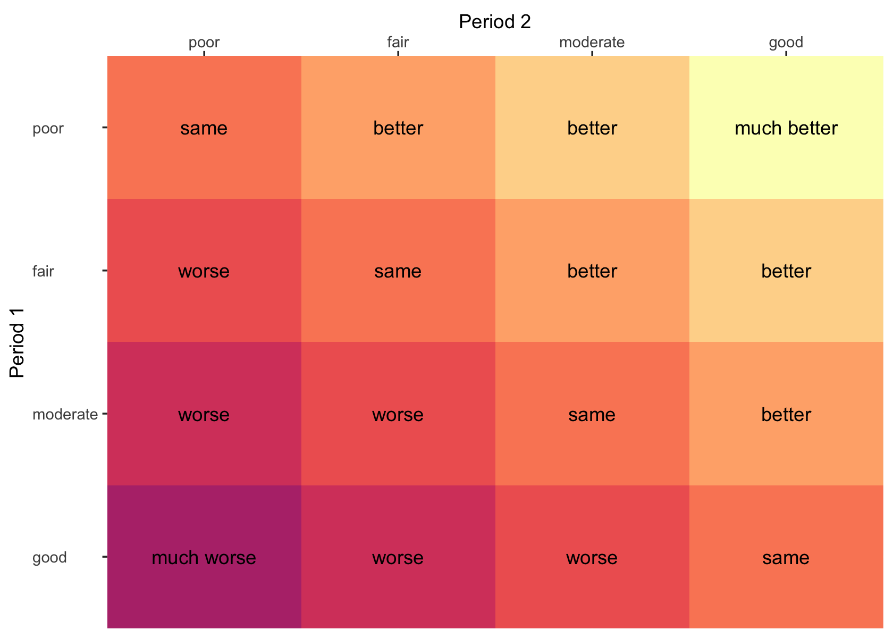

04: Other outcomes and the AB/BA design
================
A Solomon Kurz
2023-11-20

We can find code for this chapter from
<http://www.senns.uk/CTiCR/CTICR2Programs.htm#R>.

Here we load our packages and the PEF data from back in Chapter 3.

``` r
# load packages
library(tidyverse)
library(flextable)
library(ordinal)
library(broom)
library(marginaleffects)
library(lme4)
library(broom.mixed)

# Input data
n1 <- 7 # number of patients first sequence
n2 <- 6 # number of patients second sequence
n <- n1 + n2

seqn <- factor((c(rep(1, n1), rep(2, n2), rep(1, n1), rep(2, n2))),
               labels = c("forsal", "salfor")) # sequences

patient <- factor(rep(c("1", "4", "6", "7", "10", "11", "14", "2", "3", "5", "9", "12", "13"), 2),
                  levels = 1:14) 

# not in the original code, but here is sex
sex <- c("male", "female", "female", "male", "male", "female", "male", "male", "male", "female", "male", "male", "male")

period <- factor(c(rep("1", n), rep("2", n)))

treat <- factor(c(rep(2, n1), rep(1, n2), rep(1, n1), rep(2, n2)),
                labels = c("salbutamol", "formoterol"))

#Note: "formoterol" is coded second level of factor
pef <- c(310, 310, 370, 410, 250, 380, 330, 370, 310, 380, 290, 260, 90, 270, 260, 300, 390, 210, 350, 365, 385, 400, 410, 320, 340, 220)
base <- c(290, 300, 250, 390, 250, 365, 190, 350, 350, 350, 280, 270, 220, 270, 270, 210, 390, 240, 380, 260, 345, 370, 360, 290, 310, 220)

d <- tibble(
  seqn = seqn,
  patient = patient,
  period = period,
  treat = treat,
  pef = pef,
  base = base
) %>% 
  arrange(period, as.double(as.character(patient))) %>% 
  mutate(sex = c(sex, sex))

# what?
head(d)
```

    ## # A tibble: 6 × 7
    ##   seqn   patient period treat        pef  base sex   
    ##   <fct>  <fct>   <fct>  <fct>      <dbl> <dbl> <chr> 
    ## 1 forsal 1       1      formoterol   310   290 male  
    ## 2 salfor 2       1      salbutamol   370   350 female
    ## 3 salfor 3       1      salbutamol   310   350 female
    ## 4 forsal 4       1      formoterol   310   300 male  
    ## 5 salfor 5       1      salbutamol   380   350 male  
    ## 6 forsal 6       1      formoterol   370   250 female

## 4.1 Introduction

For simplicity, I’m going to omit quotation marks and rearrange the
foratting, but this section began in part with the following:

Techniques for dealing with non-Normal outcomes will be considrere under
six major headings:

- transformations,
- non-parametric methods,
- methods for binary outcomes,
- methods for ordered categorical data,
- analysis of frequency data, and
- survival analysis.

## 4.2 Transformations

Log transformations can make it easier to express the treatment effects
as multiplicative.

### 4.2.1 Logarithmic transformations.

Here’s a way to make our version of Table 4.1. You’ll note it’s a minor
extension of the code used to make our version of Table 3.2 from back in
Section 3.2.

``` r
d %>% 
  mutate(sequence = ifelse(seqn == "forsal", "for/sal", "sal/for"),
         patient = as.double(patient),
         # log transform the outcome variable
         pef = log(pef)) %>%
  select(sequence, patient, treat, pef) %>%
  pivot_wider(names_from = treat, values_from = pef) %>% 
  mutate(difference = round(formoterol - salbutamol, digits = 3),
         # note this is a ratio of pef in its natural metric
         ratio = round(exp(formoterol) / exp(salbutamol), digits = 4)) %>% 
  mutate_at(.vars = vars(formoterol:salbutamol), 
            .funs = ~ round(., digits = 4)) %>% 
  arrange(sequence, patient) %>% 
  as_grouped_data(groups = c("sequence")) %>% 
  flextable() %>% 
  padding(padding.top = 2, padding.bottom = 2, part = "all")
```

<div class="tabwid"><style>.cl-913d9904{}.cl-9132f300{font-family:'Helvetica';font-size:11pt;font-weight:normal;font-style:normal;text-decoration:none;color:rgba(0, 0, 0, 1.00);background-color:transparent;}.cl-913bb1e8{margin:0;text-align:left;border-bottom: 0 solid rgba(0, 0, 0, 1.00);border-top: 0 solid rgba(0, 0, 0, 1.00);border-left: 0 solid rgba(0, 0, 0, 1.00);border-right: 0 solid rgba(0, 0, 0, 1.00);padding-bottom:2pt;padding-top:2pt;padding-left:5pt;padding-right:5pt;line-height: 1;background-color:transparent;}.cl-913bb1f2{margin:0;text-align:right;border-bottom: 0 solid rgba(0, 0, 0, 1.00);border-top: 0 solid rgba(0, 0, 0, 1.00);border-left: 0 solid rgba(0, 0, 0, 1.00);border-right: 0 solid rgba(0, 0, 0, 1.00);padding-bottom:2pt;padding-top:2pt;padding-left:5pt;padding-right:5pt;line-height: 1;background-color:transparent;}.cl-913bba76{width:0.75in;background-color:transparent;vertical-align: middle;border-bottom: 1.5pt solid rgba(102, 102, 102, 1.00);border-top: 1.5pt solid rgba(102, 102, 102, 1.00);border-left: 0 solid rgba(0, 0, 0, 1.00);border-right: 0 solid rgba(0, 0, 0, 1.00);margin-bottom:0;margin-top:0;margin-left:0;margin-right:0;}.cl-913bba77{width:0.75in;background-color:transparent;vertical-align: middle;border-bottom: 1.5pt solid rgba(102, 102, 102, 1.00);border-top: 1.5pt solid rgba(102, 102, 102, 1.00);border-left: 0 solid rgba(0, 0, 0, 1.00);border-right: 0 solid rgba(0, 0, 0, 1.00);margin-bottom:0;margin-top:0;margin-left:0;margin-right:0;}.cl-913bba80{width:0.75in;background-color:transparent;vertical-align: middle;border-bottom: 0 solid rgba(0, 0, 0, 1.00);border-top: 0 solid rgba(0, 0, 0, 1.00);border-left: 0 solid rgba(0, 0, 0, 1.00);border-right: 0 solid rgba(0, 0, 0, 1.00);margin-bottom:0;margin-top:0;margin-left:0;margin-right:0;}.cl-913bba81{width:0.75in;background-color:transparent;vertical-align: middle;border-bottom: 0 solid rgba(0, 0, 0, 1.00);border-top: 0 solid rgba(0, 0, 0, 1.00);border-left: 0 solid rgba(0, 0, 0, 1.00);border-right: 0 solid rgba(0, 0, 0, 1.00);margin-bottom:0;margin-top:0;margin-left:0;margin-right:0;}.cl-913bba82{width:0.75in;background-color:transparent;vertical-align: middle;border-bottom: 1.5pt solid rgba(102, 102, 102, 1.00);border-top: 0 solid rgba(0, 0, 0, 1.00);border-left: 0 solid rgba(0, 0, 0, 1.00);border-right: 0 solid rgba(0, 0, 0, 1.00);margin-bottom:0;margin-top:0;margin-left:0;margin-right:0;}.cl-913bba83{width:0.75in;background-color:transparent;vertical-align: middle;border-bottom: 1.5pt solid rgba(102, 102, 102, 1.00);border-top: 0 solid rgba(0, 0, 0, 1.00);border-left: 0 solid rgba(0, 0, 0, 1.00);border-right: 0 solid rgba(0, 0, 0, 1.00);margin-bottom:0;margin-top:0;margin-left:0;margin-right:0;}</style><table data-quarto-disable-processing='true' class='cl-913d9904'><thead><tr style="overflow-wrap:break-word;"><th class="cl-913bba76"><p class="cl-913bb1e8"><span class="cl-9132f300">sequence</span></p></th><th class="cl-913bba77"><p class="cl-913bb1f2"><span class="cl-9132f300">patient</span></p></th><th class="cl-913bba77"><p class="cl-913bb1f2"><span class="cl-9132f300">formoterol</span></p></th><th class="cl-913bba77"><p class="cl-913bb1f2"><span class="cl-9132f300">salbutamol</span></p></th><th class="cl-913bba77"><p class="cl-913bb1f2"><span class="cl-9132f300">difference</span></p></th><th class="cl-913bba77"><p class="cl-913bb1f2"><span class="cl-9132f300">ratio</span></p></th></tr></thead><tbody><tr style="overflow-wrap:break-word;"><td class="cl-913bba80"><p class="cl-913bb1e8"><span class="cl-9132f300">for/sal</span></p></td><td class="cl-913bba81"><p class="cl-913bb1f2"><span class="cl-9132f300"></span></p></td><td class="cl-913bba81"><p class="cl-913bb1f2"><span class="cl-9132f300"></span></p></td><td class="cl-913bba81"><p class="cl-913bb1f2"><span class="cl-9132f300"></span></p></td><td class="cl-913bba81"><p class="cl-913bb1f2"><span class="cl-9132f300"></span></p></td><td class="cl-913bba81"><p class="cl-913bb1f2"><span class="cl-9132f300"></span></p></td></tr><tr style="overflow-wrap:break-word;"><td class="cl-913bba80"><p class="cl-913bb1e8"><span class="cl-9132f300"></span></p></td><td class="cl-913bba81"><p class="cl-913bb1f2"><span class="cl-9132f300">1</span></p></td><td class="cl-913bba81"><p class="cl-913bb1f2"><span class="cl-9132f300">5.7366</span></p></td><td class="cl-913bba81"><p class="cl-913bb1f2"><span class="cl-9132f300">5.5984</span></p></td><td class="cl-913bba81"><p class="cl-913bb1f2"><span class="cl-9132f300">0.138</span></p></td><td class="cl-913bba81"><p class="cl-913bb1f2"><span class="cl-9132f300">1.1481</span></p></td></tr><tr style="overflow-wrap:break-word;"><td class="cl-913bba80"><p class="cl-913bb1e8"><span class="cl-9132f300"></span></p></td><td class="cl-913bba81"><p class="cl-913bb1f2"><span class="cl-9132f300">4</span></p></td><td class="cl-913bba81"><p class="cl-913bb1f2"><span class="cl-9132f300">5.7366</span></p></td><td class="cl-913bba81"><p class="cl-913bb1f2"><span class="cl-9132f300">5.5607</span></p></td><td class="cl-913bba81"><p class="cl-913bb1f2"><span class="cl-9132f300">0.176</span></p></td><td class="cl-913bba81"><p class="cl-913bb1f2"><span class="cl-9132f300">1.1923</span></p></td></tr><tr style="overflow-wrap:break-word;"><td class="cl-913bba80"><p class="cl-913bb1e8"><span class="cl-9132f300"></span></p></td><td class="cl-913bba81"><p class="cl-913bb1f2"><span class="cl-9132f300">6</span></p></td><td class="cl-913bba81"><p class="cl-913bb1f2"><span class="cl-9132f300">5.9135</span></p></td><td class="cl-913bba81"><p class="cl-913bb1f2"><span class="cl-9132f300">5.7038</span></p></td><td class="cl-913bba81"><p class="cl-913bb1f2"><span class="cl-9132f300">0.210</span></p></td><td class="cl-913bba81"><p class="cl-913bb1f2"><span class="cl-9132f300">1.2333</span></p></td></tr><tr style="overflow-wrap:break-word;"><td class="cl-913bba80"><p class="cl-913bb1e8"><span class="cl-9132f300"></span></p></td><td class="cl-913bba81"><p class="cl-913bb1f2"><span class="cl-9132f300">7</span></p></td><td class="cl-913bba81"><p class="cl-913bb1f2"><span class="cl-9132f300">6.0162</span></p></td><td class="cl-913bba81"><p class="cl-913bb1f2"><span class="cl-9132f300">5.9661</span></p></td><td class="cl-913bba81"><p class="cl-913bb1f2"><span class="cl-9132f300">0.050</span></p></td><td class="cl-913bba81"><p class="cl-913bb1f2"><span class="cl-9132f300">1.0513</span></p></td></tr><tr style="overflow-wrap:break-word;"><td class="cl-913bba80"><p class="cl-913bb1e8"><span class="cl-9132f300"></span></p></td><td class="cl-913bba81"><p class="cl-913bb1f2"><span class="cl-9132f300">10</span></p></td><td class="cl-913bba81"><p class="cl-913bb1f2"><span class="cl-9132f300">5.5215</span></p></td><td class="cl-913bba81"><p class="cl-913bb1f2"><span class="cl-9132f300">5.3471</span></p></td><td class="cl-913bba81"><p class="cl-913bb1f2"><span class="cl-9132f300">0.174</span></p></td><td class="cl-913bba81"><p class="cl-913bb1f2"><span class="cl-9132f300">1.1905</span></p></td></tr><tr style="overflow-wrap:break-word;"><td class="cl-913bba80"><p class="cl-913bb1e8"><span class="cl-9132f300"></span></p></td><td class="cl-913bba81"><p class="cl-913bb1f2"><span class="cl-9132f300">11</span></p></td><td class="cl-913bba81"><p class="cl-913bb1f2"><span class="cl-9132f300">5.9402</span></p></td><td class="cl-913bba81"><p class="cl-913bb1f2"><span class="cl-9132f300">5.8579</span></p></td><td class="cl-913bba81"><p class="cl-913bb1f2"><span class="cl-9132f300">0.082</span></p></td><td class="cl-913bba81"><p class="cl-913bb1f2"><span class="cl-9132f300">1.0857</span></p></td></tr><tr style="overflow-wrap:break-word;"><td class="cl-913bba80"><p class="cl-913bb1e8"><span class="cl-9132f300"></span></p></td><td class="cl-913bba81"><p class="cl-913bb1f2"><span class="cl-9132f300">14</span></p></td><td class="cl-913bba81"><p class="cl-913bb1f2"><span class="cl-9132f300">5.7991</span></p></td><td class="cl-913bba81"><p class="cl-913bb1f2"><span class="cl-9132f300">5.8999</span></p></td><td class="cl-913bba81"><p class="cl-913bb1f2"><span class="cl-9132f300">-0.101</span></p></td><td class="cl-913bba81"><p class="cl-913bb1f2"><span class="cl-9132f300">0.9041</span></p></td></tr><tr style="overflow-wrap:break-word;"><td class="cl-913bba80"><p class="cl-913bb1e8"><span class="cl-9132f300">sal/for</span></p></td><td class="cl-913bba81"><p class="cl-913bb1f2"><span class="cl-9132f300"></span></p></td><td class="cl-913bba81"><p class="cl-913bb1f2"><span class="cl-9132f300"></span></p></td><td class="cl-913bba81"><p class="cl-913bb1f2"><span class="cl-9132f300"></span></p></td><td class="cl-913bba81"><p class="cl-913bb1f2"><span class="cl-9132f300"></span></p></td><td class="cl-913bba81"><p class="cl-913bb1f2"><span class="cl-9132f300"></span></p></td></tr><tr style="overflow-wrap:break-word;"><td class="cl-913bba80"><p class="cl-913bb1e8"><span class="cl-9132f300"></span></p></td><td class="cl-913bba81"><p class="cl-913bb1f2"><span class="cl-9132f300">2</span></p></td><td class="cl-913bba81"><p class="cl-913bb1f2"><span class="cl-9132f300">5.9532</span></p></td><td class="cl-913bba81"><p class="cl-913bb1f2"><span class="cl-9132f300">5.9135</span></p></td><td class="cl-913bba81"><p class="cl-913bb1f2"><span class="cl-9132f300">0.040</span></p></td><td class="cl-913bba81"><p class="cl-913bb1f2"><span class="cl-9132f300">1.0405</span></p></td></tr><tr style="overflow-wrap:break-word;"><td class="cl-913bba80"><p class="cl-913bb1e8"><span class="cl-9132f300"></span></p></td><td class="cl-913bba81"><p class="cl-913bb1f2"><span class="cl-9132f300">3</span></p></td><td class="cl-913bba81"><p class="cl-913bb1f2"><span class="cl-9132f300">5.9915</span></p></td><td class="cl-913bba81"><p class="cl-913bb1f2"><span class="cl-9132f300">5.7366</span></p></td><td class="cl-913bba81"><p class="cl-913bb1f2"><span class="cl-9132f300">0.255</span></p></td><td class="cl-913bba81"><p class="cl-913bb1f2"><span class="cl-9132f300">1.2903</span></p></td></tr><tr style="overflow-wrap:break-word;"><td class="cl-913bba80"><p class="cl-913bb1e8"><span class="cl-9132f300"></span></p></td><td class="cl-913bba81"><p class="cl-913bb1f2"><span class="cl-9132f300">5</span></p></td><td class="cl-913bba81"><p class="cl-913bb1f2"><span class="cl-9132f300">6.0162</span></p></td><td class="cl-913bba81"><p class="cl-913bb1f2"><span class="cl-9132f300">5.9402</span></p></td><td class="cl-913bba81"><p class="cl-913bb1f2"><span class="cl-9132f300">0.076</span></p></td><td class="cl-913bba81"><p class="cl-913bb1f2"><span class="cl-9132f300">1.0789</span></p></td></tr><tr style="overflow-wrap:break-word;"><td class="cl-913bba80"><p class="cl-913bb1e8"><span class="cl-9132f300"></span></p></td><td class="cl-913bba81"><p class="cl-913bb1f2"><span class="cl-9132f300">9</span></p></td><td class="cl-913bba81"><p class="cl-913bb1f2"><span class="cl-9132f300">5.7683</span></p></td><td class="cl-913bba81"><p class="cl-913bb1f2"><span class="cl-9132f300">5.6699</span></p></td><td class="cl-913bba81"><p class="cl-913bb1f2"><span class="cl-9132f300">0.098</span></p></td><td class="cl-913bba81"><p class="cl-913bb1f2"><span class="cl-9132f300">1.1034</span></p></td></tr><tr style="overflow-wrap:break-word;"><td class="cl-913bba80"><p class="cl-913bb1e8"><span class="cl-9132f300"></span></p></td><td class="cl-913bba81"><p class="cl-913bb1f2"><span class="cl-9132f300">12</span></p></td><td class="cl-913bba81"><p class="cl-913bb1f2"><span class="cl-9132f300">5.8289</span></p></td><td class="cl-913bba81"><p class="cl-913bb1f2"><span class="cl-9132f300">5.5607</span></p></td><td class="cl-913bba81"><p class="cl-913bb1f2"><span class="cl-9132f300">0.268</span></p></td><td class="cl-913bba81"><p class="cl-913bb1f2"><span class="cl-9132f300">1.3077</span></p></td></tr><tr style="overflow-wrap:break-word;"><td class="cl-913bba82"><p class="cl-913bb1e8"><span class="cl-9132f300"></span></p></td><td class="cl-913bba83"><p class="cl-913bb1f2"><span class="cl-9132f300">13</span></p></td><td class="cl-913bba83"><p class="cl-913bb1f2"><span class="cl-9132f300">5.3936</span></p></td><td class="cl-913bba83"><p class="cl-913bb1f2"><span class="cl-9132f300">4.4998</span></p></td><td class="cl-913bba83"><p class="cl-913bb1f2"><span class="cl-9132f300">0.894</span></p></td><td class="cl-913bba83"><p class="cl-913bb1f2"><span class="cl-9132f300">2.4444</span></p></td></tr></tbody></table></div>

Let’s go ahead and save the log-transformed version of `pef` in the data
frame as `lpef`.

``` r
d <- d %>% 
  mutate(lpef = log(pef))

# what?
head(d)
```

    ## # A tibble: 6 × 8
    ##   seqn   patient period treat        pef  base sex     lpef
    ##   <fct>  <fct>   <fct>  <fct>      <dbl> <dbl> <chr>  <dbl>
    ## 1 forsal 1       1      formoterol   310   290 male    5.74
    ## 2 salfor 2       1      salbutamol   370   350 female  5.91
    ## 3 salfor 3       1      salbutamol   310   350 female  5.74
    ## 4 forsal 4       1      formoterol   310   300 male    5.74
    ## 5 salfor 5       1      salbutamol   380   350 male    5.94
    ## 6 forsal 6       1      formoterol   370   250 female  5.91

Now we can get ready to do a CROS analysis of these data by first
computing the participant-level difference scores of the log-transformed
outcome by treatment (the *basic estimator*), and modeling the
difference-scores conditional by phase. Here as in Section 3.6, we’ll do
so by way of the `y ~ 0 + ...` syntax.

``` r
fit4.1 <- lm(
  data = d %>% 
    select(patient, seqn, treat, lpef) %>% 
    pivot_wider(names_from = treat, values_from = lpef) %>% 
    mutate(dif = formoterol - salbutamol),
  dif ~ 0 + seqn
) 

summary(fit4.1)
```

    ## 
    ## Call:
    ## lm(formula = dif ~ 0 + seqn, data = d %>% select(patient, seqn, 
    ##     treat, lpef) %>% pivot_wider(names_from = treat, values_from = lpef) %>% 
    ##     mutate(dif = formoterol - salbutamol))
    ## 
    ## Residuals:
    ##      Min       1Q   Median       3Q      Max 
    ## -0.23212 -0.17342 -0.01696  0.07013  0.62196 
    ## 
    ## Coefficients:
    ##            Estimate Std. Error t value Pr(>|t|)  
    ## seqnforsal  0.10422    0.08658   1.204   0.2540  
    ## seqnsalfor  0.27186    0.09352   2.907   0.0143 *
    ## ---
    ## Signif. codes:  0 '***' 0.001 '**' 0.01 '*' 0.05 '.' 0.1 ' ' 1
    ## 
    ## Residual standard error: 0.2291 on 11 degrees of freedom
    ## Multiple R-squared:  0.4737, Adjusted R-squared:  0.378 
    ## F-statistic:  4.95 on 2 and 11 DF,  p-value: 0.02931

Now here’s the final step of the CROS analysis where we compute the
unweighted average of the phase-specific averages of the difference
scores.

``` r
# define the data grid
nd <- d %>% 
  distinct(seqn)

# compute the phase-specific contrasts (intermediate step)
predictions(fit4.1, newdata = nd)
```

    ## 
    ##  Estimate Std. Error    z Pr(>|z|)   S   2.5 % 97.5 %   seqn
    ##     0.104     0.0866 1.20  0.22870 2.1 -0.0655  0.274 forsal
    ##     0.272     0.0935 2.91  0.00365 8.1  0.0886  0.455 salfor
    ## 
    ## Columns: rowid, estimate, std.error, statistic, p.value, s.value, conf.low, conf.high, seqn, dif 
    ## Type:  response

``` r
# compute the unweighted average of the phase-specific contrasts 
avg_predictions(fit4.1, newdata = nd) %>% 
  data.frame() %>% 
  mutate_all(.funs = ~ round(., digits = 3))
```

    ##   estimate std.error statistic p.value s.value conf.low conf.high
    ## 1    0.188     0.064     2.951   0.003   8.302    0.063     0.313

This results matches the value Senn reported at the bottom of page 90.

Senn recommended anti-logging the estimate (i.e., exponentiating), which
transforms it to a ratio. Here’s how we might do that with our
`avg_predictions()`-based workflow.

``` r
avg_predictions(fit4.1, 
                newdata = nd, 
                # for t-distribution based inference and CIs
                df = insight::get_df(fit4.1)) %>% 
  data.frame() %>% 
  select(estimate, contains("conf.")) %>% 
  mutate_all(.funs = ~ exp(.) %>% round(digits = 3))
```

    ##   estimate conf.low conf.high
    ## 1    1.207    1.049     1.389

This can be interpreted as formoterol increased `pef` values by about
21%, relative to salbutamol. But when we mind the 95% CIs, we note this
increase might well be as low as 5%, or as high as 39%.

Senn then remarked: We could have achieved this estimate directly by
calculating a basic estimator for each patient in terms of ratios of PEF
\[as in Table 4.1\]… The fact that we have taken ratios, however,
implies that we need to take a geometric mean rather than the more usual
arithmetic mean” (p. 91). I’m not aware of a geometric mean function
within **R**, but I believe you can do so with a combination of `log()`,
`mean()`, and `exp()`. Here are the sequence-specific geometric means.

``` r
d %>% 
  mutate(sequence = ifelse(seqn == "forsal", "for/sal", "sal/for"),
         patient = as.double(patient)) %>%
  select(sequence, patient, treat, pef) %>%
  pivot_wider(names_from = treat, values_from = pef) %>% 
  mutate(ratio = formoterol / salbutamol) %>% 
  group_by(sequence) %>% 
  summarise(gm = log(ratio) %>% mean() %>% exp())
```

    ## # A tibble: 2 × 2
    ##   sequence    gm
    ##   <chr>    <dbl>
    ## 1 for/sal   1.11
    ## 2 sal/for   1.31

Here’s the mean of those geometric means.

``` r
d %>% 
  mutate(sequence = ifelse(seqn == "forsal", "for/sal", "sal/for"),
         patient = as.double(patient)) %>%
  select(sequence, patient, treat, pef) %>%
  pivot_wider(names_from = treat, values_from = pef) %>% 
  mutate(ratio = formoterol / salbutamol) %>% 
  group_by(sequence) %>% 
  summarise(gm = log(ratio) %>% mean() %>% exp()) %>% 
  summarise(mean_gm = mean(gm))
```

    ## # A tibble: 1 × 1
    ##   mean_gm
    ##     <dbl>
    ## 1    1.21

I’m not aware of a great way to do this within a frequentist GLM
framework. We can get close, though. Here’s how to fit the initial model
of for the basic estimator for each patient in terms of ratios for
`pef`.

``` r
fit4.2 <- lm(
  data = d %>% 
    select(patient, seqn, treat, pef) %>% 
    pivot_wider(names_from = treat, values_from = pef) %>% 
    mutate(ratio = formoterol / salbutamol),
  log(ratio) ~ 0 + seqn
) 

summary(fit4.2)
```

    ## 
    ## Call:
    ## lm(formula = log(ratio) ~ 0 + seqn, data = d %>% select(patient, 
    ##     seqn, treat, pef) %>% pivot_wider(names_from = treat, values_from = pef) %>% 
    ##     mutate(ratio = formoterol/salbutamol))
    ## 
    ## Residuals:
    ##      Min       1Q   Median       3Q      Max 
    ## -0.23212 -0.17342 -0.01696  0.07013  0.62196 
    ## 
    ## Coefficients:
    ##            Estimate Std. Error t value Pr(>|t|)  
    ## seqnforsal  0.10422    0.08658   1.204   0.2540  
    ## seqnsalfor  0.27186    0.09352   2.907   0.0143 *
    ## ---
    ## Signif. codes:  0 '***' 0.001 '**' 0.01 '*' 0.05 '.' 0.1 ' ' 1
    ## 
    ## Residual standard error: 0.2291 on 11 degrees of freedom
    ## Multiple R-squared:  0.4737, Adjusted R-squared:  0.378 
    ## F-statistic:  4.95 on 2 and 11 DF,  p-value: 0.02931

We can then use `transform = exp` within `predictions()` to get the
`seqn` specific results.

``` r
predictions(fit4.2, newdata = nd, transform = exp) %>% 
  data.frame()
```

    ##   rowid estimate     p.value  s.value  conf.low conf.high   seqn    ratio
    ## 1     1 1.109848 0.228696509 2.128494 0.9366196  1.315114 forsal 1.148148
    ## 2     2 1.312399 0.003650214 8.097803 1.0925988  1.576417 salfor 1.148148

A single `summarise()` will return the mean of those point estimates,
which is the same as the mean of the geometric means we computed by
hand, above.

``` r
predictions(fit4.2, 
            newdata = nd, 
            transform = exp) %>% 
  data.frame() %>% 
  summarise(estimate = mean(estimate),
            conf.low = mean(conf.low),
            conf.high = mean(conf.high))
```

    ##   estimate conf.low conf.high
    ## 1 1.211123 1.014609  1.445765

However, I’m not aware of a good way to get the correct standard error
for this within a frequentist framework. The naive application of
`avg_predictions()` for this doesn’t work, for example.

``` r
avg_predictions(fit4.2, newdata = nd, transform = exp) %>% 
  data.frame()
```

    ##   estimate     p.value s.value conf.low conf.high
    ## 1 1.206881 0.003168948 8.30178  1.06518  1.367434

So it goes…

Senn then discussed how this log-transform method can be sensitive to
unusual cases. For example, here’s what happens when you repeat the
analysis for our `fit4.1`, but drop `patient == 13`.

``` r
fit4.3 <- lm(
  data = d %>% 
    filter(patient != 13) %>% 
    select(patient, seqn, treat, lpef) %>% 
    pivot_wider(names_from = treat, values_from = lpef) %>% 
    mutate(dif = formoterol - salbutamol),
  dif ~ 0 + seqn
) 

# summary(fit4.3)

# compute the unweighted average of the phase-specific contrasts 
avg_predictions(fit4.3, newdata = nd) %>% 
  data.frame() %>% 
  mutate_all(.funs = ~ round(., digits = 4))
```

    ##   estimate std.error statistic p.value s.value conf.low conf.high
    ## 1   0.1258    0.0311    4.0428   1e-04 14.2085   0.0648    0.1869

The estimate dropped form 0.188 to 0.126. However, the standard error is
much lower, even with one fewer case. It’s about half the size of the SE
from the first model with all cases.

``` r
avg_predictions(fit4.1, newdata = nd) %>% 
  data.frame() %>% 
  mutate_all(.funs = ~ round(., digits = 4))
```

    ##   estimate std.error statistic p.value s.value conf.low conf.high
    ## 1    0.188    0.0637    2.9509  0.0032  8.3018   0.0631    0.3129

### 4.2.2 The logit transformation.

Here’s what the logit transform looks like for VAS values ranging from 0
to 100.

``` r
tibble(vas = 0:100) %>% 
  mutate(logit_score = log(vas / (100 - vas))) %>% 
  
  ggplot(aes(x = vas, y = logit_score)) +
  geom_point() +
  coord_cartesian(ylim = c(-5, 5))
```


We do this all the time with logistic regression models for binomial
data.

You might assume you could find the basic code for the Example 4.1 data,
in the Example 4.1 section of
<http://www.senns.uk/CTiCR/CTICR2Programs.htm#R>. Frustratingly, that
doesn’t appear to be the case. We can, however, recreate the basics from
Table 4.2 on page 93. Here we put the primary values into a tribble
called `d2.`

``` r
d2 <- tribble(
  ~patient, ~seqn, ~formoterol, ~salbutamol,
  1,    "forsal",   63, 82,
  3,    "forsal",   24, 84,
  5,    "forsal",   32, 66,
  6,    "forsal",   33, 51,
  10,   "forsal",   24, 75,
  12,   "forsal",   30, 38,
  2,    "salfor",   40, 68,
  4,    "salfor",   5,  4,
  7,    "salfor",   21, 57,
  8,    "salfor",   5,  23,
  9,    "salfor",   32, 56,
  11,   "salfor",   4,  53
) %>% 
  mutate(patient = factor(patient, levels = 1:14),
         seqn = factor(seqn, levels = c("forsal", "salfor"))) %>% 
  pivot_longer(formoterol:salbutamol, names_to = "treat", values_to = "vas") %>% 
  mutate(period = case_when(
    seqn == "forsal" & treat == "formoterol" ~ 1,
    seqn == "forsal" & treat == "salbutamol" ~ 2,
    seqn == "salfor" & treat == "formoterol" ~ 2,
    seqn == "salfor" & treat == "salbutamol" ~ 1
  ) %>% 
    factor(levels = 1:2)
  ) %>% 
  select(seqn, patient, period, treat, vas) %>% 
  arrange(period, patient)

# what?
head(d2)
```

    ## # A tibble: 6 × 5
    ##   seqn   patient period treat        vas
    ##   <fct>  <fct>   <fct>  <chr>      <dbl>
    ## 1 forsal 1       1      formoterol    63
    ## 2 salfor 2       1      salbutamol    68
    ## 3 forsal 3       1      formoterol    24
    ## 4 salfor 4       1      salbutamol     4
    ## 5 forsal 5       1      formoterol    32
    ## 6 forsal 6       1      formoterol    33

Here’s our version of Table 4.2 (p. 93).

``` r
d2 %>% 
  mutate(sequence = ifelse(seqn == "forsal", "for/sal", "sal/for"),
         patient = as.double(patient)) %>% 
  select(sequence, patient, treat, vas) %>%
  pivot_wider(names_from = treat, values_from = vas) %>% 
  mutate(basic_estimator = formoterol - salbutamol) %>% 
  arrange(sequence, patient) %>% 
  as_grouped_data(groups = c("sequence")) %>% 
  flextable() %>% 
  padding(padding.top = 2, padding.bottom = 2, part = "all")
```

<div class="tabwid"><style>.cl-918106e4{}.cl-917db21e{font-family:'Helvetica';font-size:11pt;font-weight:normal;font-style:normal;text-decoration:none;color:rgba(0, 0, 0, 1.00);background-color:transparent;}.cl-917f67e4{margin:0;text-align:left;border-bottom: 0 solid rgba(0, 0, 0, 1.00);border-top: 0 solid rgba(0, 0, 0, 1.00);border-left: 0 solid rgba(0, 0, 0, 1.00);border-right: 0 solid rgba(0, 0, 0, 1.00);padding-bottom:2pt;padding-top:2pt;padding-left:5pt;padding-right:5pt;line-height: 1;background-color:transparent;}.cl-917f67ee{margin:0;text-align:right;border-bottom: 0 solid rgba(0, 0, 0, 1.00);border-top: 0 solid rgba(0, 0, 0, 1.00);border-left: 0 solid rgba(0, 0, 0, 1.00);border-right: 0 solid rgba(0, 0, 0, 1.00);padding-bottom:2pt;padding-top:2pt;padding-left:5pt;padding-right:5pt;line-height: 1;background-color:transparent;}.cl-917f6fc8{width:0.75in;background-color:transparent;vertical-align: middle;border-bottom: 1.5pt solid rgba(102, 102, 102, 1.00);border-top: 1.5pt solid rgba(102, 102, 102, 1.00);border-left: 0 solid rgba(0, 0, 0, 1.00);border-right: 0 solid rgba(0, 0, 0, 1.00);margin-bottom:0;margin-top:0;margin-left:0;margin-right:0;}.cl-917f6fc9{width:0.75in;background-color:transparent;vertical-align: middle;border-bottom: 1.5pt solid rgba(102, 102, 102, 1.00);border-top: 1.5pt solid rgba(102, 102, 102, 1.00);border-left: 0 solid rgba(0, 0, 0, 1.00);border-right: 0 solid rgba(0, 0, 0, 1.00);margin-bottom:0;margin-top:0;margin-left:0;margin-right:0;}.cl-917f6fd2{width:0.75in;background-color:transparent;vertical-align: middle;border-bottom: 0 solid rgba(0, 0, 0, 1.00);border-top: 0 solid rgba(0, 0, 0, 1.00);border-left: 0 solid rgba(0, 0, 0, 1.00);border-right: 0 solid rgba(0, 0, 0, 1.00);margin-bottom:0;margin-top:0;margin-left:0;margin-right:0;}.cl-917f6fd3{width:0.75in;background-color:transparent;vertical-align: middle;border-bottom: 0 solid rgba(0, 0, 0, 1.00);border-top: 0 solid rgba(0, 0, 0, 1.00);border-left: 0 solid rgba(0, 0, 0, 1.00);border-right: 0 solid rgba(0, 0, 0, 1.00);margin-bottom:0;margin-top:0;margin-left:0;margin-right:0;}.cl-917f6fd4{width:0.75in;background-color:transparent;vertical-align: middle;border-bottom: 1.5pt solid rgba(102, 102, 102, 1.00);border-top: 0 solid rgba(0, 0, 0, 1.00);border-left: 0 solid rgba(0, 0, 0, 1.00);border-right: 0 solid rgba(0, 0, 0, 1.00);margin-bottom:0;margin-top:0;margin-left:0;margin-right:0;}.cl-917f6fd5{width:0.75in;background-color:transparent;vertical-align: middle;border-bottom: 1.5pt solid rgba(102, 102, 102, 1.00);border-top: 0 solid rgba(0, 0, 0, 1.00);border-left: 0 solid rgba(0, 0, 0, 1.00);border-right: 0 solid rgba(0, 0, 0, 1.00);margin-bottom:0;margin-top:0;margin-left:0;margin-right:0;}</style><table data-quarto-disable-processing='true' class='cl-918106e4'><thead><tr style="overflow-wrap:break-word;"><th class="cl-917f6fc8"><p class="cl-917f67e4"><span class="cl-917db21e">sequence</span></p></th><th class="cl-917f6fc9"><p class="cl-917f67ee"><span class="cl-917db21e">patient</span></p></th><th class="cl-917f6fc9"><p class="cl-917f67ee"><span class="cl-917db21e">formoterol</span></p></th><th class="cl-917f6fc9"><p class="cl-917f67ee"><span class="cl-917db21e">salbutamol</span></p></th><th class="cl-917f6fc9"><p class="cl-917f67ee"><span class="cl-917db21e">basic_estimator</span></p></th></tr></thead><tbody><tr style="overflow-wrap:break-word;"><td class="cl-917f6fd2"><p class="cl-917f67e4"><span class="cl-917db21e">for/sal</span></p></td><td class="cl-917f6fd3"><p class="cl-917f67ee"><span class="cl-917db21e"></span></p></td><td class="cl-917f6fd3"><p class="cl-917f67ee"><span class="cl-917db21e"></span></p></td><td class="cl-917f6fd3"><p class="cl-917f67ee"><span class="cl-917db21e"></span></p></td><td class="cl-917f6fd3"><p class="cl-917f67ee"><span class="cl-917db21e"></span></p></td></tr><tr style="overflow-wrap:break-word;"><td class="cl-917f6fd2"><p class="cl-917f67e4"><span class="cl-917db21e"></span></p></td><td class="cl-917f6fd3"><p class="cl-917f67ee"><span class="cl-917db21e">1</span></p></td><td class="cl-917f6fd3"><p class="cl-917f67ee"><span class="cl-917db21e">63</span></p></td><td class="cl-917f6fd3"><p class="cl-917f67ee"><span class="cl-917db21e">82</span></p></td><td class="cl-917f6fd3"><p class="cl-917f67ee"><span class="cl-917db21e">-19</span></p></td></tr><tr style="overflow-wrap:break-word;"><td class="cl-917f6fd2"><p class="cl-917f67e4"><span class="cl-917db21e"></span></p></td><td class="cl-917f6fd3"><p class="cl-917f67ee"><span class="cl-917db21e">3</span></p></td><td class="cl-917f6fd3"><p class="cl-917f67ee"><span class="cl-917db21e">24</span></p></td><td class="cl-917f6fd3"><p class="cl-917f67ee"><span class="cl-917db21e">84</span></p></td><td class="cl-917f6fd3"><p class="cl-917f67ee"><span class="cl-917db21e">-60</span></p></td></tr><tr style="overflow-wrap:break-word;"><td class="cl-917f6fd2"><p class="cl-917f67e4"><span class="cl-917db21e"></span></p></td><td class="cl-917f6fd3"><p class="cl-917f67ee"><span class="cl-917db21e">5</span></p></td><td class="cl-917f6fd3"><p class="cl-917f67ee"><span class="cl-917db21e">32</span></p></td><td class="cl-917f6fd3"><p class="cl-917f67ee"><span class="cl-917db21e">66</span></p></td><td class="cl-917f6fd3"><p class="cl-917f67ee"><span class="cl-917db21e">-34</span></p></td></tr><tr style="overflow-wrap:break-word;"><td class="cl-917f6fd2"><p class="cl-917f67e4"><span class="cl-917db21e"></span></p></td><td class="cl-917f6fd3"><p class="cl-917f67ee"><span class="cl-917db21e">6</span></p></td><td class="cl-917f6fd3"><p class="cl-917f67ee"><span class="cl-917db21e">33</span></p></td><td class="cl-917f6fd3"><p class="cl-917f67ee"><span class="cl-917db21e">51</span></p></td><td class="cl-917f6fd3"><p class="cl-917f67ee"><span class="cl-917db21e">-18</span></p></td></tr><tr style="overflow-wrap:break-word;"><td class="cl-917f6fd2"><p class="cl-917f67e4"><span class="cl-917db21e"></span></p></td><td class="cl-917f6fd3"><p class="cl-917f67ee"><span class="cl-917db21e">10</span></p></td><td class="cl-917f6fd3"><p class="cl-917f67ee"><span class="cl-917db21e">24</span></p></td><td class="cl-917f6fd3"><p class="cl-917f67ee"><span class="cl-917db21e">75</span></p></td><td class="cl-917f6fd3"><p class="cl-917f67ee"><span class="cl-917db21e">-51</span></p></td></tr><tr style="overflow-wrap:break-word;"><td class="cl-917f6fd2"><p class="cl-917f67e4"><span class="cl-917db21e"></span></p></td><td class="cl-917f6fd3"><p class="cl-917f67ee"><span class="cl-917db21e">12</span></p></td><td class="cl-917f6fd3"><p class="cl-917f67ee"><span class="cl-917db21e">30</span></p></td><td class="cl-917f6fd3"><p class="cl-917f67ee"><span class="cl-917db21e">38</span></p></td><td class="cl-917f6fd3"><p class="cl-917f67ee"><span class="cl-917db21e">-8</span></p></td></tr><tr style="overflow-wrap:break-word;"><td class="cl-917f6fd2"><p class="cl-917f67e4"><span class="cl-917db21e">sal/for</span></p></td><td class="cl-917f6fd3"><p class="cl-917f67ee"><span class="cl-917db21e"></span></p></td><td class="cl-917f6fd3"><p class="cl-917f67ee"><span class="cl-917db21e"></span></p></td><td class="cl-917f6fd3"><p class="cl-917f67ee"><span class="cl-917db21e"></span></p></td><td class="cl-917f6fd3"><p class="cl-917f67ee"><span class="cl-917db21e"></span></p></td></tr><tr style="overflow-wrap:break-word;"><td class="cl-917f6fd2"><p class="cl-917f67e4"><span class="cl-917db21e"></span></p></td><td class="cl-917f6fd3"><p class="cl-917f67ee"><span class="cl-917db21e">2</span></p></td><td class="cl-917f6fd3"><p class="cl-917f67ee"><span class="cl-917db21e">40</span></p></td><td class="cl-917f6fd3"><p class="cl-917f67ee"><span class="cl-917db21e">68</span></p></td><td class="cl-917f6fd3"><p class="cl-917f67ee"><span class="cl-917db21e">-28</span></p></td></tr><tr style="overflow-wrap:break-word;"><td class="cl-917f6fd2"><p class="cl-917f67e4"><span class="cl-917db21e"></span></p></td><td class="cl-917f6fd3"><p class="cl-917f67ee"><span class="cl-917db21e">4</span></p></td><td class="cl-917f6fd3"><p class="cl-917f67ee"><span class="cl-917db21e">5</span></p></td><td class="cl-917f6fd3"><p class="cl-917f67ee"><span class="cl-917db21e">4</span></p></td><td class="cl-917f6fd3"><p class="cl-917f67ee"><span class="cl-917db21e">1</span></p></td></tr><tr style="overflow-wrap:break-word;"><td class="cl-917f6fd2"><p class="cl-917f67e4"><span class="cl-917db21e"></span></p></td><td class="cl-917f6fd3"><p class="cl-917f67ee"><span class="cl-917db21e">7</span></p></td><td class="cl-917f6fd3"><p class="cl-917f67ee"><span class="cl-917db21e">21</span></p></td><td class="cl-917f6fd3"><p class="cl-917f67ee"><span class="cl-917db21e">57</span></p></td><td class="cl-917f6fd3"><p class="cl-917f67ee"><span class="cl-917db21e">-36</span></p></td></tr><tr style="overflow-wrap:break-word;"><td class="cl-917f6fd2"><p class="cl-917f67e4"><span class="cl-917db21e"></span></p></td><td class="cl-917f6fd3"><p class="cl-917f67ee"><span class="cl-917db21e">8</span></p></td><td class="cl-917f6fd3"><p class="cl-917f67ee"><span class="cl-917db21e">5</span></p></td><td class="cl-917f6fd3"><p class="cl-917f67ee"><span class="cl-917db21e">23</span></p></td><td class="cl-917f6fd3"><p class="cl-917f67ee"><span class="cl-917db21e">-18</span></p></td></tr><tr style="overflow-wrap:break-word;"><td class="cl-917f6fd2"><p class="cl-917f67e4"><span class="cl-917db21e"></span></p></td><td class="cl-917f6fd3"><p class="cl-917f67ee"><span class="cl-917db21e">9</span></p></td><td class="cl-917f6fd3"><p class="cl-917f67ee"><span class="cl-917db21e">32</span></p></td><td class="cl-917f6fd3"><p class="cl-917f67ee"><span class="cl-917db21e">56</span></p></td><td class="cl-917f6fd3"><p class="cl-917f67ee"><span class="cl-917db21e">-24</span></p></td></tr><tr style="overflow-wrap:break-word;"><td class="cl-917f6fd4"><p class="cl-917f67e4"><span class="cl-917db21e"></span></p></td><td class="cl-917f6fd5"><p class="cl-917f67ee"><span class="cl-917db21e">11</span></p></td><td class="cl-917f6fd5"><p class="cl-917f67ee"><span class="cl-917db21e">4</span></p></td><td class="cl-917f6fd5"><p class="cl-917f67ee"><span class="cl-917db21e">53</span></p></td><td class="cl-917f6fd5"><p class="cl-917f67ee"><span class="cl-917db21e">-49</span></p></td></tr></tbody></table></div>

Here’s a version of Senn’s depiction of the data in his Figure 4.1
(p. 94).

``` r
d2 %>% 
  mutate(sequence = ifelse(seqn == "forsal", "for/sal", "sal/for")) %>% 
  
  ggplot(aes(x = patient, y = vas)) +
  geom_point(aes(shape = treat)) +
  scale_shape_manual(values = c(0, 4)) +
  scale_y_continuous("VAS (mm)", limits = c(0, 100)) +
  labs(caption = expression(italic(Note)*'. For the VAS, 0 = "good", 100 = "bad"')) +
  facet_wrap(~ sequence) +
  theme(panel.grid = element_blank())
```


Based on the scaling of the VAS, it looks like folks preferred
formoterol to salbutamol by a lot.

Here’s our version of the standard Gaussian CROS analysis model for the
VAS scores.

``` r
fit4.4 <- lm(
  data = d2 %>% 
    select(patient, seqn, treat, vas) %>% 
    pivot_wider(names_from = treat, values_from = vas) %>% 
    mutate(dif = formoterol - salbutamol),
  dif ~ 0 + seqn
) 

summary(fit4.4)
```

    ## 
    ## Call:
    ## lm(formula = dif ~ 0 + seqn, data = d2 %>% select(patient, seqn, 
    ##     treat, vas) %>% pivot_wider(names_from = treat, values_from = vas) %>% 
    ##     mutate(dif = formoterol - salbutamol))
    ## 
    ## Residuals:
    ##      Min       1Q   Median       3Q      Max 
    ## -28.3333 -12.5833  -0.3333  12.9167  26.6667 
    ## 
    ## Coefficients:
    ##            Estimate Std. Error t value Pr(>|t|)   
    ## seqnforsal  -31.667      7.658  -4.135  0.00203 **
    ## seqnsalfor  -25.667      7.658  -3.352  0.00735 **
    ## ---
    ## Signif. codes:  0 '***' 0.001 '**' 0.01 '*' 0.05 '.' 0.1 ' ' 1
    ## 
    ## Residual standard error: 18.76 on 10 degrees of freedom
    ## Multiple R-squared:  0.7391, Adjusted R-squared:  0.687 
    ## F-statistic: 14.17 on 2 and 10 DF,  p-value: 0.001208

Here’s the focal contrast.

``` r
avg_predictions(fit4.4, 
                newdata = nd,
                # for t-distribution based inference and CIs
                df = insight::get_df(fit4.4)) %>% 
  data.frame() %>% 
  mutate_all(.funs = ~ round(., digits = 2))
```

    ##   estimate std.error statistic p.value s.value conf.low conf.high df
    ## 1   -28.67      5.41     -5.29       0   11.48   -40.73     -16.6 10

Averaging over the two levels of `seqn`, formoterol was rated about 29
VAS points lower than salbutamol, which seems pretty large, to me.

Before we fit the next model, let’s add a `logit_score` version of the
`vas` variable.

``` r
d2 <- d2 %>% 
  mutate(logit_score = log(vas / (100 - vas)))

# what?
d2 %>% 
  select(vas, logit_score) %>% 
  head()
```

    ## # A tibble: 6 × 2
    ##     vas logit_score
    ##   <dbl>       <dbl>
    ## 1    63       0.532
    ## 2    68       0.754
    ## 3    24      -1.15 
    ## 4     4      -3.18 
    ## 5    32      -0.754
    ## 6    33      -0.708

Here’s the Gaussian CROS analysis model for the logit-score version of
the VAS scores.

``` r
fit4.5 <- lm(
  data = d2 %>% 
    select(patient, seqn, treat, logit_score) %>% 
    pivot_wider(names_from = treat, values_from = logit_score) %>% 
    mutate(dif = formoterol - salbutamol),
  dif ~ 0 + seqn
) 

summary(fit4.5)
```

    ## 
    ## Call:
    ## lm(formula = dif ~ 0 + seqn, data = d2 %>% select(patient, seqn, 
    ##     treat, logit_score) %>% pivot_wider(names_from = treat, values_from = logit_score) %>% 
    ##     mutate(dif = formoterol - salbutamol))
    ## 
    ## Residuals:
    ##     Min      1Q  Median      3Q     Max 
    ## -1.8713 -0.4377  0.1394  0.5031  1.6606 
    ## 
    ## Coefficients:
    ##            Estimate Std. Error t value Pr(>|t|)   
    ## seqnforsal   -1.428      0.429  -3.330  0.00762 **
    ## seqnsalfor   -1.427      0.429  -3.327  0.00766 **
    ## ---
    ## Signif. codes:  0 '***' 0.001 '**' 0.01 '*' 0.05 '.' 0.1 ' ' 1
    ## 
    ## Residual standard error: 1.051 on 10 degrees of freedom
    ## Multiple R-squared:  0.689,  Adjusted R-squared:  0.6268 
    ## F-statistic: 11.08 on 2 and 10 DF,  p-value: 0.002911

``` r
avg_predictions(fit4.5, 
                newdata = nd,
                # for t-distribution based inference and CIs
                df = insight::get_df(fit4.5)) %>% 
  data.frame() %>% 
  mutate_all(.funs = ~ round(., digits = 3))
```

    ##   estimate std.error statistic p.value s.value conf.low conf.high df
    ## 1   -1.428     0.303    -4.707   0.001  10.229   -2.103    -0.752 10

Our results match those Senn reported in the middle of page 94, but I
don’t know they’re any more interpretable.

Here we transform the logit score of -1.0221 back into its expected VAS
value (p. 95).

``` r
logit_score <- -1.0221
100 * (exp(logit_score) / (1 + exp(logit_score)))
```

    ## [1] 26.46185

We can also do this with help from `plogis()` and a little
multiplicative scaling.

``` r
100 * plogis(logit_score)
```

    ## [1] 26.46185

We cannot just do this with out logis-score ATE, however. That is
because we computed that from a model of logit-score difference values.

In the middle of page 95, Senn then briefly considered an alternative
*arc sine transformation* for VAS data. Here we make that version of the
`vas` values and save the results as `arc_sine_score`.

``` r
d2 <- d2 %>% 
  mutate(arc_sine_score = asin(sqrt(vas / 100)))

# what?
d2 %>% 
  select(vas:arc_sine_score) %>% 
  head()
```

    ## # A tibble: 6 × 3
    ##     vas logit_score arc_sine_score
    ##   <dbl>       <dbl>          <dbl>
    ## 1    63       0.532          0.917
    ## 2    68       0.754          0.970
    ## 3    24      -1.15           0.512
    ## 4     4      -3.18           0.201
    ## 5    32      -0.754          0.601
    ## 6    33      -0.708          0.612

Note, the *arc sine transformation* is typically done with 0-to-1 data,
and the reason we divide the `vas` values by 100 is to scale them that
way before the transformation.

Here’s our version of left-hand side of Table 4.3 (p. 96).

``` r
d2 %>% 
  mutate(sequence = ifelse(seqn == "forsal", "for/sal", "sal/for"),
         patient = as.double(patient)) %>% 
  select(sequence, patient, treat, logit_score) %>%
  pivot_wider(names_from = treat, values_from = logit_score) %>% 
  mutate(basic_estimator = round(formoterol - salbutamol, digits = 3)) %>% 
  mutate_at(.vars = vars(formoterol:salbutamol),
            .funs = ~ round(., digits = 4)) %>% 
  arrange(sequence, patient) %>% 
  as_grouped_data(groups = c("sequence")) %>% 
  flextable() %>% 
  padding(padding.top = 2, padding.bottom = 2, part = "all")
```

<div class="tabwid"><style>.cl-91adb6c6{}.cl-91aafa08{font-family:'Helvetica';font-size:11pt;font-weight:normal;font-style:normal;text-decoration:none;color:rgba(0, 0, 0, 1.00);background-color:transparent;}.cl-91ac20b8{margin:0;text-align:left;border-bottom: 0 solid rgba(0, 0, 0, 1.00);border-top: 0 solid rgba(0, 0, 0, 1.00);border-left: 0 solid rgba(0, 0, 0, 1.00);border-right: 0 solid rgba(0, 0, 0, 1.00);padding-bottom:2pt;padding-top:2pt;padding-left:5pt;padding-right:5pt;line-height: 1;background-color:transparent;}.cl-91ac20c2{margin:0;text-align:right;border-bottom: 0 solid rgba(0, 0, 0, 1.00);border-top: 0 solid rgba(0, 0, 0, 1.00);border-left: 0 solid rgba(0, 0, 0, 1.00);border-right: 0 solid rgba(0, 0, 0, 1.00);padding-bottom:2pt;padding-top:2pt;padding-left:5pt;padding-right:5pt;line-height: 1;background-color:transparent;}.cl-91ac27f2{width:0.75in;background-color:transparent;vertical-align: middle;border-bottom: 1.5pt solid rgba(102, 102, 102, 1.00);border-top: 1.5pt solid rgba(102, 102, 102, 1.00);border-left: 0 solid rgba(0, 0, 0, 1.00);border-right: 0 solid rgba(0, 0, 0, 1.00);margin-bottom:0;margin-top:0;margin-left:0;margin-right:0;}.cl-91ac27f3{width:0.75in;background-color:transparent;vertical-align: middle;border-bottom: 1.5pt solid rgba(102, 102, 102, 1.00);border-top: 1.5pt solid rgba(102, 102, 102, 1.00);border-left: 0 solid rgba(0, 0, 0, 1.00);border-right: 0 solid rgba(0, 0, 0, 1.00);margin-bottom:0;margin-top:0;margin-left:0;margin-right:0;}.cl-91ac27fc{width:0.75in;background-color:transparent;vertical-align: middle;border-bottom: 0 solid rgba(0, 0, 0, 1.00);border-top: 0 solid rgba(0, 0, 0, 1.00);border-left: 0 solid rgba(0, 0, 0, 1.00);border-right: 0 solid rgba(0, 0, 0, 1.00);margin-bottom:0;margin-top:0;margin-left:0;margin-right:0;}.cl-91ac27fd{width:0.75in;background-color:transparent;vertical-align: middle;border-bottom: 0 solid rgba(0, 0, 0, 1.00);border-top: 0 solid rgba(0, 0, 0, 1.00);border-left: 0 solid rgba(0, 0, 0, 1.00);border-right: 0 solid rgba(0, 0, 0, 1.00);margin-bottom:0;margin-top:0;margin-left:0;margin-right:0;}.cl-91ac27fe{width:0.75in;background-color:transparent;vertical-align: middle;border-bottom: 1.5pt solid rgba(102, 102, 102, 1.00);border-top: 0 solid rgba(0, 0, 0, 1.00);border-left: 0 solid rgba(0, 0, 0, 1.00);border-right: 0 solid rgba(0, 0, 0, 1.00);margin-bottom:0;margin-top:0;margin-left:0;margin-right:0;}.cl-91ac27ff{width:0.75in;background-color:transparent;vertical-align: middle;border-bottom: 1.5pt solid rgba(102, 102, 102, 1.00);border-top: 0 solid rgba(0, 0, 0, 1.00);border-left: 0 solid rgba(0, 0, 0, 1.00);border-right: 0 solid rgba(0, 0, 0, 1.00);margin-bottom:0;margin-top:0;margin-left:0;margin-right:0;}</style><table data-quarto-disable-processing='true' class='cl-91adb6c6'><thead><tr style="overflow-wrap:break-word;"><th class="cl-91ac27f2"><p class="cl-91ac20b8"><span class="cl-91aafa08">sequence</span></p></th><th class="cl-91ac27f3"><p class="cl-91ac20c2"><span class="cl-91aafa08">patient</span></p></th><th class="cl-91ac27f3"><p class="cl-91ac20c2"><span class="cl-91aafa08">formoterol</span></p></th><th class="cl-91ac27f3"><p class="cl-91ac20c2"><span class="cl-91aafa08">salbutamol</span></p></th><th class="cl-91ac27f3"><p class="cl-91ac20c2"><span class="cl-91aafa08">basic_estimator</span></p></th></tr></thead><tbody><tr style="overflow-wrap:break-word;"><td class="cl-91ac27fc"><p class="cl-91ac20b8"><span class="cl-91aafa08">for/sal</span></p></td><td class="cl-91ac27fd"><p class="cl-91ac20c2"><span class="cl-91aafa08"></span></p></td><td class="cl-91ac27fd"><p class="cl-91ac20c2"><span class="cl-91aafa08"></span></p></td><td class="cl-91ac27fd"><p class="cl-91ac20c2"><span class="cl-91aafa08"></span></p></td><td class="cl-91ac27fd"><p class="cl-91ac20c2"><span class="cl-91aafa08"></span></p></td></tr><tr style="overflow-wrap:break-word;"><td class="cl-91ac27fc"><p class="cl-91ac20b8"><span class="cl-91aafa08"></span></p></td><td class="cl-91ac27fd"><p class="cl-91ac20c2"><span class="cl-91aafa08">1</span></p></td><td class="cl-91ac27fd"><p class="cl-91ac20c2"><span class="cl-91aafa08">0.5322</span></p></td><td class="cl-91ac27fd"><p class="cl-91ac20c2"><span class="cl-91aafa08">1.5163</span></p></td><td class="cl-91ac27fd"><p class="cl-91ac20c2"><span class="cl-91aafa08">-0.984</span></p></td></tr><tr style="overflow-wrap:break-word;"><td class="cl-91ac27fc"><p class="cl-91ac20b8"><span class="cl-91aafa08"></span></p></td><td class="cl-91ac27fd"><p class="cl-91ac20c2"><span class="cl-91aafa08">3</span></p></td><td class="cl-91ac27fd"><p class="cl-91ac20c2"><span class="cl-91aafa08">-1.1527</span></p></td><td class="cl-91ac27fd"><p class="cl-91ac20c2"><span class="cl-91aafa08">1.6582</span></p></td><td class="cl-91ac27fd"><p class="cl-91ac20c2"><span class="cl-91aafa08">-2.811</span></p></td></tr><tr style="overflow-wrap:break-word;"><td class="cl-91ac27fc"><p class="cl-91ac20b8"><span class="cl-91aafa08"></span></p></td><td class="cl-91ac27fd"><p class="cl-91ac20c2"><span class="cl-91aafa08">5</span></p></td><td class="cl-91ac27fd"><p class="cl-91ac20c2"><span class="cl-91aafa08">-0.7538</span></p></td><td class="cl-91ac27fd"><p class="cl-91ac20c2"><span class="cl-91aafa08">0.6633</span></p></td><td class="cl-91ac27fd"><p class="cl-91ac20c2"><span class="cl-91aafa08">-1.417</span></p></td></tr><tr style="overflow-wrap:break-word;"><td class="cl-91ac27fc"><p class="cl-91ac20b8"><span class="cl-91aafa08"></span></p></td><td class="cl-91ac27fd"><p class="cl-91ac20c2"><span class="cl-91aafa08">6</span></p></td><td class="cl-91ac27fd"><p class="cl-91ac20c2"><span class="cl-91aafa08">-0.7082</span></p></td><td class="cl-91ac27fd"><p class="cl-91ac20c2"><span class="cl-91aafa08">0.0400</span></p></td><td class="cl-91ac27fd"><p class="cl-91ac20c2"><span class="cl-91aafa08">-0.748</span></p></td></tr><tr style="overflow-wrap:break-word;"><td class="cl-91ac27fc"><p class="cl-91ac20b8"><span class="cl-91aafa08"></span></p></td><td class="cl-91ac27fd"><p class="cl-91ac20c2"><span class="cl-91aafa08">10</span></p></td><td class="cl-91ac27fd"><p class="cl-91ac20c2"><span class="cl-91aafa08">-1.1527</span></p></td><td class="cl-91ac27fd"><p class="cl-91ac20c2"><span class="cl-91aafa08">1.0986</span></p></td><td class="cl-91ac27fd"><p class="cl-91ac20c2"><span class="cl-91aafa08">-2.251</span></p></td></tr><tr style="overflow-wrap:break-word;"><td class="cl-91ac27fc"><p class="cl-91ac20b8"><span class="cl-91aafa08"></span></p></td><td class="cl-91ac27fd"><p class="cl-91ac20c2"><span class="cl-91aafa08">12</span></p></td><td class="cl-91ac27fd"><p class="cl-91ac20c2"><span class="cl-91aafa08">-0.8473</span></p></td><td class="cl-91ac27fd"><p class="cl-91ac20c2"><span class="cl-91aafa08">-0.4895</span></p></td><td class="cl-91ac27fd"><p class="cl-91ac20c2"><span class="cl-91aafa08">-0.358</span></p></td></tr><tr style="overflow-wrap:break-word;"><td class="cl-91ac27fc"><p class="cl-91ac20b8"><span class="cl-91aafa08">sal/for</span></p></td><td class="cl-91ac27fd"><p class="cl-91ac20c2"><span class="cl-91aafa08"></span></p></td><td class="cl-91ac27fd"><p class="cl-91ac20c2"><span class="cl-91aafa08"></span></p></td><td class="cl-91ac27fd"><p class="cl-91ac20c2"><span class="cl-91aafa08"></span></p></td><td class="cl-91ac27fd"><p class="cl-91ac20c2"><span class="cl-91aafa08"></span></p></td></tr><tr style="overflow-wrap:break-word;"><td class="cl-91ac27fc"><p class="cl-91ac20b8"><span class="cl-91aafa08"></span></p></td><td class="cl-91ac27fd"><p class="cl-91ac20c2"><span class="cl-91aafa08">2</span></p></td><td class="cl-91ac27fd"><p class="cl-91ac20c2"><span class="cl-91aafa08">-0.4055</span></p></td><td class="cl-91ac27fd"><p class="cl-91ac20c2"><span class="cl-91aafa08">0.7538</span></p></td><td class="cl-91ac27fd"><p class="cl-91ac20c2"><span class="cl-91aafa08">-1.159</span></p></td></tr><tr style="overflow-wrap:break-word;"><td class="cl-91ac27fc"><p class="cl-91ac20b8"><span class="cl-91aafa08"></span></p></td><td class="cl-91ac27fd"><p class="cl-91ac20c2"><span class="cl-91aafa08">4</span></p></td><td class="cl-91ac27fd"><p class="cl-91ac20c2"><span class="cl-91aafa08">-2.9444</span></p></td><td class="cl-91ac27fd"><p class="cl-91ac20c2"><span class="cl-91aafa08">-3.1781</span></p></td><td class="cl-91ac27fd"><p class="cl-91ac20c2"><span class="cl-91aafa08">0.234</span></p></td></tr><tr style="overflow-wrap:break-word;"><td class="cl-91ac27fc"><p class="cl-91ac20b8"><span class="cl-91aafa08"></span></p></td><td class="cl-91ac27fd"><p class="cl-91ac20c2"><span class="cl-91aafa08">7</span></p></td><td class="cl-91ac27fd"><p class="cl-91ac20c2"><span class="cl-91aafa08">-1.3249</span></p></td><td class="cl-91ac27fd"><p class="cl-91ac20c2"><span class="cl-91aafa08">0.2819</span></p></td><td class="cl-91ac27fd"><p class="cl-91ac20c2"><span class="cl-91aafa08">-1.607</span></p></td></tr><tr style="overflow-wrap:break-word;"><td class="cl-91ac27fc"><p class="cl-91ac20b8"><span class="cl-91aafa08"></span></p></td><td class="cl-91ac27fd"><p class="cl-91ac20c2"><span class="cl-91aafa08">8</span></p></td><td class="cl-91ac27fd"><p class="cl-91ac20c2"><span class="cl-91aafa08">-2.9444</span></p></td><td class="cl-91ac27fd"><p class="cl-91ac20c2"><span class="cl-91aafa08">-1.2083</span></p></td><td class="cl-91ac27fd"><p class="cl-91ac20c2"><span class="cl-91aafa08">-1.736</span></p></td></tr><tr style="overflow-wrap:break-word;"><td class="cl-91ac27fc"><p class="cl-91ac20b8"><span class="cl-91aafa08"></span></p></td><td class="cl-91ac27fd"><p class="cl-91ac20c2"><span class="cl-91aafa08">9</span></p></td><td class="cl-91ac27fd"><p class="cl-91ac20c2"><span class="cl-91aafa08">-0.7538</span></p></td><td class="cl-91ac27fd"><p class="cl-91ac20c2"><span class="cl-91aafa08">0.2412</span></p></td><td class="cl-91ac27fd"><p class="cl-91ac20c2"><span class="cl-91aafa08">-0.995</span></p></td></tr><tr style="overflow-wrap:break-word;"><td class="cl-91ac27fe"><p class="cl-91ac20b8"><span class="cl-91aafa08"></span></p></td><td class="cl-91ac27ff"><p class="cl-91ac20c2"><span class="cl-91aafa08">11</span></p></td><td class="cl-91ac27ff"><p class="cl-91ac20c2"><span class="cl-91aafa08">-3.1781</span></p></td><td class="cl-91ac27ff"><p class="cl-91ac20c2"><span class="cl-91aafa08">0.1201</span></p></td><td class="cl-91ac27ff"><p class="cl-91ac20c2"><span class="cl-91aafa08">-3.298</span></p></td></tr></tbody></table></div>

Now here’s our version of right-hand side of Table 4.3 (p. 96).

``` r
d2 %>% 
  mutate(sequence = ifelse(seqn == "forsal", "for/sal", "sal/for"),
         patient = as.double(patient)) %>% 
  select(sequence, patient, treat, arc_sine_score) %>%
  pivot_wider(names_from = treat, values_from = arc_sine_score) %>% 
  mutate(basic_estimator = round(formoterol - salbutamol, digits = 4)) %>% 
  mutate_at(.vars = vars(formoterol:salbutamol),
            .funs = ~ round(., digits = 5)) %>% 
  arrange(sequence, patient) %>% 
  as_grouped_data(groups = c("sequence")) %>% 
  flextable() %>% 
  padding(padding.top = 2, padding.bottom = 2, part = "all")
```

<div class="tabwid"><style>.cl-91b71eb4{}.cl-91b45b48{font-family:'Helvetica';font-size:11pt;font-weight:normal;font-style:normal;text-decoration:none;color:rgba(0, 0, 0, 1.00);background-color:transparent;}.cl-91b57e06{margin:0;text-align:left;border-bottom: 0 solid rgba(0, 0, 0, 1.00);border-top: 0 solid rgba(0, 0, 0, 1.00);border-left: 0 solid rgba(0, 0, 0, 1.00);border-right: 0 solid rgba(0, 0, 0, 1.00);padding-bottom:2pt;padding-top:2pt;padding-left:5pt;padding-right:5pt;line-height: 1;background-color:transparent;}.cl-91b57e10{margin:0;text-align:right;border-bottom: 0 solid rgba(0, 0, 0, 1.00);border-top: 0 solid rgba(0, 0, 0, 1.00);border-left: 0 solid rgba(0, 0, 0, 1.00);border-right: 0 solid rgba(0, 0, 0, 1.00);padding-bottom:2pt;padding-top:2pt;padding-left:5pt;padding-right:5pt;line-height: 1;background-color:transparent;}.cl-91b585c2{width:0.75in;background-color:transparent;vertical-align: middle;border-bottom: 1.5pt solid rgba(102, 102, 102, 1.00);border-top: 1.5pt solid rgba(102, 102, 102, 1.00);border-left: 0 solid rgba(0, 0, 0, 1.00);border-right: 0 solid rgba(0, 0, 0, 1.00);margin-bottom:0;margin-top:0;margin-left:0;margin-right:0;}.cl-91b585c3{width:0.75in;background-color:transparent;vertical-align: middle;border-bottom: 1.5pt solid rgba(102, 102, 102, 1.00);border-top: 1.5pt solid rgba(102, 102, 102, 1.00);border-left: 0 solid rgba(0, 0, 0, 1.00);border-right: 0 solid rgba(0, 0, 0, 1.00);margin-bottom:0;margin-top:0;margin-left:0;margin-right:0;}.cl-91b585cc{width:0.75in;background-color:transparent;vertical-align: middle;border-bottom: 0 solid rgba(0, 0, 0, 1.00);border-top: 0 solid rgba(0, 0, 0, 1.00);border-left: 0 solid rgba(0, 0, 0, 1.00);border-right: 0 solid rgba(0, 0, 0, 1.00);margin-bottom:0;margin-top:0;margin-left:0;margin-right:0;}.cl-91b585cd{width:0.75in;background-color:transparent;vertical-align: middle;border-bottom: 0 solid rgba(0, 0, 0, 1.00);border-top: 0 solid rgba(0, 0, 0, 1.00);border-left: 0 solid rgba(0, 0, 0, 1.00);border-right: 0 solid rgba(0, 0, 0, 1.00);margin-bottom:0;margin-top:0;margin-left:0;margin-right:0;}.cl-91b585ce{width:0.75in;background-color:transparent;vertical-align: middle;border-bottom: 1.5pt solid rgba(102, 102, 102, 1.00);border-top: 0 solid rgba(0, 0, 0, 1.00);border-left: 0 solid rgba(0, 0, 0, 1.00);border-right: 0 solid rgba(0, 0, 0, 1.00);margin-bottom:0;margin-top:0;margin-left:0;margin-right:0;}.cl-91b585d6{width:0.75in;background-color:transparent;vertical-align: middle;border-bottom: 1.5pt solid rgba(102, 102, 102, 1.00);border-top: 0 solid rgba(0, 0, 0, 1.00);border-left: 0 solid rgba(0, 0, 0, 1.00);border-right: 0 solid rgba(0, 0, 0, 1.00);margin-bottom:0;margin-top:0;margin-left:0;margin-right:0;}</style><table data-quarto-disable-processing='true' class='cl-91b71eb4'><thead><tr style="overflow-wrap:break-word;"><th class="cl-91b585c2"><p class="cl-91b57e06"><span class="cl-91b45b48">sequence</span></p></th><th class="cl-91b585c3"><p class="cl-91b57e10"><span class="cl-91b45b48">patient</span></p></th><th class="cl-91b585c3"><p class="cl-91b57e10"><span class="cl-91b45b48">formoterol</span></p></th><th class="cl-91b585c3"><p class="cl-91b57e10"><span class="cl-91b45b48">salbutamol</span></p></th><th class="cl-91b585c3"><p class="cl-91b57e10"><span class="cl-91b45b48">basic_estimator</span></p></th></tr></thead><tbody><tr style="overflow-wrap:break-word;"><td class="cl-91b585cc"><p class="cl-91b57e06"><span class="cl-91b45b48">for/sal</span></p></td><td class="cl-91b585cd"><p class="cl-91b57e10"><span class="cl-91b45b48"></span></p></td><td class="cl-91b585cd"><p class="cl-91b57e10"><span class="cl-91b45b48"></span></p></td><td class="cl-91b585cd"><p class="cl-91b57e10"><span class="cl-91b45b48"></span></p></td><td class="cl-91b585cd"><p class="cl-91b57e10"><span class="cl-91b45b48"></span></p></td></tr><tr style="overflow-wrap:break-word;"><td class="cl-91b585cc"><p class="cl-91b57e06"><span class="cl-91b45b48"></span></p></td><td class="cl-91b585cd"><p class="cl-91b57e10"><span class="cl-91b45b48">1</span></p></td><td class="cl-91b585cd"><p class="cl-91b57e10"><span class="cl-91b45b48">0.91691</span></p></td><td class="cl-91b585cd"><p class="cl-91b57e10"><span class="cl-91b45b48">1.13265</span></p></td><td class="cl-91b585cd"><p class="cl-91b57e10"><span class="cl-91b45b48">-0.2157</span></p></td></tr><tr style="overflow-wrap:break-word;"><td class="cl-91b585cc"><p class="cl-91b57e06"><span class="cl-91b45b48"></span></p></td><td class="cl-91b585cd"><p class="cl-91b57e10"><span class="cl-91b45b48">3</span></p></td><td class="cl-91b585cd"><p class="cl-91b57e10"><span class="cl-91b45b48">0.51197</span></p></td><td class="cl-91b585cd"><p class="cl-91b57e10"><span class="cl-91b45b48">1.15928</span></p></td><td class="cl-91b585cd"><p class="cl-91b57e10"><span class="cl-91b45b48">-0.6473</span></p></td></tr><tr style="overflow-wrap:break-word;"><td class="cl-91b585cc"><p class="cl-91b57e06"><span class="cl-91b45b48"></span></p></td><td class="cl-91b585cd"><p class="cl-91b57e10"><span class="cl-91b45b48">5</span></p></td><td class="cl-91b585cd"><p class="cl-91b57e10"><span class="cl-91b45b48">0.60126</span></p></td><td class="cl-91b585cd"><p class="cl-91b57e10"><span class="cl-91b45b48">0.94826</span></p></td><td class="cl-91b585cd"><p class="cl-91b57e10"><span class="cl-91b45b48">-0.3470</span></p></td></tr><tr style="overflow-wrap:break-word;"><td class="cl-91b585cc"><p class="cl-91b57e06"><span class="cl-91b45b48"></span></p></td><td class="cl-91b585cd"><p class="cl-91b57e10"><span class="cl-91b45b48">6</span></p></td><td class="cl-91b585cd"><p class="cl-91b57e10"><span class="cl-91b45b48">0.61194</span></p></td><td class="cl-91b585cd"><p class="cl-91b57e10"><span class="cl-91b45b48">0.79540</span></p></td><td class="cl-91b585cd"><p class="cl-91b57e10"><span class="cl-91b45b48">-0.1835</span></p></td></tr><tr style="overflow-wrap:break-word;"><td class="cl-91b585cc"><p class="cl-91b57e06"><span class="cl-91b45b48"></span></p></td><td class="cl-91b585cd"><p class="cl-91b57e10"><span class="cl-91b45b48">10</span></p></td><td class="cl-91b585cd"><p class="cl-91b57e10"><span class="cl-91b45b48">0.51197</span></p></td><td class="cl-91b585cd"><p class="cl-91b57e10"><span class="cl-91b45b48">1.04720</span></p></td><td class="cl-91b585cd"><p class="cl-91b57e10"><span class="cl-91b45b48">-0.5352</span></p></td></tr><tr style="overflow-wrap:break-word;"><td class="cl-91b585cc"><p class="cl-91b57e06"><span class="cl-91b45b48"></span></p></td><td class="cl-91b585cd"><p class="cl-91b57e10"><span class="cl-91b45b48">12</span></p></td><td class="cl-91b585cd"><p class="cl-91b57e10"><span class="cl-91b45b48">0.57964</span></p></td><td class="cl-91b585cd"><p class="cl-91b57e10"><span class="cl-91b45b48">0.66422</span></p></td><td class="cl-91b585cd"><p class="cl-91b57e10"><span class="cl-91b45b48">-0.0846</span></p></td></tr><tr style="overflow-wrap:break-word;"><td class="cl-91b585cc"><p class="cl-91b57e06"><span class="cl-91b45b48">sal/for</span></p></td><td class="cl-91b585cd"><p class="cl-91b57e10"><span class="cl-91b45b48"></span></p></td><td class="cl-91b585cd"><p class="cl-91b57e10"><span class="cl-91b45b48"></span></p></td><td class="cl-91b585cd"><p class="cl-91b57e10"><span class="cl-91b45b48"></span></p></td><td class="cl-91b585cd"><p class="cl-91b57e10"><span class="cl-91b45b48"></span></p></td></tr><tr style="overflow-wrap:break-word;"><td class="cl-91b585cc"><p class="cl-91b57e06"><span class="cl-91b45b48"></span></p></td><td class="cl-91b585cd"><p class="cl-91b57e10"><span class="cl-91b45b48">2</span></p></td><td class="cl-91b585cd"><p class="cl-91b57e10"><span class="cl-91b45b48">0.68472</span></p></td><td class="cl-91b585cd"><p class="cl-91b57e10"><span class="cl-91b45b48">0.96953</span></p></td><td class="cl-91b585cd"><p class="cl-91b57e10"><span class="cl-91b45b48">-0.2848</span></p></td></tr><tr style="overflow-wrap:break-word;"><td class="cl-91b585cc"><p class="cl-91b57e06"><span class="cl-91b45b48"></span></p></td><td class="cl-91b585cd"><p class="cl-91b57e10"><span class="cl-91b45b48">4</span></p></td><td class="cl-91b585cd"><p class="cl-91b57e10"><span class="cl-91b45b48">0.22551</span></p></td><td class="cl-91b585cd"><p class="cl-91b57e10"><span class="cl-91b45b48">0.20136</span></p></td><td class="cl-91b585cd"><p class="cl-91b57e10"><span class="cl-91b45b48">0.0242</span></p></td></tr><tr style="overflow-wrap:break-word;"><td class="cl-91b585cc"><p class="cl-91b57e06"><span class="cl-91b45b48"></span></p></td><td class="cl-91b585cd"><p class="cl-91b57e10"><span class="cl-91b45b48">7</span></p></td><td class="cl-91b585cd"><p class="cl-91b57e10"><span class="cl-91b45b48">0.47603</span></p></td><td class="cl-91b585cd"><p class="cl-91b57e10"><span class="cl-91b45b48">0.85563</span></p></td><td class="cl-91b585cd"><p class="cl-91b57e10"><span class="cl-91b45b48">-0.3796</span></p></td></tr><tr style="overflow-wrap:break-word;"><td class="cl-91b585cc"><p class="cl-91b57e06"><span class="cl-91b45b48"></span></p></td><td class="cl-91b585cd"><p class="cl-91b57e10"><span class="cl-91b45b48">8</span></p></td><td class="cl-91b585cd"><p class="cl-91b57e10"><span class="cl-91b45b48">0.22551</span></p></td><td class="cl-91b585cd"><p class="cl-91b57e10"><span class="cl-91b45b48">0.50018</span></p></td><td class="cl-91b585cd"><p class="cl-91b57e10"><span class="cl-91b45b48">-0.2747</span></p></td></tr><tr style="overflow-wrap:break-word;"><td class="cl-91b585cc"><p class="cl-91b57e06"><span class="cl-91b45b48"></span></p></td><td class="cl-91b585cd"><p class="cl-91b57e10"><span class="cl-91b45b48">9</span></p></td><td class="cl-91b585cd"><p class="cl-91b57e10"><span class="cl-91b45b48">0.60126</span></p></td><td class="cl-91b585cd"><p class="cl-91b57e10"><span class="cl-91b45b48">0.84554</span></p></td><td class="cl-91b585cd"><p class="cl-91b57e10"><span class="cl-91b45b48">-0.2443</span></p></td></tr><tr style="overflow-wrap:break-word;"><td class="cl-91b585ce"><p class="cl-91b57e06"><span class="cl-91b45b48"></span></p></td><td class="cl-91b585d6"><p class="cl-91b57e10"><span class="cl-91b45b48">11</span></p></td><td class="cl-91b585d6"><p class="cl-91b57e10"><span class="cl-91b45b48">0.20136</span></p></td><td class="cl-91b585d6"><p class="cl-91b57e10"><span class="cl-91b45b48">0.81542</span></p></td><td class="cl-91b585d6"><p class="cl-91b57e10"><span class="cl-91b45b48">-0.6141</span></p></td></tr></tbody></table></div>

Here’s what the logit transform looks like for VAS values ranging from 0
to 100.

Here’s what the *arc sine transformation* looks like across the full
scale of the VAS scores.

``` r
tibble(vas = 0:100) %>% 
  mutate(arc_sine_score = asin(sqrt(vas / 100))) %>% 
  
  ggplot(aes(x = vas, y = arc_sine_score)) +
  geom_point()
```


I’m really not sure what’s gained by this. But anyway, here’s our
Gaussian CROS analysis model for the arc-sine-transformed version of the
VAS scores.

``` r
fit4.6 <- lm(
  data = d2 %>% 
    select(patient, seqn, treat, arc_sine_score) %>% 
    pivot_wider(names_from = treat, values_from = arc_sine_score) %>% 
    mutate(dif = formoterol - salbutamol),
  dif ~ 0 + seqn
) 

summary(fit4.6)
```

    ## 
    ## Call:
    ## lm(formula = dif ~ 0 + seqn, data = d2 %>% select(patient, seqn, 
    ##     treat, arc_sine_score) %>% pivot_wider(names_from = treat, 
    ##     values_from = arc_sine_score) %>% mutate(dif = formoterol - 
    ##     salbutamol))
    ## 
    ## Residuals:
    ##     Min      1Q  Median      3Q     Max 
    ## -0.3185 -0.1130  0.0158  0.1279  0.3197 
    ## 
    ## Coefficients:
    ##            Estimate Std. Error t value Pr(>|t|)   
    ## seqnforsal -0.33555    0.08675  -3.868  0.00312 **
    ## seqnsalfor -0.29554    0.08675  -3.407  0.00670 **
    ## ---
    ## Signif. codes:  0 '***' 0.001 '**' 0.01 '*' 0.05 '.' 0.1 ' ' 1
    ## 
    ## Residual standard error: 0.2125 on 10 degrees of freedom
    ## Multiple R-squared:  0.7265, Adjusted R-squared:  0.6718 
    ## F-statistic: 13.28 on 2 and 10 DF,  p-value: 0.00153

``` r
avg_predictions(fit4.6, 
                newdata = nd,
                # for t-distribution based inference and CIs
                df = insight::get_df(fit4.5)) %>% 
  data.frame() %>% 
  mutate_all(.funs = ~ round(., digits = 3))
```

    ##   estimate std.error statistic p.value s.value conf.low conf.high df
    ## 1   -0.316     0.061    -5.144       0  11.166   -0.452    -0.179 10

Our $t$-value matches the one Senn reported below Equation 4.3 on page
95.

### 4.2.3 Other transformations.

Little for us here, other than to note Senn approves of Poisson
refression for counts.

## 4.3 Non-parameterc methods

Meh to all of this.

### 4.3.1 Ignoring the effect of period.

### 4.3.2 Methods based on the sign test.

### 4.3.3 Methods based on the Wilcoxon signed rank test.

### 4.3.4 A permutation test.

### 4.3.5 Computer analysis ignoring the period effect.

### 4.3.6 Allowing for the effect of period.

### 4.3.7 A period adjusted sign test.

### 4.3.8 An adaptation of the Brown-Mood median test.

### 4.3.9 Koch’s adaptation of the Wilcoxon-Mann-Whitney rank sum test.

### 4.3.10 A permutation test allowing for the period effect.

### 4.3.11 Computer analysis allowing for the period effect.

### 4.3.12 Further non-parameterc tests\*.

### 4.3.13 Discussion.

## 4.4 Binary outcomes

“Curiously enough, although binary outcomes are extremely simple, their
analysis is a delicate and controversial matter” (p. 126).

We can find code for this Section from
<http://www.senns.uk/CTiCR/CTICR2Programs.htm#R>, under the Example 4.3
section. Here code below is based on that code, but adjusted for my
tastes.

``` r
# Input data values
# n1 is number of values in first sequence,
# n2 is number in second sequence,
# sequence is factor of sequence labels
n1 <- 12
n2 <- 12

d3 <- tibble(
  seqn = factor(c(rep("forsal", n1), rep("salfor", n2))),
  patient = factor(c(3, 4, 7, 8, 9, 11, 15, 16, 19, 20, 22, 23, 1, 2, 5, 6, 10, 12, 13, 14, 17, 18, 21, 24)),
  `1` = c(4, 3, 4, 4, 4, 4, 4, 4, 4, 4, 4, 4, 2, 3, 4, 4, 4, 4, 4, 4, 3, 2, 2, 3),
  `2` = c(4, 1, 1, 3, 4, 3, 3, 1, 3, 1, 3, 2, 4, 4, 4, 4, 4, 4, 4, 3, 4, 4, 4, 4)
) %>% 
  pivot_longer(`1`:`2`, names_to = "period", values_to = "efficacy") %>% 
  mutate(period = factor(period, levels = 1:2),
         binary = ifelse(efficacy == 4, 1, 0),
         treat = case_when(
    seqn == "salfor" & period == 1 ~ "salbutamol",
    seqn == "salfor" & period == 2 ~ "formoterol",
    seqn == "forsal" & period == 1 ~ "formoterol",
    seqn == "forsal" & period == 2 ~ "salbutamol"
  )) %>% 
  arrange(patient, period) %>% 
  select(seqn, patient, period, treat, efficacy, binary)

# what?
head(d3)
```

    ## # A tibble: 6 × 6
    ##   seqn   patient period treat      efficacy binary
    ##   <fct>  <fct>   <fct>  <chr>         <dbl>  <dbl>
    ## 1 salfor 1       1      salbutamol        2      0
    ## 2 salfor 1       2      formoterol        4      1
    ## 3 salfor 2       1      salbutamol        3      0
    ## 4 salfor 2       2      formoterol        4      1
    ## 5 forsal 3       1      formoterol        4      1
    ## 6 forsal 3       2      salbutamol        4      1

Here’s a version of Figure 4.12 (p. 127).

``` r
d3 %>% 
  mutate(sequence = ifelse(seqn == "forsal", "for/sal", "sal/for"),
         patient = as.double(patient),
         efficacy = case_when(
           binary == 0 ~ str_c(efficacy, " −"),
           binary == 1 ~ str_c(efficacy, " +")
         )
         ) %>% 
  select(sequence, patient, treat, efficacy)  %>%
  pivot_wider(names_from = treat, values_from = efficacy) %>% 
  select(sequence, patient, formoterol, salbutamol) %>% 
  arrange(sequence, patient) %>% 
  as_grouped_data(groups = c("sequence")) %>% 
  flextable() %>% 
  padding(padding.top = 2, padding.bottom = 1, part = "all") %>%
  align(j = 3:4, align = "center")
```

<div class="tabwid"><style>.cl-91d4b8ac{}.cl-91d1ca8e{font-family:'Helvetica';font-size:11pt;font-weight:normal;font-style:normal;text-decoration:none;color:rgba(0, 0, 0, 1.00);background-color:transparent;}.cl-91d2fb8e{margin:0;text-align:left;border-bottom: 0 solid rgba(0, 0, 0, 1.00);border-top: 0 solid rgba(0, 0, 0, 1.00);border-left: 0 solid rgba(0, 0, 0, 1.00);border-right: 0 solid rgba(0, 0, 0, 1.00);padding-bottom:1pt;padding-top:2pt;padding-left:5pt;padding-right:5pt;line-height: 1;background-color:transparent;}.cl-91d2fb98{margin:0;text-align:right;border-bottom: 0 solid rgba(0, 0, 0, 1.00);border-top: 0 solid rgba(0, 0, 0, 1.00);border-left: 0 solid rgba(0, 0, 0, 1.00);border-right: 0 solid rgba(0, 0, 0, 1.00);padding-bottom:1pt;padding-top:2pt;padding-left:5pt;padding-right:5pt;line-height: 1;background-color:transparent;}.cl-91d2fb99{margin:0;text-align:center;border-bottom: 0 solid rgba(0, 0, 0, 1.00);border-top: 0 solid rgba(0, 0, 0, 1.00);border-left: 0 solid rgba(0, 0, 0, 1.00);border-right: 0 solid rgba(0, 0, 0, 1.00);padding-bottom:1pt;padding-top:2pt;padding-left:5pt;padding-right:5pt;line-height: 1;background-color:transparent;}.cl-91d30340{width:0.75in;background-color:transparent;vertical-align: middle;border-bottom: 1.5pt solid rgba(102, 102, 102, 1.00);border-top: 1.5pt solid rgba(102, 102, 102, 1.00);border-left: 0 solid rgba(0, 0, 0, 1.00);border-right: 0 solid rgba(0, 0, 0, 1.00);margin-bottom:0;margin-top:0;margin-left:0;margin-right:0;}.cl-91d30341{width:0.75in;background-color:transparent;vertical-align: middle;border-bottom: 1.5pt solid rgba(102, 102, 102, 1.00);border-top: 1.5pt solid rgba(102, 102, 102, 1.00);border-left: 0 solid rgba(0, 0, 0, 1.00);border-right: 0 solid rgba(0, 0, 0, 1.00);margin-bottom:0;margin-top:0;margin-left:0;margin-right:0;}.cl-91d30342{width:0.75in;background-color:transparent;vertical-align: middle;border-bottom: 0 solid rgba(0, 0, 0, 1.00);border-top: 0 solid rgba(0, 0, 0, 1.00);border-left: 0 solid rgba(0, 0, 0, 1.00);border-right: 0 solid rgba(0, 0, 0, 1.00);margin-bottom:0;margin-top:0;margin-left:0;margin-right:0;}.cl-91d30343{width:0.75in;background-color:transparent;vertical-align: middle;border-bottom: 0 solid rgba(0, 0, 0, 1.00);border-top: 0 solid rgba(0, 0, 0, 1.00);border-left: 0 solid rgba(0, 0, 0, 1.00);border-right: 0 solid rgba(0, 0, 0, 1.00);margin-bottom:0;margin-top:0;margin-left:0;margin-right:0;}.cl-91d3034a{width:0.75in;background-color:transparent;vertical-align: middle;border-bottom: 0 solid rgba(0, 0, 0, 1.00);border-top: 0 solid rgba(0, 0, 0, 1.00);border-left: 0 solid rgba(0, 0, 0, 1.00);border-right: 0 solid rgba(0, 0, 0, 1.00);margin-bottom:0;margin-top:0;margin-left:0;margin-right:0;}.cl-91d3034b{width:0.75in;background-color:transparent;vertical-align: middle;border-bottom: 1.5pt solid rgba(102, 102, 102, 1.00);border-top: 0 solid rgba(0, 0, 0, 1.00);border-left: 0 solid rgba(0, 0, 0, 1.00);border-right: 0 solid rgba(0, 0, 0, 1.00);margin-bottom:0;margin-top:0;margin-left:0;margin-right:0;}.cl-91d30372{width:0.75in;background-color:transparent;vertical-align: middle;border-bottom: 1.5pt solid rgba(102, 102, 102, 1.00);border-top: 0 solid rgba(0, 0, 0, 1.00);border-left: 0 solid rgba(0, 0, 0, 1.00);border-right: 0 solid rgba(0, 0, 0, 1.00);margin-bottom:0;margin-top:0;margin-left:0;margin-right:0;}.cl-91d3037c{width:0.75in;background-color:transparent;vertical-align: middle;border-bottom: 1.5pt solid rgba(102, 102, 102, 1.00);border-top: 0 solid rgba(0, 0, 0, 1.00);border-left: 0 solid rgba(0, 0, 0, 1.00);border-right: 0 solid rgba(0, 0, 0, 1.00);margin-bottom:0;margin-top:0;margin-left:0;margin-right:0;}</style><table data-quarto-disable-processing='true' class='cl-91d4b8ac'><thead><tr style="overflow-wrap:break-word;"><th class="cl-91d30340"><p class="cl-91d2fb8e"><span class="cl-91d1ca8e">sequence</span></p></th><th class="cl-91d30341"><p class="cl-91d2fb98"><span class="cl-91d1ca8e">patient</span></p></th><th class="cl-91d30340"><p class="cl-91d2fb8e"><span class="cl-91d1ca8e">formoterol</span></p></th><th class="cl-91d30340"><p class="cl-91d2fb8e"><span class="cl-91d1ca8e">salbutamol</span></p></th></tr></thead><tbody><tr style="overflow-wrap:break-word;"><td class="cl-91d30342"><p class="cl-91d2fb8e"><span class="cl-91d1ca8e">for/sal</span></p></td><td class="cl-91d30343"><p class="cl-91d2fb98"><span class="cl-91d1ca8e"></span></p></td><td class="cl-91d3034a"><p class="cl-91d2fb99"><span class="cl-91d1ca8e"></span></p></td><td class="cl-91d3034a"><p class="cl-91d2fb99"><span class="cl-91d1ca8e"></span></p></td></tr><tr style="overflow-wrap:break-word;"><td class="cl-91d30342"><p class="cl-91d2fb8e"><span class="cl-91d1ca8e"></span></p></td><td class="cl-91d30343"><p class="cl-91d2fb98"><span class="cl-91d1ca8e">3</span></p></td><td class="cl-91d3034a"><p class="cl-91d2fb99"><span class="cl-91d1ca8e">4 +</span></p></td><td class="cl-91d3034a"><p class="cl-91d2fb99"><span class="cl-91d1ca8e">4 +</span></p></td></tr><tr style="overflow-wrap:break-word;"><td class="cl-91d30342"><p class="cl-91d2fb8e"><span class="cl-91d1ca8e"></span></p></td><td class="cl-91d30343"><p class="cl-91d2fb98"><span class="cl-91d1ca8e">4</span></p></td><td class="cl-91d3034a"><p class="cl-91d2fb99"><span class="cl-91d1ca8e">3 −</span></p></td><td class="cl-91d3034a"><p class="cl-91d2fb99"><span class="cl-91d1ca8e">1 −</span></p></td></tr><tr style="overflow-wrap:break-word;"><td class="cl-91d30342"><p class="cl-91d2fb8e"><span class="cl-91d1ca8e"></span></p></td><td class="cl-91d30343"><p class="cl-91d2fb98"><span class="cl-91d1ca8e">7</span></p></td><td class="cl-91d3034a"><p class="cl-91d2fb99"><span class="cl-91d1ca8e">4 +</span></p></td><td class="cl-91d3034a"><p class="cl-91d2fb99"><span class="cl-91d1ca8e">1 −</span></p></td></tr><tr style="overflow-wrap:break-word;"><td class="cl-91d30342"><p class="cl-91d2fb8e"><span class="cl-91d1ca8e"></span></p></td><td class="cl-91d30343"><p class="cl-91d2fb98"><span class="cl-91d1ca8e">8</span></p></td><td class="cl-91d3034a"><p class="cl-91d2fb99"><span class="cl-91d1ca8e">4 +</span></p></td><td class="cl-91d3034a"><p class="cl-91d2fb99"><span class="cl-91d1ca8e">3 −</span></p></td></tr><tr style="overflow-wrap:break-word;"><td class="cl-91d30342"><p class="cl-91d2fb8e"><span class="cl-91d1ca8e"></span></p></td><td class="cl-91d30343"><p class="cl-91d2fb98"><span class="cl-91d1ca8e">9</span></p></td><td class="cl-91d3034a"><p class="cl-91d2fb99"><span class="cl-91d1ca8e">4 +</span></p></td><td class="cl-91d3034a"><p class="cl-91d2fb99"><span class="cl-91d1ca8e">4 +</span></p></td></tr><tr style="overflow-wrap:break-word;"><td class="cl-91d30342"><p class="cl-91d2fb8e"><span class="cl-91d1ca8e"></span></p></td><td class="cl-91d30343"><p class="cl-91d2fb98"><span class="cl-91d1ca8e">11</span></p></td><td class="cl-91d3034a"><p class="cl-91d2fb99"><span class="cl-91d1ca8e">4 +</span></p></td><td class="cl-91d3034a"><p class="cl-91d2fb99"><span class="cl-91d1ca8e">3 −</span></p></td></tr><tr style="overflow-wrap:break-word;"><td class="cl-91d30342"><p class="cl-91d2fb8e"><span class="cl-91d1ca8e"></span></p></td><td class="cl-91d30343"><p class="cl-91d2fb98"><span class="cl-91d1ca8e">15</span></p></td><td class="cl-91d3034a"><p class="cl-91d2fb99"><span class="cl-91d1ca8e">4 +</span></p></td><td class="cl-91d3034a"><p class="cl-91d2fb99"><span class="cl-91d1ca8e">3 −</span></p></td></tr><tr style="overflow-wrap:break-word;"><td class="cl-91d30342"><p class="cl-91d2fb8e"><span class="cl-91d1ca8e"></span></p></td><td class="cl-91d30343"><p class="cl-91d2fb98"><span class="cl-91d1ca8e">16</span></p></td><td class="cl-91d3034a"><p class="cl-91d2fb99"><span class="cl-91d1ca8e">4 +</span></p></td><td class="cl-91d3034a"><p class="cl-91d2fb99"><span class="cl-91d1ca8e">1 −</span></p></td></tr><tr style="overflow-wrap:break-word;"><td class="cl-91d30342"><p class="cl-91d2fb8e"><span class="cl-91d1ca8e"></span></p></td><td class="cl-91d30343"><p class="cl-91d2fb98"><span class="cl-91d1ca8e">19</span></p></td><td class="cl-91d3034a"><p class="cl-91d2fb99"><span class="cl-91d1ca8e">4 +</span></p></td><td class="cl-91d3034a"><p class="cl-91d2fb99"><span class="cl-91d1ca8e">3 −</span></p></td></tr><tr style="overflow-wrap:break-word;"><td class="cl-91d30342"><p class="cl-91d2fb8e"><span class="cl-91d1ca8e"></span></p></td><td class="cl-91d30343"><p class="cl-91d2fb98"><span class="cl-91d1ca8e">20</span></p></td><td class="cl-91d3034a"><p class="cl-91d2fb99"><span class="cl-91d1ca8e">4 +</span></p></td><td class="cl-91d3034a"><p class="cl-91d2fb99"><span class="cl-91d1ca8e">1 −</span></p></td></tr><tr style="overflow-wrap:break-word;"><td class="cl-91d30342"><p class="cl-91d2fb8e"><span class="cl-91d1ca8e"></span></p></td><td class="cl-91d30343"><p class="cl-91d2fb98"><span class="cl-91d1ca8e">22</span></p></td><td class="cl-91d3034a"><p class="cl-91d2fb99"><span class="cl-91d1ca8e">4 +</span></p></td><td class="cl-91d3034a"><p class="cl-91d2fb99"><span class="cl-91d1ca8e">3 −</span></p></td></tr><tr style="overflow-wrap:break-word;"><td class="cl-91d30342"><p class="cl-91d2fb8e"><span class="cl-91d1ca8e"></span></p></td><td class="cl-91d30343"><p class="cl-91d2fb98"><span class="cl-91d1ca8e">23</span></p></td><td class="cl-91d3034a"><p class="cl-91d2fb99"><span class="cl-91d1ca8e">4 +</span></p></td><td class="cl-91d3034a"><p class="cl-91d2fb99"><span class="cl-91d1ca8e">2 −</span></p></td></tr><tr style="overflow-wrap:break-word;"><td class="cl-91d30342"><p class="cl-91d2fb8e"><span class="cl-91d1ca8e">sal/for</span></p></td><td class="cl-91d30343"><p class="cl-91d2fb98"><span class="cl-91d1ca8e"></span></p></td><td class="cl-91d3034a"><p class="cl-91d2fb99"><span class="cl-91d1ca8e"></span></p></td><td class="cl-91d3034a"><p class="cl-91d2fb99"><span class="cl-91d1ca8e"></span></p></td></tr><tr style="overflow-wrap:break-word;"><td class="cl-91d30342"><p class="cl-91d2fb8e"><span class="cl-91d1ca8e"></span></p></td><td class="cl-91d30343"><p class="cl-91d2fb98"><span class="cl-91d1ca8e">1</span></p></td><td class="cl-91d3034a"><p class="cl-91d2fb99"><span class="cl-91d1ca8e">4 +</span></p></td><td class="cl-91d3034a"><p class="cl-91d2fb99"><span class="cl-91d1ca8e">2 −</span></p></td></tr><tr style="overflow-wrap:break-word;"><td class="cl-91d30342"><p class="cl-91d2fb8e"><span class="cl-91d1ca8e"></span></p></td><td class="cl-91d30343"><p class="cl-91d2fb98"><span class="cl-91d1ca8e">2</span></p></td><td class="cl-91d3034a"><p class="cl-91d2fb99"><span class="cl-91d1ca8e">4 +</span></p></td><td class="cl-91d3034a"><p class="cl-91d2fb99"><span class="cl-91d1ca8e">3 −</span></p></td></tr><tr style="overflow-wrap:break-word;"><td class="cl-91d30342"><p class="cl-91d2fb8e"><span class="cl-91d1ca8e"></span></p></td><td class="cl-91d30343"><p class="cl-91d2fb98"><span class="cl-91d1ca8e">5</span></p></td><td class="cl-91d3034a"><p class="cl-91d2fb99"><span class="cl-91d1ca8e">4 +</span></p></td><td class="cl-91d3034a"><p class="cl-91d2fb99"><span class="cl-91d1ca8e">4 +</span></p></td></tr><tr style="overflow-wrap:break-word;"><td class="cl-91d30342"><p class="cl-91d2fb8e"><span class="cl-91d1ca8e"></span></p></td><td class="cl-91d30343"><p class="cl-91d2fb98"><span class="cl-91d1ca8e">6</span></p></td><td class="cl-91d3034a"><p class="cl-91d2fb99"><span class="cl-91d1ca8e">4 +</span></p></td><td class="cl-91d3034a"><p class="cl-91d2fb99"><span class="cl-91d1ca8e">4 +</span></p></td></tr><tr style="overflow-wrap:break-word;"><td class="cl-91d30342"><p class="cl-91d2fb8e"><span class="cl-91d1ca8e"></span></p></td><td class="cl-91d30343"><p class="cl-91d2fb98"><span class="cl-91d1ca8e">10</span></p></td><td class="cl-91d3034a"><p class="cl-91d2fb99"><span class="cl-91d1ca8e">4 +</span></p></td><td class="cl-91d3034a"><p class="cl-91d2fb99"><span class="cl-91d1ca8e">4 +</span></p></td></tr><tr style="overflow-wrap:break-word;"><td class="cl-91d30342"><p class="cl-91d2fb8e"><span class="cl-91d1ca8e"></span></p></td><td class="cl-91d30343"><p class="cl-91d2fb98"><span class="cl-91d1ca8e">12</span></p></td><td class="cl-91d3034a"><p class="cl-91d2fb99"><span class="cl-91d1ca8e">4 +</span></p></td><td class="cl-91d3034a"><p class="cl-91d2fb99"><span class="cl-91d1ca8e">4 +</span></p></td></tr><tr style="overflow-wrap:break-word;"><td class="cl-91d30342"><p class="cl-91d2fb8e"><span class="cl-91d1ca8e"></span></p></td><td class="cl-91d30343"><p class="cl-91d2fb98"><span class="cl-91d1ca8e">13</span></p></td><td class="cl-91d3034a"><p class="cl-91d2fb99"><span class="cl-91d1ca8e">4 +</span></p></td><td class="cl-91d3034a"><p class="cl-91d2fb99"><span class="cl-91d1ca8e">4 +</span></p></td></tr><tr style="overflow-wrap:break-word;"><td class="cl-91d30342"><p class="cl-91d2fb8e"><span class="cl-91d1ca8e"></span></p></td><td class="cl-91d30343"><p class="cl-91d2fb98"><span class="cl-91d1ca8e">14</span></p></td><td class="cl-91d3034a"><p class="cl-91d2fb99"><span class="cl-91d1ca8e">3 −</span></p></td><td class="cl-91d3034a"><p class="cl-91d2fb99"><span class="cl-91d1ca8e">4 +</span></p></td></tr><tr style="overflow-wrap:break-word;"><td class="cl-91d30342"><p class="cl-91d2fb8e"><span class="cl-91d1ca8e"></span></p></td><td class="cl-91d30343"><p class="cl-91d2fb98"><span class="cl-91d1ca8e">17</span></p></td><td class="cl-91d3034a"><p class="cl-91d2fb99"><span class="cl-91d1ca8e">4 +</span></p></td><td class="cl-91d3034a"><p class="cl-91d2fb99"><span class="cl-91d1ca8e">3 −</span></p></td></tr><tr style="overflow-wrap:break-word;"><td class="cl-91d30342"><p class="cl-91d2fb8e"><span class="cl-91d1ca8e"></span></p></td><td class="cl-91d30343"><p class="cl-91d2fb98"><span class="cl-91d1ca8e">18</span></p></td><td class="cl-91d3034a"><p class="cl-91d2fb99"><span class="cl-91d1ca8e">4 +</span></p></td><td class="cl-91d3034a"><p class="cl-91d2fb99"><span class="cl-91d1ca8e">2 −</span></p></td></tr><tr style="overflow-wrap:break-word;"><td class="cl-91d30342"><p class="cl-91d2fb8e"><span class="cl-91d1ca8e"></span></p></td><td class="cl-91d30343"><p class="cl-91d2fb98"><span class="cl-91d1ca8e">21</span></p></td><td class="cl-91d3034a"><p class="cl-91d2fb99"><span class="cl-91d1ca8e">4 +</span></p></td><td class="cl-91d3034a"><p class="cl-91d2fb99"><span class="cl-91d1ca8e">2 −</span></p></td></tr><tr style="overflow-wrap:break-word;"><td class="cl-91d3034b"><p class="cl-91d2fb8e"><span class="cl-91d1ca8e"></span></p></td><td class="cl-91d30372"><p class="cl-91d2fb98"><span class="cl-91d1ca8e">24</span></p></td><td class="cl-91d3037c"><p class="cl-91d2fb99"><span class="cl-91d1ca8e">4 +</span></p></td><td class="cl-91d3037c"><p class="cl-91d2fb99"><span class="cl-91d1ca8e">3 −</span></p></td></tr></tbody></table></div>

Senn didn’t do this, but here’s a visualization of the `efficacy`
ratings in a similar format to some of his other figures.

``` r
d3 %>% 
  mutate(sequence = ifelse(seqn == "forsal", "for/sal", "sal/for")) %>% 
  
  ggplot(aes(x = patient, y = efficacy)) +
  geom_point(aes(shape = treat)) +
  scale_shape_manual(values = c(0, 4)) +
  facet_wrap(~ sequence) +
  theme(legend.background = element_blank(),
        legend.position = c(0.9, 0.125),
        panel.grid = element_blank())
```


At a glance, things are looking better for formoterol.

### 4.4.1 Ignoring the effect of period.

Here we count the preferences, as Senn did at the bottom of page 127.

``` r
d3 %>% 
  select(patient, treat, binary)  %>%
  pivot_wider(names_from = treat, values_from = binary) %>% 
  mutate(preference = case_when(
    formoterol == 1 & salbutamol == 0 ~ "prefer formoterol",
    formoterol == 0 & salbutamol == 1 ~ "prefer salbutamol",
    formoterol == salbutamol ~ "no preference"
  ) %>% factor(levels = c("prefer formoterol", "no preference", "prefer salbutamol"))) %>% 
  count(preference)
```

    ## # A tibble: 3 × 2
    ##   preference            n
    ##   <fct>             <int>
    ## 1 prefer formoterol    15
    ## 2 no preference         8
    ## 3 prefer salbutamol     1

I’m not doing a McNemar’s test.

### 4.4.2 Allowing for period: The Mainland-Gart test.

Here are the period preference counts, by `seqn`, as depicted in the
inner part of Table 4.13 (p. 129).

``` r
d3 %>% 
  select(patient, seqn, period, binary)  %>%
  pivot_wider(names_from = period, values_from = binary) %>% 
  mutate(preference = case_when(
    `1` == 1 & `2` == 0 ~ "prefer first period",
    `1` == 0 & `2` == 1 ~ "prefer second period",
    `1` == `2` ~ "no preference"
  ) %>% factor(levels = c("prefer first period", "no preference", "prefer second period"))) %>% 
  count(seqn, preference, .drop = FALSE) %>% 
  pivot_wider(names_from = preference, values_from = n)
```

    ## # A tibble: 2 × 4
    ##   seqn   `prefer first period` `no preference` `prefer second period`
    ##   <fct>                  <int>           <int>                  <int>
    ## 1 forsal                     9               3                      0
    ## 2 salfor                     1               5                      6

The inner portion of Table 4.14 is much the same, but without one of the
columns.

``` r
d3 %>% 
  select(patient, seqn, period, binary)  %>%
  pivot_wider(names_from = period, values_from = binary) %>% 
  mutate(preference = case_when(
    `1` == 1 & `2` == 0 ~ "prefer first period",
    `1` == 0 & `2` == 1 ~ "prefer second period",
    `1` == `2` ~ "no preference"
  ) %>% factor(levels = c("prefer first period", "no preference", "prefer second period"))) %>% 
  count(seqn, preference, .drop = FALSE) %>% 
  pivot_wider(names_from = preference, values_from = n) %>% 
  select(-`no preference`)
```

    ## # A tibble: 2 × 3
    ##   seqn   `prefer first period` `prefer second period`
    ##   <fct>                  <int>                  <int>
    ## 1 forsal                     9                      0
    ## 2 salfor                     1                      6

I’m not going to do a Mainland-Gart test. However, we might practice a
little with what an aggregated binomial model of these data might look
like. First, we’ll save a version of those Table 3.14 counts in a data
frame called `t3.14.data`.

``` r
t3.14.data <- d3 %>% 
  select(patient, seqn, period, binary)  %>%
  pivot_wider(names_from = period, values_from = binary) %>% 
  mutate(preference = case_when(
    `1` == 1 & `2` == 0 ~ "prefer first period",
    `1` == 0 & `2` == 1 ~ "prefer second period",
    `1` == `2` ~ "no preference"
  ) %>% factor(levels = c("prefer first period", "no preference", "prefer second period"))) %>% 
  count(seqn, preference, .drop = FALSE) %>% 
  filter(preference != "no preference") %>% 
  mutate(total = sum(n))

# what?
print(t3.14.data)
```

    ## # A tibble: 4 × 4
    ##   seqn   preference               n total
    ##   <fct>  <fct>                <int> <int>
    ## 1 forsal prefer first period      9    16
    ## 2 forsal prefer second period     0    16
    ## 3 salfor prefer first period      1    16
    ## 4 salfor prefer second period     6    16

Here’s how one might fit an aggregated binomial model to those data.

``` r
fit4.7 <- glm(
  data = t3.14.data,
  family = binomial,
  n / total ~ 1 + seqn + preference + seqn : preference,
  weights = total)

summary(fit4.7)
```

    ## 
    ## Call:
    ## glm(formula = n/total ~ 1 + seqn + preference + seqn:preference, 
    ##     family = binomial, data = t3.14.data, weights = total)
    ## 
    ## Coefficients:
    ##                                             Estimate Std. Error z value Pr(>|z|)  
    ## (Intercept)                                   0.2513     0.5040   0.499    0.618  
    ## seqnsalfor                                   -2.9594     1.1492  -2.575    0.010 *
    ## preferenceprefer second period              -25.7952 53403.2302   0.000    1.000  
    ## seqnsalfor:preferenceprefer second period    27.9924 53403.2302   0.001    1.000  
    ## ---
    ## Signif. codes:  0 '***' 0.001 '**' 0.01 '*' 0.05 '.' 0.1 ' ' 1
    ## 
    ## (Dispersion parameter for binomial family taken to be 1)
    ## 
    ##     Null deviance: 2.1397e+01  on 3  degrees of freedom
    ## Residual deviance: 2.5799e-10  on 0  degrees of freedom
    ## AIC: 16.37
    ## 
    ## Number of Fisher Scoring iterations: 22

Look at those large standard errors. The difficulty with these data is
the zero-count in the cell with `seqn == "forsal"` and
`preference == "prefer second period"`. Frequentist binomial regression
always has a hard time with exact-zero cells.

### 4.4.3 Allowing for period: Prescott’s test.

I’m not doing this. But if we don’t discard the information from those
with no preference, we might update our aggregated binomial approach.
First, we make a data set called `t3.13.data`, which resembles the data
from Table 3.13.

``` r
t3.13.data <- d3 %>% 
  select(patient, seqn, period, binary)  %>%
  pivot_wider(names_from = period, values_from = binary) %>% 
  mutate(preference = case_when(
    `1` == 1 & `2` == 0 ~ "prefer first period",
    `1` == 0 & `2` == 1 ~ "prefer second period",
    `1` == `2` ~ "no preference"
  ) %>% factor(levels = c("prefer first period", "no preference", "prefer second period"))) %>% 
  count(seqn, preference, .drop = FALSE) %>% 
  mutate(total = sum(n))

# what?
print(t3.13.data)
```

    ## # A tibble: 6 × 4
    ##   seqn   preference               n total
    ##   <fct>  <fct>                <int> <int>
    ## 1 forsal prefer first period      9    24
    ## 2 forsal no preference            3    24
    ## 3 forsal prefer second period     0    24
    ## 4 salfor prefer first period      1    24
    ## 5 salfor no preference            5    24
    ## 6 salfor prefer second period     6    24

Now fit the updated model.

``` r
fit4.8 <- glm(
  data = t3.13.data,
  family = binomial,
  n / total ~ 1 + seqn + preference + seqn : preference,
  weights = total)

summary(fit4.8)
```

    ## 
    ## Call:
    ## glm(formula = n/total ~ 1 + seqn + preference + seqn:preference, 
    ##     family = binomial, data = t3.13.data, weights = total)
    ## 
    ## Coefficients:
    ##                                             Estimate Std. Error z value Pr(>|z|)  
    ## (Intercept)                                  -0.5108     0.4216  -1.212   0.2257  
    ## seqnsalfor                                   -2.6247     1.1051  -2.375   0.0175 *
    ## preferenceno preference                      -1.4351     0.7475  -1.920   0.0549 .
    ## preferenceprefer second period              -25.4130 52727.2551   0.000   0.9996  
    ## seqnsalfor:preferenceno preference            3.2356     1.3619   2.376   0.0175 *
    ## seqnsalfor:preferenceprefer second period    27.4499 52727.2551   0.001   0.9996  
    ## ---
    ## Signif. codes:  0 '***' 0.001 '**' 0.01 '*' 0.05 '.' 0.1 ' ' 1
    ## 
    ## (Dispersion parameter for binomial family taken to be 1)
    ## 
    ##     Null deviance: 2.0052e+01  on 5  degrees of freedom
    ## Residual deviance: 2.6465e-10  on 0  degrees of freedom
    ## AIC: 27.026
    ## 
    ## Number of Fisher Scoring iterations: 22

Sadly, that exact-zero cell still haunts us.

### 4.4.4 Ezzet and Whitehead’s random effect approach\*.

Now we’re talking. Ezzet and Whitehead (1992;
<https://doi.org/10.2307/2347622>) proposed a full model

$$
\begin{align*}
\text{binary}_{ij} & \sim \operatorname{Binomial}(n = 1, p_{ij}) \\
\operatorname{logit}(p_{ij}) & = \beta_0 + \beta_1 \text{tx}_{ij} + \beta_2 \text{period}_{ij} + \beta_3 \text{tx}_{ij} \text{period}_{ij} + u_j \\
u_j & \sim \operatorname{Normal}(0, \sigma_u)
\end{align*}
$$

where you have a full treatment-by-period interaction, and a random
intercept. Based on his SAS code (pp. 132–133), Senn seemed to fit a
special case of this model which left out the interaction term
$\beta_3$. Here’s our `glmer()` version of Senn’s model.

``` r
fit4.9 <- glmer(
  data = d3,
  family = binomial,
  binary ~ treat + period + (1 | patient)
)
```

    ## boundary (singular) fit: see help('isSingular')

``` r
summary(fit4.9)
```

    ## Generalized linear mixed model fit by maximum likelihood (Laplace Approximation) ['glmerMod']
    ##  Family: binomial  ( logit )
    ## Formula: binary ~ treat + period + (1 | patient)
    ##    Data: d3
    ## 
    ##      AIC      BIC   logLik deviance df.resid 
    ##     50.0     57.5    -21.0     42.0       44 
    ## 
    ## Scaled residuals: 
    ##     Min      1Q  Median      3Q     Max 
    ## -4.7667 -0.5122  0.2098  0.3771  1.9523 
    ## 
    ## Random effects:
    ##  Groups  Name        Variance Std.Dev.
    ##  patient (Intercept) 0        0       
    ## Number of obs: 48, groups:  patient, 24
    ## 
    ## Fixed effects:
    ##                 Estimate Std. Error z value Pr(>|z|)    
    ## (Intercept)       3.1233     0.9504   3.286 0.001015 ** 
    ## treatsalbutamol  -3.2884     0.9114  -3.608 0.000309 ***
    ## period2          -1.1729     0.8054  -1.456 0.145318    
    ## ---
    ## Signif. codes:  0 '***' 0.001 '**' 0.01 '*' 0.05 '.' 0.1 ' ' 1
    ## 
    ## Correlation of Fixed Effects:
    ##             (Intr) trtslb
    ## treatslbtml -0.825       
    ## period2     -0.618  0.292
    ## optimizer (Nelder_Mead) convergence code: 0 (OK)
    ## boundary (singular) fit: see help('isSingular')

Our model summary mirrors the summary Senn reported on page 133. In
short, though we have clear evidence of a treatment effect, there’s
little evidence for a period effect.

It’s hard to intpret things on the log-odds scale. Happily, we can use
functions like `predictions()` to compute the population probabilities
for the four cells.

``` r
nd <- d3 %>% 
  distinct(treat, period) %>% 
  arrange(period, treat)

predictions(fit4.9, newdata = nd, re.form = NA) %>% 
  data.frame() %>% 
  select(estimate, starts_with("conf."), treat:period)
```

    ##    estimate     conf.low conf.high      treat period
    ## 1 0.9578433  0.882627759 1.0330589 formoterol      1
    ## 2 0.4588233  0.190088133 0.7275585 salbutamol      1
    ## 3 0.8754900  0.709277525 1.0417025 formoterol      2
    ## 4 0.2078433 -0.005316716 0.4210034 salbutamol      2

We can use `comparisons()` to compute the probability differences for
`treat`, separately by each level of `period`.

``` r
nd <- d3 %>% 
  distinct(period)

comparisons(fit4.9, newdata = nd, re.form = NA, variables = list(treat = "revpairwise")) %>% 
  data.frame() %>% 
  select(period, contrast:std.error, p.value, starts_with("conf.")) %>% 
  mutate_if(is.double, round, digits = 3)
```

    ##   period                contrast estimate std.error p.value conf.low conf.high
    ## 1      1 formoterol - salbutamol    0.499     0.128       0    0.247     0.751
    ## 2      2 formoterol - salbutamol    0.668     0.123       0    0.426     0.910

If we want the average of the `period`-level results, we can use
`avg_comparisons()`, instead.

``` r
avg_comparisons(fit4.9, newdata = nd, re.form = NA, variables = list(treat = "revpairwise")) %>% 
  data.frame() %>% 
  select(contrast:std.error, p.value, starts_with("conf.")) %>% 
  mutate_if(is.double, round, digits = 3)
```

    ##                  contrast estimate std.error p.value conf.low conf.high
    ## 1 formoterol - salbutamol    0.583     0.108       0    0.371     0.795

Though not shown in the text, here’s the full model with the interaction
term.

``` r
fit4.10 <- glmer(
  data = d3,
  family = binomial,
  binary ~ treat + period + treat : period + (1 | patient)
)
```

    ## boundary (singular) fit: see help('isSingular')

``` r
summary(fit4.10)
```

    ## Generalized linear mixed model fit by maximum likelihood (Laplace Approximation) ['glmerMod']
    ##  Family: binomial  ( logit )
    ## Formula: binary ~ treat + period + treat:period + (1 | patient)
    ##    Data: d3
    ## 
    ##      AIC      BIC   logLik deviance df.resid 
    ##     51.2     60.6    -20.6     41.2       43 
    ## 
    ## Scaled residuals: 
    ##     Min      1Q  Median      3Q     Max 
    ## -3.3166 -0.4472  0.3015  0.3015  2.2361 
    ## 
    ## Random effects:
    ##  Groups  Name        Variance Std.Dev.
    ##  patient (Intercept) 0        0       
    ## Number of obs: 48, groups:  patient, 24
    ## 
    ## Fixed effects:
    ##                           Estimate Std. Error z value Pr(>|z|)  
    ## (Intercept)              2.398e+00  1.044e+00   2.296   0.0217 *
    ## treatsalbutamol         -2.398e+00  1.193e+00  -2.009   0.0445 *
    ## period2                  4.490e-13  1.477e+00   0.000   1.0000  
    ## treatsalbutamol:period2 -1.609e+00  1.765e+00  -0.912   0.3618  
    ## ---
    ## Signif. codes:  0 '***' 0.001 '**' 0.01 '*' 0.05 '.' 0.1 ' ' 1
    ## 
    ## Correlation of Fixed Effects:
    ##             (Intr) trtslb perid2
    ## treatslbtml -0.875              
    ## period2     -0.707  0.619       
    ## trtslbtml:2  0.592 -0.676 -0.837
    ## optimizer (Nelder_Mead) convergence code: 0 (OK)
    ## boundary (singular) fit: see help('isSingular')

Compute the population probabilities for the four cells.

``` r
nd <- d3 %>% 
  distinct(treat, period) %>% 
  arrange(period, treat)

predictions(fit4.10, newdata = nd, re.form = NA) %>% 
  data.frame() %>% 
  select(estimate, starts_with("conf."), treat:period)
```

    ##    estimate    conf.low conf.high      treat period
    ## 1 0.9166667  0.76029012 1.0730432 formoterol      1
    ## 2 0.5000000  0.21710365 0.7828963 salbutamol      1
    ## 3 0.9166667  0.76028981 1.0730435 formoterol      2
    ## 4 0.1666667 -0.04419193 0.3775253 salbutamol      2

We might check how well those estimates compare with the simple sample
statistics.

``` r
d3 %>% 
  group_by(period, treat) %>% 
  summarise(prob = mean(binary))
```

    ## `summarise()` has grouped output by 'period'. You can override using the `.groups` argument.

    ## # A tibble: 4 × 3
    ## # Groups:   period [2]
    ##   period treat       prob
    ##   <fct>  <chr>      <dbl>
    ## 1 1      formoterol 0.917
    ## 2 1      salbutamol 0.5  
    ## 3 2      formoterol 0.917
    ## 4 2      salbutamol 0.167

They match (as they well should)!

Now compute the probability differences for `treat`, separately by each
level of `period`.

``` r
nd <- d3 %>% 
  distinct(period)

comparisons(fit4.10, newdata = nd, re.form = NA, variables = list(treat = "revpairwise")) %>% 
  data.frame() %>% 
  select(period, contrast:std.error, p.value, starts_with("conf.")) %>% 
  mutate_if(is.double, round, digits = 3)
```

    ##   period                contrast estimate std.error p.value conf.low conf.high
    ## 1      1 formoterol - salbutamol    0.417     0.165   0.012    0.093     0.740
    ## 2      2 formoterol - salbutamol    0.750     0.134   0.000    0.487     1.013

Compute the average of the `period`-level results.

``` r
avg_comparisons(fit4.10, newdata = nd, re.form = NA, variables = list(treat = "revpairwise")) %>% 
  data.frame() %>% 
  select(contrast:std.error, p.value, starts_with("conf.")) %>% 
  mutate_if(is.double, round, digits = 3)
```

    ##                  contrast estimate std.error p.value conf.low conf.high
    ## 1 formoterol - salbutamol    0.583     0.106       0    0.375     0.792

In this case, the answer is almost identical to the one from the simpler
model without the interaction term.

### 4.4.5 Other approaches\*.

## 4.5 Ordered categorical data

We might make our version of Table 4.15 as a tile plot.

``` r
crossing(p1 = factor(1:4, 
                     levels = 1:4,
                     labels = c("poor", "fair", "moderate", "good")),
         p2 = factor(1:4, 
                     levels = 1:4,
                     labels = c("poor", "fair", "moderate", "good"))) %>% 
  mutate(d = as.double(p2) - as.double(p1)) %>% 
  mutate(categorization = factor(d,
                                 levels = -3:3,
                                 labels = c("much worse", "worse", "worse", "same", "better", "better", "much better"))) %>% 
  mutate(p1 = fct_rev(p1)) %>% 
  
  ggplot(aes(x = p2, y = p1)) +
  geom_tile(aes(fill = d),
            show.legend = F) +
  geom_text(aes(label = categorization)) +
  scale_fill_viridis_c(option = "A", begin = .5) +
  scale_x_discrete("Period 2", expand = expansion(mult = 0), position = "top") +
  scale_y_discrete("Period 1", expand = expansion(mult = 0)) +
  theme(axis.text.y = element_text(hjust = 0))
```



These are basically ordinal change scores.

Here we’ll make a new version of the data set that uses the change
scores. Their numeric values will be saved as `d`, and their categorical
values will be saved as `categorization`. The new version of the data
set will have only one row per participant, and will be called `d4`.

``` r
d4 <- d3 %>% 
  select(-treat, -binary) %>% 
  mutate(period = str_c("p", period)) %>% 
  pivot_wider(names_from = period, values_from = efficacy) %>% 
  mutate(d = p2 - p1) %>% 
  mutate(categorization = factor(d,
                                 levels = -3:3,
                                 labels = c("much worse", "worse", "worse", "same", "better", "better", "much better")))

# what?
head(d4)
```

    ## # A tibble: 6 × 6
    ##   seqn   patient    p1    p2     d categorization
    ##   <fct>  <fct>   <dbl> <dbl> <dbl> <fct>         
    ## 1 salfor 1           2     4     2 better        
    ## 2 salfor 2           3     4     1 better        
    ## 3 forsal 3           4     4     0 same          
    ## 4 forsal 4           3     1    -2 worse         
    ## 5 salfor 5           4     4     0 same          
    ## 6 salfor 6           4     4     0 same

Here’s a version of Table 4.16 (p. 136).

``` r
bind_rows(
  # conditional on sequence
  d4 %>% 
    mutate(sequence = ifelse(seqn == "forsal", "for/sal", "sal/for")) %>% 
    count(sequence, categorization, .drop = FALSE) %>% 
    pivot_wider(names_from = categorization, values_from = n),
  # overall
  d4 %>% 
    count(categorization, .drop = FALSE) %>% 
    pivot_wider(names_from = categorization, values_from = n) %>% 
    mutate(sequence = "both") %>% 
    select(sequence, everything())
) %>% 
  flextable()
```

<div class="tabwid"><style>.cl-92466aec{}.cl-9243d368{font-family:'Helvetica';font-size:11pt;font-weight:normal;font-style:normal;text-decoration:none;color:rgba(0, 0, 0, 1.00);background-color:transparent;}.cl-9244ea14{margin:0;text-align:left;border-bottom: 0 solid rgba(0, 0, 0, 1.00);border-top: 0 solid rgba(0, 0, 0, 1.00);border-left: 0 solid rgba(0, 0, 0, 1.00);border-right: 0 solid rgba(0, 0, 0, 1.00);padding-bottom:5pt;padding-top:5pt;padding-left:5pt;padding-right:5pt;line-height: 1;background-color:transparent;}.cl-9244ea1e{margin:0;text-align:right;border-bottom: 0 solid rgba(0, 0, 0, 1.00);border-top: 0 solid rgba(0, 0, 0, 1.00);border-left: 0 solid rgba(0, 0, 0, 1.00);border-right: 0 solid rgba(0, 0, 0, 1.00);padding-bottom:5pt;padding-top:5pt;padding-left:5pt;padding-right:5pt;line-height: 1;background-color:transparent;}.cl-9244f11c{width:0.75in;background-color:transparent;vertical-align: middle;border-bottom: 1.5pt solid rgba(102, 102, 102, 1.00);border-top: 1.5pt solid rgba(102, 102, 102, 1.00);border-left: 0 solid rgba(0, 0, 0, 1.00);border-right: 0 solid rgba(0, 0, 0, 1.00);margin-bottom:0;margin-top:0;margin-left:0;margin-right:0;}.cl-9244f11d{width:0.75in;background-color:transparent;vertical-align: middle;border-bottom: 1.5pt solid rgba(102, 102, 102, 1.00);border-top: 1.5pt solid rgba(102, 102, 102, 1.00);border-left: 0 solid rgba(0, 0, 0, 1.00);border-right: 0 solid rgba(0, 0, 0, 1.00);margin-bottom:0;margin-top:0;margin-left:0;margin-right:0;}.cl-9244f11e{width:0.75in;background-color:transparent;vertical-align: middle;border-bottom: 0 solid rgba(0, 0, 0, 1.00);border-top: 0 solid rgba(0, 0, 0, 1.00);border-left: 0 solid rgba(0, 0, 0, 1.00);border-right: 0 solid rgba(0, 0, 0, 1.00);margin-bottom:0;margin-top:0;margin-left:0;margin-right:0;}.cl-9244f11f{width:0.75in;background-color:transparent;vertical-align: middle;border-bottom: 0 solid rgba(0, 0, 0, 1.00);border-top: 0 solid rgba(0, 0, 0, 1.00);border-left: 0 solid rgba(0, 0, 0, 1.00);border-right: 0 solid rgba(0, 0, 0, 1.00);margin-bottom:0;margin-top:0;margin-left:0;margin-right:0;}.cl-9244f126{width:0.75in;background-color:transparent;vertical-align: middle;border-bottom: 1.5pt solid rgba(102, 102, 102, 1.00);border-top: 0 solid rgba(0, 0, 0, 1.00);border-left: 0 solid rgba(0, 0, 0, 1.00);border-right: 0 solid rgba(0, 0, 0, 1.00);margin-bottom:0;margin-top:0;margin-left:0;margin-right:0;}.cl-9244f127{width:0.75in;background-color:transparent;vertical-align: middle;border-bottom: 1.5pt solid rgba(102, 102, 102, 1.00);border-top: 0 solid rgba(0, 0, 0, 1.00);border-left: 0 solid rgba(0, 0, 0, 1.00);border-right: 0 solid rgba(0, 0, 0, 1.00);margin-bottom:0;margin-top:0;margin-left:0;margin-right:0;}</style><table data-quarto-disable-processing='true' class='cl-92466aec'><thead><tr style="overflow-wrap:break-word;"><th class="cl-9244f11c"><p class="cl-9244ea14"><span class="cl-9243d368">sequence</span></p></th><th class="cl-9244f11d"><p class="cl-9244ea1e"><span class="cl-9243d368">much worse</span></p></th><th class="cl-9244f11d"><p class="cl-9244ea1e"><span class="cl-9243d368">worse</span></p></th><th class="cl-9244f11d"><p class="cl-9244ea1e"><span class="cl-9243d368">same</span></p></th><th class="cl-9244f11d"><p class="cl-9244ea1e"><span class="cl-9243d368">better</span></p></th><th class="cl-9244f11d"><p class="cl-9244ea1e"><span class="cl-9243d368">much better</span></p></th></tr></thead><tbody><tr style="overflow-wrap:break-word;"><td class="cl-9244f11e"><p class="cl-9244ea14"><span class="cl-9243d368">for/sal</span></p></td><td class="cl-9244f11f"><p class="cl-9244ea1e"><span class="cl-9243d368">3</span></p></td><td class="cl-9244f11f"><p class="cl-9244ea1e"><span class="cl-9243d368">7</span></p></td><td class="cl-9244f11f"><p class="cl-9244ea1e"><span class="cl-9243d368">2</span></p></td><td class="cl-9244f11f"><p class="cl-9244ea1e"><span class="cl-9243d368">0</span></p></td><td class="cl-9244f11f"><p class="cl-9244ea1e"><span class="cl-9243d368">0</span></p></td></tr><tr style="overflow-wrap:break-word;"><td class="cl-9244f11e"><p class="cl-9244ea14"><span class="cl-9243d368">sal/for</span></p></td><td class="cl-9244f11f"><p class="cl-9244ea1e"><span class="cl-9243d368">0</span></p></td><td class="cl-9244f11f"><p class="cl-9244ea1e"><span class="cl-9243d368">1</span></p></td><td class="cl-9244f11f"><p class="cl-9244ea1e"><span class="cl-9243d368">5</span></p></td><td class="cl-9244f11f"><p class="cl-9244ea1e"><span class="cl-9243d368">6</span></p></td><td class="cl-9244f11f"><p class="cl-9244ea1e"><span class="cl-9243d368">0</span></p></td></tr><tr style="overflow-wrap:break-word;"><td class="cl-9244f126"><p class="cl-9244ea14"><span class="cl-9243d368">both</span></p></td><td class="cl-9244f127"><p class="cl-9244ea1e"><span class="cl-9243d368">3</span></p></td><td class="cl-9244f127"><p class="cl-9244ea1e"><span class="cl-9243d368">8</span></p></td><td class="cl-9244f127"><p class="cl-9244ea1e"><span class="cl-9243d368">7</span></p></td><td class="cl-9244f127"><p class="cl-9244ea1e"><span class="cl-9243d368">6</span></p></td><td class="cl-9244f127"><p class="cl-9244ea1e"><span class="cl-9243d368">0</span></p></td></tr></tbody></table></div>

As this data set has no `much better` values, let’s make a version of
the `categorization` variable that doesn’t have that as a factor level.
We’ll call it `cat`.

``` r
d4 <- d4 %>% 
  mutate(cat = factor(categorization, levels = c("much worse", "worse", "same", "better")))

# does it pass the check?
d4 %>% 
  distinct(d, categorization, cat) %>% 
  arrange(d)
```

    ## # A tibble: 6 × 3
    ##       d categorization cat       
    ##   <dbl> <fct>          <fct>     
    ## 1    -3 much worse     much worse
    ## 2    -2 worse          worse     
    ## 3    -1 worse          worse     
    ## 4     0 same           same      
    ## 5     1 better         better    
    ## 6     2 better         better

I’m not going to go through a lot of the hand calculations Senn reported
on pages 136–137. But before we jump straight to the full ordered logit
model he preseented at the bottom of page 137, we’ll first fit a
intercepts-only ordered logit model with `MASS::polr()`.

``` r
fit4.11 <- MASS::polr(
  data = d4,
  cat ~ 1,
  Hess = T)  # to compute the Hessian

summary(fit4.11)
```

    ## Call:
    ## MASS::polr(formula = cat ~ 1, data = d4, Hess = T)
    ## 
    ## No coefficients
    ## 
    ## Intercepts:
    ##                  Value   Std. Error t value
    ## much worse|worse -1.9459  0.6172    -3.1527
    ## worse|same       -0.1671  0.4097    -0.4078
    ## same|better       1.0986  0.4714     2.3305
    ## 
    ## Residual Deviance: 63.93999 
    ## AIC: 69.93999

The estimates in the `Intercepts` section of the `summary()` output are
the thresholds or cut-points. We can compute them from the `d4` data by
hand like so.

``` r
d4 %>% 
  count(cat) %>% 
  mutate(proportion = n / sum(n)) %>% 
  mutate(cumulative_proportion = cumsum(proportion)) %>% 
  mutate(logit_threshold = qlogis(cumulative_proportion))
```

    ## # A tibble: 4 × 5
    ##   cat            n proportion cumulative_proportion logit_threshold
    ##   <fct>      <int>      <dbl>                 <dbl>           <dbl>
    ## 1 much worse     3      0.125                 0.125          -1.95 
    ## 2 worse          8      0.333                 0.458          -0.167
    ## 3 same           7      0.292                 0.75            1.10 
    ## 4 better         6      0.25                  1             Inf

As is always the case with cumulative models, we get the final threshold
$\infty$ for free. Now we’re warmed up, here’s the model where the
latent mean is conditional on `seqn`.

``` r
fit4.12 <- MASS::polr(
  data = d4,
  cat ~ 1 + seqn,
  Hess = T)  # to compute the Hessian

summary(fit4.12)
```

    ## Call:
    ## MASS::polr(formula = cat ~ 1 + seqn, data = d4, Hess = T)
    ## 
    ## Coefficients:
    ##            Value Std. Error t value
    ## seqnsalfor 4.252      1.295   3.283
    ## 
    ## Intercepts:
    ##                  Value   Std. Error t value
    ## much worse|worse -1.1175  0.6671    -1.6752
    ## worse|same        1.6603  0.7738     2.1456
    ## same|better       4.2797  1.2646     3.3844
    ## 
    ## Residual Deviance: 45.61784 
    ## AIC: 53.61784

It appears Senn coded his `GROUP` variable in the opposite direction of
our `seqn` variable. Thus if you flip the sign, our $\beta_1$
coefficient has the same point estimate as the one Senn reported at the
top of page 138, and they both have the same standard error.

The large positive $\hat \beta_1$ value means there’s a much larger
overall probability those in the `salfor` group had `better` outcomes in
the second period (i.e., during the formoterol) treatment, than those in
the `forsal` group (i.e., when they got the salbutamol treatment).

### 4.5.1 Discussion of the logistic regression procedure.

### 4.5.2 An alternative approach using the original categories.\*

Within the frequentist paradigm, it’s possible to fit multilevel ordinal
models to the original `efficacy` variable directly with the `clmm()`
function from the **ordinal** package.

Here’s how to fit an intercepts-only model. Note our use of the
`nAGQ = 50` setting. The model had convergence problems with the lower
default settings. You can find some recommendations for such cases at
<https://stat.ethz.ch/pipermail/r-sig-mixed-models/2011q1/015328.html>.

``` r
fit4.13 <- clmm(
  data = d3 %>% mutate(efficacy = factor(efficacy)),
  efficacy ~ 1 + (1 | patient),
  nAGQ = 50)
```

    ## Warning in update.uC(rho): Non finite negative log-likelihood
    ##   at iteration 28

``` r
summary(fit4.13)
```

    ## Cumulative Link Mixed Model fitted with the adaptive Gauss-Hermite 
    ## quadrature approximation with 50 quadrature points 
    ## 
    ## formula: efficacy ~ 1 + (1 | patient)
    ## data:    d3 %>% mutate(efficacy = factor(efficacy))
    ## 
    ##  link  threshold nobs logLik AIC    niter    max.grad cond.H 
    ##  logit flexible  48   -49.67 107.33 270(254) 2.48e-08 1.7e+07
    ## 
    ## Random effects:
    ##  Groups  Name        Variance Std.Dev. 
    ##  patient (Intercept) 2.61e-09 5.109e-05
    ## Number of groups:  patient 24 
    ## 
    ## No Coefficients
    ## 
    ## Threshold coefficients:
    ##     Estimate Std. Error z value
    ## 1|2  -2.3979     0.5222  -4.592
    ## 2|3  -1.6094     0.3873  -4.156
    ## 3|4  -0.5108     0.2981  -1.713

We can check the validity of those thresholds with thresholds computed
by hand.

``` r
d3 %>% 
  count(efficacy) %>% 
  mutate(proportion = n / sum(n)) %>% 
  mutate(cumulative_proportion = cumsum(proportion)) %>% 
  mutate(logit_threshold = qlogis(cumulative_proportion))
```

    ## # A tibble: 4 × 5
    ##   efficacy     n proportion cumulative_proportion logit_threshold
    ##      <dbl> <int>      <dbl>                 <dbl>           <dbl>
    ## 1        1     4     0.0833                0.0833          -2.40 
    ## 2        2     4     0.0833                0.167           -1.61 
    ## 3        3    10     0.208                 0.375           -0.511
    ## 4        4    30     0.625                 1              Inf

Spot on.

Now fit a model with a `treat` effect.

``` r
fit4.14 <- clmm(
  data = d3 %>% mutate(efficacy = factor(efficacy)),
  efficacy ~ 1 + treat + (1 | patient))

summary(fit4.14)
```

    ## Cumulative Link Mixed Model fitted with the Laplace approximation
    ## 
    ## formula: efficacy ~ 1 + treat + (1 | patient)
    ## data:    d3 %>% mutate(efficacy = factor(efficacy))
    ## 
    ##  link  threshold nobs logLik AIC   niter    max.grad cond.H 
    ##  logit flexible  48   -39.29 88.58 155(319) 8.02e-06 8.0e+01
    ## 
    ## Random effects:
    ##  Groups  Name        Variance Std.Dev.
    ##  patient (Intercept) 0.4968   0.7049  
    ## Number of groups:  patient 24 
    ## 
    ## Coefficients:
    ##                 Estimate Std. Error z value Pr(>|z|)   
    ## treatsalbutamol   -3.472      1.136  -3.057  0.00224 **
    ## ---
    ## Signif. codes:  0 '***' 0.001 '**' 0.01 '*' 0.05 '.' 0.1 ' ' 1
    ## 
    ## Threshold coefficients:
    ##     Estimate Std. Error z value
    ## 1|2  -5.2799     1.4657  -3.602
    ## 2|3  -4.2893     1.2510  -3.429
    ## 3|4  -2.6274     0.9197  -2.857

The $\beta_1$ coefficient is very low, indicating the `efficacy` ratings
were much higher for the reference treatment `formoterol`.

Now control for `period`.

``` r
fit4.15 <- clmm(
  data = d3 %>% mutate(efficacy = factor(efficacy)),
  efficacy ~ 1 + treat + period + (1 | patient))

summary(fit4.15)
```

    ## Cumulative Link Mixed Model fitted with the Laplace approximation
    ## 
    ## formula: efficacy ~ 1 + treat + period + (1 | patient)
    ## data:    d3 %>% mutate(efficacy = factor(efficacy))
    ## 
    ##  link  threshold nobs logLik AIC   niter    max.grad cond.H 
    ##  logit flexible  48   -37.74 87.49 211(582) 9.03e-06 9.7e+01
    ## 
    ## Random effects:
    ##  Groups  Name        Variance Std.Dev.
    ##  patient (Intercept) 0.8287   0.9103  
    ## Number of groups:  patient 24 
    ## 
    ## Coefficients:
    ##                 Estimate Std. Error z value Pr(>|z|)   
    ## treatsalbutamol  -3.8218     1.2444  -3.071  0.00213 **
    ## period2          -1.3092     0.8036  -1.629  0.10328   
    ## ---
    ## Signif. codes:  0 '***' 0.001 '**' 0.01 '*' 0.05 '.' 0.1 ' ' 1
    ## 
    ## Threshold coefficients:
    ##     Estimate Std. Error z value
    ## 1|2   -6.479      1.906  -3.400
    ## 2|3   -5.362      1.608  -3.333
    ## 3|4   -3.526      1.202  -2.934

Add a treatment-by-period interaction.

``` r
fit4.16 <- clmm(
  data = d3 %>% mutate(efficacy = factor(efficacy)),
  efficacy ~ 1 + treat + period + treat : period + (1 | patient))

summary(fit4.16)
```

    ## Cumulative Link Mixed Model fitted with the Laplace approximation
    ## 
    ## formula: efficacy ~ 1 + treat + period + treat:period + (1 | patient)
    ## data:    d3 %>% mutate(efficacy = factor(efficacy))
    ## 
    ##  link  threshold nobs logLik AIC   niter    max.grad cond.H 
    ##  logit flexible  48   -37.36 88.72 286(790) 3.37e-05 1.3e+02
    ## 
    ## Random effects:
    ##  Groups  Name        Variance Std.Dev.
    ##  patient (Intercept) 0.7889   0.8882  
    ## Number of groups:  patient 24 
    ## 
    ## Coefficients:
    ##                         Estimate Std. Error z value Pr(>|z|)  
    ## treatsalbutamol         -2.86716    1.44686  -1.982   0.0475 *
    ## period2                 -0.06028    1.57004  -0.038   0.9694  
    ## treatsalbutamol:period2 -1.66261    1.89434  -0.878   0.3801  
    ## ---
    ## Signif. codes:  0 '***' 0.001 '**' 0.01 '*' 0.05 '.' 0.1 ' ' 1
    ## 
    ## Threshold coefficients:
    ##     Estimate Std. Error z value
    ## 1|2   -5.757      1.871  -3.077
    ## 2|3   -4.628      1.617  -2.862
    ## 3|4   -2.769      1.286  -2.152

If you want, you can use the probit link by setting `link = "probit"`,
instead.

``` r
fit4.16 <- clmm(
  data = d3 %>% mutate(efficacy = factor(efficacy)),
  link = "probit",
  efficacy ~ 1 + treat + period + treat : period + (1 | patient))

summary(fit4.16)
```

    ## Cumulative Link Mixed Model fitted with the Laplace approximation
    ## 
    ## formula: efficacy ~ 1 + treat + period + treat:period + (1 | patient)
    ## data:    d3 %>% mutate(efficacy = factor(efficacy))
    ## 
    ##  link   threshold nobs logLik AIC   niter    max.grad cond.H 
    ##  probit flexible  48   -36.92 87.84 304(619) 1.24e-06 2.1e+02
    ## 
    ## Random effects:
    ##  Groups  Name        Variance Std.Dev.
    ##  patient (Intercept) 0.188    0.4335  
    ## Number of groups:  patient 24 
    ## 
    ## Coefficients:
    ##                         Estimate Std. Error z value Pr(>|z|)  
    ## treatsalbutamol         -1.61033    0.86355  -1.865   0.0622 .
    ## period2                 -0.06621    0.82743  -0.080   0.9362  
    ## treatsalbutamol:period2 -0.94791    0.97619  -0.971   0.3315  
    ## ---
    ## Signif. codes:  0 '***' 0.001 '**' 0.01 '*' 0.05 '.' 0.1 ' ' 1
    ## 
    ## Threshold coefficients:
    ##     Estimate Std. Error z value
    ## 1|2  -3.2824     1.1682  -2.810
    ## 2|3  -2.6340     0.9917  -2.656
    ## 3|4  -1.5746     0.7684  -2.049

Glorious.

Sadly, `clmm()` models are not supported by **marginaleffects**
functions. For robust post-processing functionality, you’ll want to
switch to **brms**.

## 4.6 Frequency data

The Poisson distribution is a natural choice for unbounded count data.

It looks like Senn did not provide code for the Example 4.4 data set on
his website. However, you can derive the data set (with complications
we’ll describe in a bit) from Table 4.17 (p. 140). Here’s the inner
portion of the upper half of the table (i.e., those in the
placebo/salmeterol group).

``` r
d5 <- tibble(
  placebo = rep(0:3, times = 4),
  salmeterol = rep(0:3, each = 4),
  n = c(27, 9, 0, 1, 3, 1, 0, 0, 0, 0, 1, 0, 0, 0, 0, 0)
)

# what?
glimpse(d5)
```

    ## Rows: 16
    ## Columns: 3
    ## $ placebo    <int> 0, 1, 2, 3, 0, 1, 2, 3, 0, 1, 2, 3, 0, 1, 2, 3
    ## $ salmeterol <int> 0, 0, 0, 0, 1, 1, 1, 1, 2, 2, 2, 2, 3, 3, 3, 3
    ## $ n          <dbl> 27, 9, 0, 1, 3, 1, 0, 0, 0, 0, 1, 0, 0, 0, 0, 0

Here’s the inner portion of the lower half of the table (i.e., those in
the salmeterol/placebo group).

``` r
d6 <- tibble(
  placebo = rep(c(0:2, 4, 6), times = 4),
  salmeterol = rep(0:3, each = 5),
  n = c(24, 10, 0, 0, 0, 7, 0, 0, 1, 1, 0, 0, 1, 0, 0, 0, 1, 0, 0, 0)
)

# what?
glimpse(d6)
```

    ## Rows: 20
    ## Columns: 3
    ## $ placebo    <dbl> 0, 1, 2, 4, 6, 0, 1, 2, 4, 6, 0, 1, 2, 4, 6, 0, 1, 2, 4, 6
    ## $ salmeterol <int> 0, 0, 0, 0, 0, 1, 1, 1, 1, 1, 2, 2, 2, 2, 2, 3, 3, 3, 3, 3
    ## $ n          <dbl> 24, 10, 0, 0, 0, 7, 0, 0, 1, 1, 0, 0, 1, 0, 0, 0, 1, 0, 0, 0

We might check we got the values right by plotting the counts from the
table in two tile plots.

``` r
d5 %>% 
  mutate(placebo = factor(placebo), 
         salmeterol = factor(salmeterol)) %>% 
  mutate(placebo = fct_rev(placebo)) %>% 
  
  ggplot(aes(x = salmeterol, y = placebo)) +
  geom_tile(aes(fill = n)) +
  geom_text(aes(label = n)) +
  scale_fill_viridis_c(begin = .5) +
  scale_x_discrete(position = "top") +
  labs(title = "Table 4.17 (upper)",
       subtitle = "Cell counts for the salmeterol/placebo group")
```


``` r
d6 %>% 
  mutate(placebo = factor(placebo), 
         salmeterol = factor(salmeterol)) %>% 
  mutate(placebo = fct_rev(placebo)) %>% 
  
  ggplot(aes(x = salmeterol, y = placebo)) +
  geom_tile(aes(fill = n)) +
  geom_text(aes(label = n)) +
  scale_fill_viridis_c(begin = .5) +
  scale_x_discrete(position = "top") +
  labs(title = "Table 4.17 (lower)",
       subtitle = "Cell counts for the placebo/salmeterol group")
```


The counts match with those in Table 4.17. However, the table contains a
typo. In the second line of the upper quadrant, the number in the
‘Total’ column reads 9, but the actual total for that row is 10. The
final value at the bottom fo the ‘Total’ column should probably read 42.
This mistake gets magnified in the prose where Senn wrote: “A summary of
the results for the *86* patients who did complete the trial is given in
Table 4.17” (p. 139, *emphasis* added). Turns out the sample size should
be 87.

Anyway, here we combine the `d5` and `d6` data sets into a whole, and
`uncount()` the cells. The results are saved as `d7`.

``` r
d7 <- bind_rows(
  # ps
  d5 %>% 
    uncount(weights = n) %>% 
    mutate(patient = 1:n()) %>% 
    pivot_longer(-patient, names_to = "treat", values_to = "count") %>% 
    mutate(period = ifelse(treat == "placebo", 1, 2) %>% factor(levels = 1:2),
           seqn = factor("ps", levels = c("ps", "sp"))),
  # sp
  d6 %>% 
    uncount(weights = n) %>% 
    mutate(patient = 1:n() + 42) %>% 
    pivot_longer(-patient, names_to = "treat", values_to = "count") %>% 
    mutate(period = ifelse(treat == "salmeterol", 1, 2) %>% factor(levels = 1:2),
           seqn = factor("sp", levels = c("ps", "sp")))
)

# what?
head(d7)
```

    ## # A tibble: 6 × 5
    ##   patient treat      count period seqn 
    ##     <dbl> <chr>      <dbl> <fct>  <fct>
    ## 1       1 placebo        0 1      ps   
    ## 2       1 salmeterol     0 2      ps   
    ## 3       2 placebo        0 1      ps   
    ## 4       2 salmeterol     0 2      ps   
    ## 5       3 placebo        0 1      ps   
    ## 6       3 salmeterol     0 2      ps

There are indeed 87 levels of `patient` in this data set.

``` r
d7 %>% 
  distinct(patient) %>% 
  count()
```

    ## # A tibble: 1 × 1
    ##       n
    ##   <int>
    ## 1    87

So we can fit a CROS-analysis type model to these data with a
multilevel-Poisson model with a random intercept. Here we do so with the
`glmer()` function.

``` r
fit4.17 <- glmer(
  data = d7,
  family = poisson,
  count ~ 1 + treat + period + treat : period + (1 | patient))

summary(fit4.17)
```

    ## Generalized linear mixed model fit by maximum likelihood (Laplace Approximation) ['glmerMod']
    ##  Family: poisson  ( log )
    ## Formula: count ~ 1 + treat + period + treat:period + (1 | patient)
    ##    Data: d7
    ## 
    ##      AIC      BIC   logLik deviance df.resid 
    ##    255.2    271.0   -122.6    245.2      169 
    ## 
    ## Scaled residuals: 
    ##     Min      1Q  Median      3Q     Max 
    ## -0.6530 -0.4553 -0.3552 -0.2606  2.2353 
    ## 
    ## Random effects:
    ##  Groups  Name        Variance Std.Dev.
    ##  patient (Intercept) 1.053    1.026   
    ## Number of obs: 174, groups:  patient, 87
    ## 
    ## Fixed effects:
    ##                         Estimate Std. Error z value Pr(>|z|)    
    ## (Intercept)              -1.5229     0.3577  -4.257 2.07e-05 ***
    ## treatsalmeterol          -0.1960     0.4545  -0.431    0.666    
    ## period2                   0.3004     0.4227   0.711    0.477    
    ## treatsalmeterol:period2  -1.0207     0.7889  -1.294    0.196    
    ## ---
    ## Signif. codes:  0 '***' 0.001 '**' 0.01 '*' 0.05 '.' 0.1 ' ' 1
    ## 
    ## Correlation of Fixed Effects:
    ##             (Intr) trtslm perid2
    ## treatslmtrl -0.627              
    ## period2     -0.674  0.704       
    ## trtslmtrl:2  0.486 -0.767 -0.741

Here we use `predictions()` to compute the four means.

``` r
nd <- d7 %>% 
  distinct(treat, period)

predictions(fit4.17, newdata = nd, re.form = NA)
```

    ## 
    ##  Estimate Std. Error    z Pr(>|z|)   S   2.5 % 97.5 %
    ##    0.2181     0.0780 2.80  0.00518 7.6 0.06519  0.371
    ##    0.0872     0.0416 2.09  0.03621 4.8 0.00561  0.169
    ##    0.2945     0.0945 3.12  0.00182 9.1 0.10937  0.480
    ##    0.1793     0.0648 2.76  0.00569 7.5 0.05219  0.306
    ## 
    ## Columns: rowid, estimate, std.error, statistic, p.value, s.value, conf.low, conf.high, treat, period, count 
    ## Type:  response

We might depict those in a coefficient plot.

``` r
predictions(fit4.17, newdata = nd, re.form = NA) %>% 
  data.frame() %>% 
  
  ggplot(aes(x = estimate, xmin = conf.low, xmax = conf.high, y = treat)) +
  geom_pointrange() +
  xlab("Average count") +
  facet_wrap(~ period, ncol = 1)
```


Here are the contrasts, within each level of `period`. We’ve presented
them as a difference contrast, and also as a ratio.

``` r
nd <- d7 %>% 
  distinct(period)

# difference
comparisons(fit4.17, newdata = nd, re.form = NA, variables = list(treat = "pairwise")) %>% 
  data.frame() %>% 
  select(period, contrast:std.error, p.value, starts_with("conf.")) %>% 
  mutate_if(is.double, round, digits = 3)
```

    ##   period             contrast estimate std.error p.value conf.low conf.high
    ## 1      1 salmeterol - placebo   -0.039     0.091   0.669   -0.217     0.139
    ## 2      2 salmeterol - placebo   -0.207     0.097   0.032   -0.396    -0.018

``` r
# ratio
comparisons(fit4.17, newdata = nd, re.form = NA, variables = list(treat = "pairwise"), comparison = "ratio") %>% 
  data.frame() %>% 
  select(period, contrast:std.error, p.value, starts_with("conf.")) %>% 
  mutate_if(is.double, round, digits = 3)
```

    ##   period             contrast estimate std.error p.value conf.low conf.high
    ## 1      1 salmeterol / placebo    0.822     0.374   0.028     0.09     1.554
    ## 2      2 salmeterol / placebo    0.296     0.156   0.058    -0.01     0.603

Here present the contrasts, but averaging over `period`.

``` r
# difference
avg_comparisons(fit4.17, newdata = nd, re.form = NA, variables = list(treat = "pairwise")) %>% 
  data.frame() %>% 
  select(contrast:std.error, p.value, starts_with("conf.")) %>% 
  mutate_if(is.double, round, digits = 3)
```

    ##               contrast estimate std.error p.value conf.low conf.high
    ## 1 salmeterol - placebo   -0.123     0.057   0.032   -0.235    -0.011

``` r
# ratio
avg_comparisons(fit4.17, newdata = nd, re.form = NA, variables = list(treat = "pairwise"), comparison = "ratio") %>% 
  data.frame() %>% 
  select(contrast:std.error, p.value, starts_with("conf.")) %>% 
  mutate_if(is.double, round, digits = 3)
```

    ##               contrast estimate std.error p.value conf.low conf.high
    ## 1 salmeterol / placebo    0.559     0.181   0.002    0.205     0.913

Why not look at those in a plot?

``` r
bind_rows(
  avg_comparisons(fit4.17, newdata = nd, re.form = NA, variables = list(treat = "pairwise")),
  avg_comparisons(fit4.17, newdata = nd, re.form = NA, variables = list(treat = "pairwise"), comparison = "ratio")
) %>% 
  data.frame() %>% 
  
  ggplot(aes(x = estimate, xmin = conf.low, xmax = conf.high, y = contrast)) +
  geom_pointrange() +
  xlab("Treatment contrast (averaging over experimental period)") 
```


When we express the contrast as a ratio, the results match nicely with
Senn’s: “This is our point estimate of the treatment effect of
salmeterol, namely that it reduces exacerbations to approximately
one-half” (p. 141).

The standard error for our ratio contrast is considerably smaller than
the one Senn reported on page 142.

## 4.7 ‘Survival’ data\*

Skipping this for another time.

### 4.7.1 A method based on ‘preferences.’

### 4.7.2 An adaptation of the Wilcoxon test.

### 4.7.3 Other approaches.

## 4.8 Final remarks

Senn was excited for GLMM developments, and it appears they have indeed
appeared.

## Session info

``` r
sessionInfo()
```

    ## R version 4.3.1 (2023-06-16)
    ## Platform: aarch64-apple-darwin20 (64-bit)
    ## Running under: macOS Ventura 13.4
    ## 
    ## Matrix products: default
    ## BLAS:   /Library/Frameworks/R.framework/Versions/4.3-arm64/Resources/lib/libRblas.0.dylib 
    ## LAPACK: /Library/Frameworks/R.framework/Versions/4.3-arm64/Resources/lib/libRlapack.dylib;  LAPACK version 3.11.0
    ## 
    ## locale:
    ## [1] en_US.UTF-8/en_US.UTF-8/en_US.UTF-8/C/en_US.UTF-8/en_US.UTF-8
    ## 
    ## time zone: America/Chicago
    ## tzcode source: internal
    ## 
    ## attached base packages:
    ## [1] stats     graphics  grDevices utils     datasets  methods   base     
    ## 
    ## other attached packages:
    ##  [1] broom.mixed_0.2.9.4    lme4_1.1-33            Matrix_1.5-4.1         marginaleffects_0.16.0 broom_1.0.5           
    ##  [6] ordinal_2022.11-16     flextable_0.9.2        lubridate_1.9.2        forcats_1.0.0          stringr_1.5.0         
    ## [11] dplyr_1.1.2            purrr_1.0.1            readr_2.1.4            tidyr_1.3.0            tibble_3.2.1          
    ## [16] ggplot2_3.4.3          tidyverse_2.0.0       
    ## 
    ## loaded via a namespace (and not attached):
    ##  [1] tidyselect_1.2.0        viridisLite_0.4.2       farver_2.1.1            fastmap_1.1.1          
    ##  [5] fontquiver_0.2.1        promises_1.2.1          digest_0.6.33           timechange_0.2.0       
    ##  [9] mime_0.12               lifecycle_1.0.3         ellipsis_0.3.2          gfonts_0.2.0           
    ## [13] magrittr_2.0.3          compiler_4.3.1          rlang_1.1.1             tools_4.3.1            
    ## [17] utf8_1.2.3              yaml_2.3.7              data.table_1.14.8       knitr_1.43             
    ## [21] labeling_0.4.3          askpass_1.1             curl_5.0.2              xml2_1.3.4             
    ## [25] httpcode_0.3.0          withr_2.5.1             numDeriv_2016.8-1.1     grid_4.3.1             
    ## [29] fansi_1.0.4             gdtools_0.3.3           xtable_1.8-4            colorspace_2.1-0       
    ## [33] future_1.33.0           globals_0.16.2          scales_1.2.1            MASS_7.3-60            
    ## [37] insight_0.19.6          crul_1.4.0              cli_3.6.1               rmarkdown_2.24         
    ## [41] crayon_1.5.2            ragg_1.2.5              generics_0.1.3          rstudioapi_0.14        
    ## [45] tzdb_0.4.0              katex_1.4.1             minqa_1.2.5             splines_4.3.1          
    ## [49] parallel_4.3.1          vctrs_0.6.3             V8_4.3.3                boot_1.3-28.1          
    ## [53] jsonlite_1.8.7          fontBitstreamVera_0.1.1 hms_1.1.3               listenv_0.9.0          
    ## [57] systemfonts_1.0.4       xslt_1.4.4              parallelly_1.36.0       glue_1.6.2             
    ## [61] nloptr_2.0.3            equatags_0.2.0          codetools_0.2-19        stringi_1.7.12         
    ## [65] gtable_0.3.4            later_1.3.1             munsell_0.5.0           pillar_1.9.0           
    ## [69] furrr_0.3.1             htmltools_0.5.6         openssl_2.0.6           R6_2.5.1               
    ## [73] ucminf_1.2.0            textshaping_0.3.6       evaluate_0.21           shiny_1.7.5            
    ## [77] lattice_0.21-8          highr_0.10              backports_1.4.1         fontLiberation_0.1.0   
    ## [81] httpuv_1.6.11           Rcpp_1.0.11             zip_2.3.0               uuid_1.1-0             
    ## [85] checkmate_2.2.0         nlme_3.1-162            officer_0.6.2           xfun_0.40              
    ## [89] pkgconfig_2.0.3
