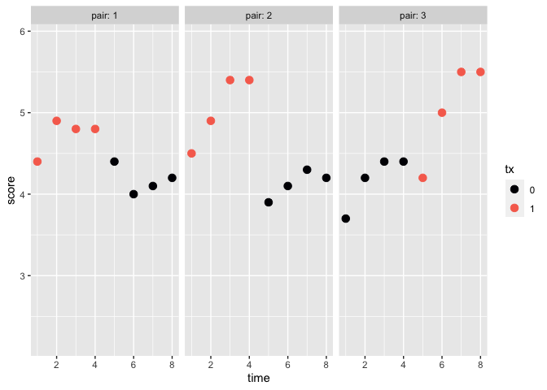

07: Some special designs
================
A Solomon Kurz
2023-11-20

Load the packages.

``` r
library(tidyverse)
library(marginaleffects)
```

## 7.4 $n$ of 1 trials

### 7.4.1 Why undertake $n$ of 1 trials?

Senn introduced an example from Guyatt et al (1990;
<https://doi.org/10.1016/0197-2456(90)90003-K>). The data are not
technically available in a data set, but as is often the case among BA
researchers, Guyatt et al displayed their primary data in a figure
(Figure 1, p. 92). Here’s an approximation of those data.

``` r
guyatt <- tibble(pair = rep(1:3, each = 4 * 2) %>% factor(),
       time = rep(1:8, times = 3),
       tx = rep(c(1:0, 1:0, 0:1), each = 4) %>% factor(),
       score = c(4.4, 4.9, 4.8, 4.8,
                 4.4, 4, 4.1, 4.2,
                 4.5, 4.9, 5.4, 5.4,
                 3.9, 4.1, 4.3, 4.2,
                 3.7, 4.2, 4.4, 4.4, 
                 4.2, 5, 5.5, 5.5)) 

# what?
head(guyatt)
```

    ## # A tibble: 6 × 4
    ##   pair   time tx    score
    ##   <fct> <int> <fct> <dbl>
    ## 1 1         1 1       4.4
    ## 2 1         2 1       4.9
    ## 3 1         3 1       4.8
    ## 4 1         4 1       4.8
    ## 5 1         5 0       4.4
    ## 6 1         6 0       4

Here’s a version of Guyatt et al’s Figure 1 (p. 92 in the original
article).

``` r
guyatt %>% 
  mutate(tx = factor(tx)) %>% 
  
  ggplot(aes(x = time, y = score, color = tx)) +
  geom_point(size = 3) +
  scale_color_viridis_d(option = "A", end = .7) +
  ylim(2.2, 5.9) +
  facet_wrap(~ pair, labeller = label_both, nrow = 1)
```

<!-- -->

Here’s the sample statistics, by `pair` and `tx`.

``` r
guyatt %>% 
  group_by(pair, tx) %>% 
  summarise(m = mean(score),
            s = sd(score))
```

    ## `summarise()` has grouped output by 'pair'. You can override using the
    ## `.groups` argument.

    ## # A tibble: 6 × 4
    ## # Groups:   pair [3]
    ##   pair  tx        m     s
    ##   <fct> <fct> <dbl> <dbl>
    ## 1 1     0      4.18 0.171
    ## 2 1     1      4.72 0.222
    ## 3 2     0      4.12 0.171
    ## 4 2     1      5.05 0.436
    ## 5 3     0      4.18 0.330
    ## 6 3     1      5.05 0.614

If we ignore temporal trends and just treat the data as Gaussian, here’s
how we might fit a simple model.

``` r
fit7.1 <- lm(
  data = guyatt,
  score ~ 1 + tx + pair + tx : pair
)

summary(fit7.1)
```

    ## 
    ## Call:
    ## lm(formula = score ~ 1 + tx + pair + tx:pair, data = guyatt)
    ## 
    ## Residuals:
    ##     Min      1Q  Median      3Q     Max 
    ## -0.8500 -0.1562  0.0500  0.2250  0.4500 
    ## 
    ## Coefficients:
    ##               Estimate Std. Error t value Pr(>|t|)    
    ## (Intercept)  4.175e+00  1.807e-01  23.109 7.84e-15 ***
    ## tx1          5.500e-01  2.555e-01   2.153   0.0452 *  
    ## pair2       -5.000e-02  2.555e-01  -0.196   0.8470    
    ## pair3       -3.464e-17  2.555e-01   0.000   1.0000    
    ## tx1:pair2    3.750e-01  3.613e-01   1.038   0.3131    
    ## tx1:pair3    3.250e-01  3.613e-01   0.899   0.3803    
    ## ---
    ## Signif. codes:  0 '***' 0.001 '**' 0.01 '*' 0.05 '.' 0.1 ' ' 1
    ## 
    ## Residual standard error: 0.3613 on 18 degrees of freedom
    ## Multiple R-squared:  0.6282, Adjusted R-squared:  0.5249 
    ## F-statistic: 6.082 on 5 and 18 DF,  p-value: 0.001821

Here are the group means.

``` r
nd <- guyatt %>% 
  distinct(tx, pair)

predictions(fit7.1, newdata = nd)
```

    ## 
    ##  Estimate Std. Error    z Pr(>|z|)     S 2.5 % 97.5 % tx pair
    ##      4.72      0.181 26.2   <0.001 498.5  4.37   5.08  1    1
    ##      4.17      0.181 23.1   <0.001 390.1  3.82   4.53  0    1
    ##      5.05      0.181 28.0   <0.001 568.8  4.70   5.40  1    2
    ##      4.12      0.181 22.8   <0.001 380.9  3.77   4.48  0    2
    ##      4.17      0.181 23.1   <0.001 390.1  3.82   4.53  0    3
    ##      5.05      0.181 28.0   <0.001 568.8  4.70   5.40  1    3
    ## 
    ## Columns: rowid, estimate, std.error, statistic, p.value, s.value, conf.low, conf.high, tx, pair, score 
    ## Type:  response

We might get a sense of what those look like with a plot.

``` r
predictions(fit7.1, newdata = guyatt) %>% 
  data.frame() %>% 
  
  ggplot(aes(x = time)) +
  geom_ribbon(aes(ymin = conf.low, ymax = conf.high, fill = tx),
              alpha = 1/4) +
  geom_line(aes(y = estimate, color = tx)) +
  geom_point(aes(y = score, color = tx)) +
  scale_fill_viridis_d(option = "A", end = .7) +
  scale_color_viridis_d(option = "A", end = .7) +
  coord_cartesian(xlim = c(1, 8),
                  ylim = c(2.2, 5.9)) +
  facet_wrap(~ pair, labeller = label_both, nrow = 1)
```

<!-- -->

Now we compute the `tx` contrasts, by `pair`.

``` r
nd <- tibble(pair = factor(1:3))

comparisons(fit7.1, newdata = nd, variables = list(tx = "pairwise"))
```

    ## Warning: The `tx` variable is treated as a categorical (factor) variable, but the
    ##   original data is of class NULL. It is safer and faster to convert such
    ##   variables to factor before fitting the model and calling `slopes`
    ##   functions.
    ##   
    ##   This warning appears once per session.

    ## 
    ##  Term Contrast Estimate Std. Error    z Pr(>|z|)    S  2.5 % 97.5 % pair
    ##    tx    1 - 0    0.550      0.255 2.15   0.0313  5.0 0.0492   1.05    1
    ##    tx    1 - 0    0.925      0.255 3.62   <0.001 11.7 0.4242   1.43    2
    ##    tx    1 - 0    0.875      0.255 3.42   <0.001 10.7 0.3742   1.38    3
    ## 
    ## Columns: rowid, term, contrast, estimate, std.error, statistic, p.value, s.value, conf.low, conf.high, predicted_lo, predicted_hi, predicted, pair, score 
    ## Type:  response

Here’s the average across the `pair`-specific contrasts.

``` r
avg_comparisons(fit7.1, 
                newdata = nd, 
                variables = list(tx = "pairwise"),
                # for t-distribution based inference and CIs
                df = insight::get_df(fit7.1))
```

    ## 
    ##  Term Contrast Estimate Std. Error    t Pr(>|t|)    S 2.5 % 97.5 % Df
    ##    tx    1 - 0    0.783      0.148 5.31   <0.001 14.4 0.473   1.09 18
    ## 
    ## Columns: term, contrast, estimate, std.error, statistic, p.value, s.value, conf.low, conf.high, df 
    ## Type:  response

Our $t$-statistic, point estimate, and standard error are all very close
to those Senn reported at the top of page 229.

### 7.4.3 General discussion.

> The analysis of a single $n$ of 1 trial does not require any
> methodology not already available for the analysis of single centre
> parallel group trial. This is because the episodes of treatment of the
> patient may be regarded as replicate observations of the patient in
> the same way as the patients in the single-centre trial may be used as
> replicate observations on that centre. (p. 230)

## 7.5 Bioequivalence studies

## Session info

``` r
sessionInfo()
```

    ## R version 4.3.1 (2023-06-16)
    ## Platform: aarch64-apple-darwin20 (64-bit)
    ## Running under: macOS Ventura 13.4
    ## 
    ## Matrix products: default
    ## BLAS:   /Library/Frameworks/R.framework/Versions/4.3-arm64/Resources/lib/libRblas.0.dylib 
    ## LAPACK: /Library/Frameworks/R.framework/Versions/4.3-arm64/Resources/lib/libRlapack.dylib;  LAPACK version 3.11.0
    ## 
    ## locale:
    ## [1] en_US.UTF-8/en_US.UTF-8/en_US.UTF-8/C/en_US.UTF-8/en_US.UTF-8
    ## 
    ## time zone: America/Chicago
    ## tzcode source: internal
    ## 
    ## attached base packages:
    ## [1] stats     graphics  grDevices utils     datasets  methods   base     
    ## 
    ## other attached packages:
    ##  [1] marginaleffects_0.16.0 lubridate_1.9.2        forcats_1.0.0         
    ##  [4] stringr_1.5.0          dplyr_1.1.2            purrr_1.0.1           
    ##  [7] readr_2.1.4            tidyr_1.3.0            tibble_3.2.1          
    ## [10] ggplot2_3.4.3          tidyverse_2.0.0       
    ## 
    ## loaded via a namespace (and not attached):
    ##  [1] utf8_1.2.3        generics_0.1.3    stringi_1.7.12    hms_1.1.3        
    ##  [5] digest_0.6.33     magrittr_2.0.3    evaluate_0.21     grid_4.3.1       
    ##  [9] timechange_0.2.0  fastmap_1.1.1     backports_1.4.1   fansi_1.0.4      
    ## [13] viridisLite_0.4.2 scales_1.2.1      cli_3.6.1         rlang_1.1.1      
    ## [17] munsell_0.5.0     withr_2.5.1       yaml_2.3.7        tools_4.3.1      
    ## [21] tzdb_0.4.0        checkmate_2.2.0   colorspace_2.1-0  vctrs_0.6.3      
    ## [25] R6_2.5.1          lifecycle_1.0.3   insight_0.19.6    pkgconfig_2.0.3  
    ## [29] pillar_1.9.0      gtable_0.3.4      glue_1.6.2        data.table_1.14.8
    ## [33] Rcpp_1.0.11       xfun_0.40         tidyselect_1.2.0  highr_0.10       
    ## [37] rstudioapi_0.14   knitr_1.43        farver_2.1.1      htmltools_0.5.6  
    ## [41] rmarkdown_2.24    labeling_0.4.3    compiler_4.3.1
