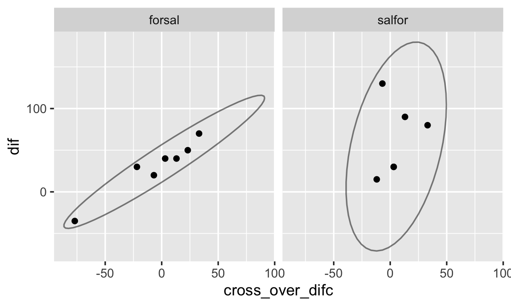

103: Addendum to Chapter 3
================
A Solomon Kurz
2023-11-28

The purpose of this file is to work through some of the models from
Chapter 3, from a potential-outcomes perspective.

Load the packages and make the primary data set `d`.

``` r
# load packages
library(tidyverse)
library(flextable)
library(broom)
library(marginaleffects)
library(lme4)
library(tidybayes)
library(brms)

# Input data
n1 <- 7 #number of patients first sequence
n2 <- 6 #number of patients second sequence
n <- n1 + n2

seqn <- factor((c(rep(1,n1), rep(2,n2), rep(1,n1), rep(2,n2))),
               labels = c("forsal","salfor")) #sequences

patient <- factor(rep(c("1","4","6","7","10","11","14","2","3","5","9","12","13"), 2),
                  # levels = 1:14
                  levels = c(1:7, 9:14)) 

# not in the original code, but here is sex
sex <- c("male", "female", "female", "male", "male", "female", "male", "male", "male", "female", "male", "male", "male")

period <- factor(c(rep("1", n), rep("2", n)))

treat <- factor(c(rep(2, n1), rep(1, n2), rep(1, n1), rep(2, n2)),
                labels = c("salbutamol", "formoterol"))

#Note: "formoterol" is coded second level of factor
pef <- c(310, 310,370,410,250,380,330,370,310,380,290,260,90,270,260,300,390,210,350,365,385,400,410,320,340,220)
base <- c(290,300,250,390,250,365,190,350,350,350,280,270,220,270,270,210,390,240,380,260,345,370,360,290,310,220)

d <- tibble(
  seqn = seqn,
  patient = patient,
  period = period,
  treat = treat,
  pef = pef,
  base = base
) %>% 
  arrange(period, as.double(as.character(patient))) %>% 
  mutate(sex = c(sex, sex),
         basec = base - mean(base))

# what?
head(d)
```

    ## # A tibble: 6 × 8
    ##   seqn   patient period treat        pef  base sex     basec
    ##   <fct>  <fct>   <fct>  <fct>      <dbl> <dbl> <chr>   <dbl>
    ## 1 forsal 1       1      formoterol   310   290 male    -8.85
    ## 2 salfor 2       1      salbutamol   370   350 female  51.2 
    ## 3 salfor 3       1      salbutamol   310   350 female  51.2 
    ## 4 forsal 4       1      formoterol   310   300 male     1.15
    ## 5 salfor 5       1      salbutamol   380   350 male    51.2 
    ## 6 forsal 6       1      formoterol   370   250 female -48.8

We’re also going to want a version of the data set that uses the basic
estimator `formoterol - salbutamol` as the criterion, called `dif`. For
this data set, we’ll also include the first measurement of the baseline
covariate `base` (i.e., for which `period == 1`).

``` r
d2 <- d %>% 
  select(patient, seqn, treat, pef) %>% 
  pivot_wider(names_from = treat, values_from = pef) %>% 
  mutate(dif = formoterol - salbutamol) %>% 
  left_join(d %>% 
              filter(period == 1) %>% 
              select(patient, base),
            by = "patient") %>% 
  left_join(d %>% 
              select(patient, seqn, period, base) %>% 
              pivot_wider(names_from = period, values_from = base) %>%
              mutate(cross_over_dif = ifelse(seqn == "forsal", `1` - `2`, `2` - `1`)) %>% 
              select(patient, cross_over_dif),
            by = "patient") %>% 
  mutate(basec = base - mean(base),
         cross_over_difc = cross_over_dif - mean(cross_over_dif))

# what?
print(d2)
```

    ## # A tibble: 13 × 9
    ##    patient seqn   formoterol salbutamol   dif  base cross_over_dif   basec cross_over_difc
    ##    <fct>   <fct>       <dbl>      <dbl> <dbl> <dbl>          <dbl>   <dbl>           <dbl>
    ##  1 1       forsal        310        270    40   290             20   -6.54           13.1 
    ##  2 2       salfor        385        370    15   350             -5   53.5           -11.9 
    ##  3 3       salfor        400        310    90   350             20   53.5            13.1 
    ##  4 4       forsal        310        260    50   300             30    3.46           23.1 
    ##  5 5       salfor        410        380    30   350             10   53.5             3.08
    ##  6 6       forsal        370        300    70   250             40  -46.5            33.1 
    ##  7 7       forsal        410        390    20   390              0   93.5            -6.92
    ##  8 9       salfor        320        290    30   280             10  -16.5             3.08
    ##  9 10      forsal        250        210    40   250             10  -46.5             3.08
    ## 10 11      forsal        380        350    30   365            -15   68.5           -21.9 
    ## 11 12      salfor        340        260    80   270             40  -26.5            33.1 
    ## 12 13      salfor        220         90   130   220              0  -76.5            -6.92
    ## 13 14      forsal        330        365   -35   190            -70 -107.            -76.9

## Dif ANOVA

We might fit simple ANOVA for the difference score as

$$
\begin{align*}
\text{dif}_i & \sim \mathcal N(\mu_i, \sigma) \\
\mu_i & = \beta_0 + \beta_1 \text{seqn}_i,
\end{align*}
$$

where $\beta_0$ is the formoterol-minus-salbutamol difference for those
in the `forsal` group, and $\beta_1$ is the difference in that treatment
difference for those in the `salfor` group, relative to those in the
default `forsal` group.

Here’s how to fit the model with OLS via `lm()`.

``` r
fit103.1 <- lm(
  data = d2,
  dif ~ seqn
)

summary(fit103.1)
```

    ## 
    ## Call:
    ## lm(formula = dif ~ seqn, data = d2)
    ## 
    ## Residuals:
    ##     Min      1Q  Median      3Q     Max 
    ## -65.714 -32.500   9.286  19.286  67.500 
    ## 
    ## Coefficients:
    ##             Estimate Std. Error t value Pr(>|t|)  
    ## (Intercept)    30.71      14.64   2.098   0.0598 .
    ## seqnsalfor     31.79      21.55   1.475   0.1683  
    ## ---
    ## Signif. codes:  0 '***' 0.001 '**' 0.01 '*' 0.05 '.' 0.1 ' ' 1
    ## 
    ## Residual standard error: 38.74 on 11 degrees of freedom
    ## Multiple R-squared:  0.1651, Adjusted R-squared:  0.08918 
    ## F-statistic: 2.175 on 1 and 11 DF,  p-value: 0.1683

Here are the two treatment effects, and their unweighted average, using
the simple $\beta$ coefficient method.

``` r
# define the data grid
nd <- d2 %>% 
  distinct(seqn)

# ATE by seqn
predictions(fit103.1, newdata = nd)
```

    ## 
    ##  Estimate Std. Error    z Pr(>|z|)    S 2.5 % 97.5 %   seqn
    ##      30.7       14.6 2.10   0.0359  4.8  2.02   59.4 forsal
    ##      62.5       15.8 3.95   <0.001 13.7 31.50   93.5 salfor
    ## 
    ## Columns: rowid, estimate, std.error, statistic, p.value, s.value, conf.low, conf.high, seqn, dif 
    ## Type:  response

``` r
# unweighted ATE
avg_predictions(fit103.1, newdata = nd)
```

    ## 
    ##  Estimate Std. Error    z Pr(>|z|)    S 2.5 % 97.5 %
    ##      46.6       10.8 4.32   <0.001 16.0  25.5   67.7
    ## 
    ## Columns: estimate, std.error, statistic, p.value, s.value, conf.low, conf.high 
    ## Type:  response

For the counterfactual potential outcomes, we’ll need to update our `nd`
predictor grid to include both levels of `seqn` for each of the 13
levels of `patient`.

``` r
nd <- crossing(
  patient = d2 %>% distinct(patient) %>% pull(),
  seqn    = d2 %>% distinct(seqn)    %>% pull())

# what?
head(nd)
```

    ## # A tibble: 6 × 2
    ##   patient seqn  
    ##   <fct>   <fct> 
    ## 1 1       forsal
    ## 2 1       salfor
    ## 3 2       forsal
    ## 4 2       salfor
    ## 5 3       forsal
    ## 6 3       salfor

Here are the model-implied causal effects for each of the 26
counterfactual levels.

``` r
predictions(fit103.1, newdata = nd)
```

    ## 
    ##  Estimate Std. Error    z Pr(>|z|)    S 2.5 % 97.5 % patient   seqn
    ##      30.7       14.6 2.10   0.0359  4.8  2.02   59.4      1  forsal
    ##      62.5       15.8 3.95   <0.001 13.7 31.50   93.5      1  salfor
    ##      30.7       14.6 2.10   0.0359  4.8  2.02   59.4      2  forsal
    ##      62.5       15.8 3.95   <0.001 13.7 31.50   93.5      2  salfor
    ##      30.7       14.6 2.10   0.0359  4.8  2.02   59.4      3  forsal
    ##      62.5       15.8 3.95   <0.001 13.7 31.50   93.5      3  salfor
    ##      30.7       14.6 2.10   0.0359  4.8  2.02   59.4      4  forsal
    ##      62.5       15.8 3.95   <0.001 13.7 31.50   93.5      4  salfor
    ##      30.7       14.6 2.10   0.0359  4.8  2.02   59.4      5  forsal
    ##      62.5       15.8 3.95   <0.001 13.7 31.50   93.5      5  salfor
    ##      30.7       14.6 2.10   0.0359  4.8  2.02   59.4      6  forsal
    ##      62.5       15.8 3.95   <0.001 13.7 31.50   93.5      6  salfor
    ##      30.7       14.6 2.10   0.0359  4.8  2.02   59.4      7  forsal
    ##      62.5       15.8 3.95   <0.001 13.7 31.50   93.5      7  salfor
    ##      30.7       14.6 2.10   0.0359  4.8  2.02   59.4      9  forsal
    ##      62.5       15.8 3.95   <0.001 13.7 31.50   93.5      9  salfor
    ##      30.7       14.6 2.10   0.0359  4.8  2.02   59.4      10 forsal
    ##      62.5       15.8 3.95   <0.001 13.7 31.50   93.5      10 salfor
    ##      30.7       14.6 2.10   0.0359  4.8  2.02   59.4      11 forsal
    ##      62.5       15.8 3.95   <0.001 13.7 31.50   93.5      11 salfor
    ##      30.7       14.6 2.10   0.0359  4.8  2.02   59.4      12 forsal
    ##      62.5       15.8 3.95   <0.001 13.7 31.50   93.5      12 salfor
    ##      30.7       14.6 2.10   0.0359  4.8  2.02   59.4      13 forsal
    ##      62.5       15.8 3.95   <0.001 13.7 31.50   93.5      13 salfor
    ##      30.7       14.6 2.10   0.0359  4.8  2.02   59.4      14 forsal
    ##      62.5       15.8 3.95   <0.001 13.7 31.50   93.5      14 salfor
    ## 
    ## Columns: rowid, estimate, std.error, statistic, p.value, s.value, conf.low, conf.high, patient, seqn, dif 
    ## Type:  response

Here are the ATEs, by `seqn`.

``` r
avg_predictions(fit103.1, newdata = nd, by = "seqn")
```

    ## 
    ##    seqn Estimate Std. Error    z Pr(>|z|)    S 2.5 % 97.5 %
    ##  forsal     30.7       14.6 2.10   0.0359  4.8  2.02   59.4
    ##  salfor     62.5       15.8 3.95   <0.001 13.7 31.50   93.5
    ## 
    ## Columns: seqn, estimate, std.error, statistic, p.value, s.value, conf.low, conf.high 
    ## Type:  response

Here’s the ATE.

``` r
avg_predictions(fit103.1, newdata = nd)
```

    ## 
    ##  Estimate Std. Error    z Pr(>|z|)    S 2.5 % 97.5 %
    ##      46.6       10.8 4.32   <0.001 16.0  25.5   67.7
    ## 
    ## Columns: estimate, std.error, statistic, p.value, s.value, conf.low, conf.high 
    ## Type:  response

## Dif ANCOVA

Here we’ll fit two versions of the dif-ANCOVA. The first will be with
the covariate `basec`. The second will be with the covariate
`cross_over_difc`.

### `basec` as covariate.

We might look at the relation between `basec` and our criterion `dif` in
a faceted scatter plot.

``` r
d2 %>% 
  ggplot(aes(x = basec, y = dif)) +
  geom_point() +
  stat_ellipse(alpha = 1/2) +
  facet_wrap(~ seqn)
```


We added 95% CI elipses for good measure.

We might fit simple ANCOVA for the difference score as

$$
\begin{align*}
\text{dif}_i & \sim \mathcal N(\mu_i, \sigma) \\
\mu_i & = \beta_0 + \beta_1 \text{seqn}_i + \beta_2 \text{basec}_i,
\end{align*}
$$

Here’s how to fit the model with OLS via `lm()`.

``` r
fit103.2 <- lm(
  data = d2,
  dif ~ seqn + basec
)

summary(fit103.2)
```

    ## 
    ## Call:
    ## lm(formula = dif ~ seqn + basec, data = d2)
    ## 
    ## Residuals:
    ##     Min      1Q  Median      3Q     Max 
    ## -75.324 -28.047   6.374  20.172  59.549 
    ## 
    ## Coefficients:
    ##             Estimate Std. Error t value Pr(>|t|)  
    ## (Intercept) 30.15856   15.21027   1.983   0.0755 .
    ## seqnsalfor  32.98979   22.45881   1.469   0.1726  
    ## basec       -0.09542    0.19122  -0.499   0.6286  
    ## ---
    ## Signif. codes:  0 '***' 0.001 '**' 0.01 '*' 0.05 '.' 0.1 ' ' 1
    ## 
    ## Residual standard error: 40.13 on 10 degrees of freedom
    ## Multiple R-squared:  0.1854, Adjusted R-squared:  0.02244 
    ## F-statistic: 1.138 on 2 and 10 DF,  p-value: 0.3588

Now we’ll use functions from **marginaleffects** to compute the ATE by
`seqn` (technically two CATEs), and the overall ATE.

``` r
# define the data grid
nd <- d2 %>% 
  distinct(seqn) %>% 
  mutate(basec = 0)

# ATE by seqn
predictions(fit103.2, newdata = nd)
```

    ## 
    ##  Estimate Std. Error    z Pr(>|z|)    S  2.5 % 97.5 %   seqn basec
    ##      30.2       15.2 1.98   0.0474  4.4  0.347   60.0 forsal     0
    ##      63.1       16.4 3.84   <0.001 13.0 30.934   95.4 salfor     0
    ## 
    ## Columns: rowid, estimate, std.error, statistic, p.value, s.value, conf.low, conf.high, seqn, basec, dif 
    ## Type:  response

``` r
# unweighted ATE
avg_predictions(fit103.2, newdata = nd)
```

    ## 
    ##  Estimate Std. Error    z Pr(>|z|)    S 2.5 % 97.5 %
    ##      46.7       11.2 4.18   <0.001 15.1  24.8   68.5
    ## 
    ## Columns: estimate, std.error, statistic, p.value, s.value, conf.low, conf.high 
    ## Type:  response

### `cross_over_difc` as covariate.

Now look at the relation between `cross_over_difc` and our criterion
`dif` in a faceted scatter plot.

``` r
d2 %>% 
  ggplot(aes(x = cross_over_difc, y = dif)) +
  geom_point() +
  stat_ellipse(alpha = 1/2) +
  facet_wrap(~ seqn)
```



We might fit simple ANCOVA for the difference score with
`cross_over_difc` as the covariate as

$$
\begin{align*}
\text{dif}_i & \sim \mathcal N(\mu_i, \sigma) \\
\mu_i & = \beta_0 + \beta_1 \text{seqn}_i + \beta_2 \text{cross over difc}_i,
\end{align*}
$$

Here’s how to fit the model with the `lm()` function.

``` r
fit103.3 <- lm(
  data = d2,
  dif ~ seqn + cross_over_difc
)

summary(fit103.3)
```

    ## 
    ## Call:
    ## lm(formula = dif ~ seqn + cross_over_difc, data = d2)
    ## 
    ## Residuals:
    ##     Min      1Q  Median      3Q     Max 
    ## -32.805  -8.915  -5.135   7.497  77.996 
    ## 
    ## Coefficients:
    ##                 Estimate Std. Error t value Pr(>|t|)  
    ## (Intercept)      34.7283    11.9901   2.896   0.0159 *
    ## seqnsalfor       23.0887    17.8208   1.296   0.2242  
    ## cross_over_difc   0.8397     0.3248   2.585   0.0272 *
    ## ---
    ## Signif. codes:  0 '***' 0.001 '**' 0.01 '*' 0.05 '.' 0.1 ' ' 1
    ## 
    ## Residual standard error: 31.46 on 10 degrees of freedom
    ## Multiple R-squared:  0.4996, Adjusted R-squared:  0.3995 
    ## F-statistic: 4.992 on 2 and 10 DF,  p-value: 0.03138

Use `predictions()` to compute the CATEs and then use
`avg_predictions()` to compute the ATE.

``` r
# update the data grid to include cross_over_difc
nd <- nd %>% 
  mutate(cross_over_difc = 0)

# ATE by seqn
predictions(fit103.3, newdata = nd)
```

    ## 
    ##  Estimate Std. Error    z Pr(>|z|)    S 2.5 % 97.5 %   seqn basec cross_over_difc
    ##      34.7         12 2.90  0.00377  8.0  11.2   58.2 forsal     0               0
    ##      57.8         13 4.46  < 0.001 16.9  32.4   83.2 salfor     0               0
    ## 
    ## Columns: rowid, estimate, std.error, statistic, p.value, s.value, conf.low, conf.high, seqn, basec, cross_over_difc, dif 
    ## Type:  response

``` r
# unweighted ATE
avg_predictions(fit103.3, newdata = nd)
```

    ## 
    ##  Estimate Std. Error    z Pr(>|z|)    S 2.5 % 97.5 %
    ##      46.3       8.75 5.29   <0.001 22.9  29.1   63.4
    ## 
    ## Columns: estimate, std.error, statistic, p.value, s.value, conf.low, conf.high 
    ## Type:  response

We might want to compare the point estimates and standard errors for the
ATE across the ANOVA and two ANCOVAs.

``` r
bind_rows(
  avg_predictions(fit103.1, newdata = nd),
  avg_predictions(fit103.2, newdata = nd),
  avg_predictions(fit103.3, newdata = nd)
) %>% 
  data.frame() %>% 
  mutate(model = c("ANOVA", "ANCOVA", "ANCOVA"),
         covariate = c("none", "basec", "cross_over_difc")) %>% 
  select(model, covariate, estimate, std.error) %>% 
  mutate_if(is.double, round, digits = 2) %>% 
  flextable()
```

<div class="tabwid"><style>.cl-c3bdb32c{}.cl-c3b62b84{font-family:'Helvetica';font-size:11pt;font-weight:normal;font-style:normal;text-decoration:none;color:rgba(0, 0, 0, 1.00);background-color:transparent;}.cl-c3bc04dc{margin:0;text-align:left;border-bottom: 0 solid rgba(0, 0, 0, 1.00);border-top: 0 solid rgba(0, 0, 0, 1.00);border-left: 0 solid rgba(0, 0, 0, 1.00);border-right: 0 solid rgba(0, 0, 0, 1.00);padding-bottom:5pt;padding-top:5pt;padding-left:5pt;padding-right:5pt;line-height: 1;background-color:transparent;}.cl-c3bc04dd{margin:0;text-align:right;border-bottom: 0 solid rgba(0, 0, 0, 1.00);border-top: 0 solid rgba(0, 0, 0, 1.00);border-left: 0 solid rgba(0, 0, 0, 1.00);border-right: 0 solid rgba(0, 0, 0, 1.00);padding-bottom:5pt;padding-top:5pt;padding-left:5pt;padding-right:5pt;line-height: 1;background-color:transparent;}.cl-c3bc0d06{width:0.75in;background-color:transparent;vertical-align: middle;border-bottom: 1.5pt solid rgba(102, 102, 102, 1.00);border-top: 1.5pt solid rgba(102, 102, 102, 1.00);border-left: 0 solid rgba(0, 0, 0, 1.00);border-right: 0 solid rgba(0, 0, 0, 1.00);margin-bottom:0;margin-top:0;margin-left:0;margin-right:0;}.cl-c3bc0d07{width:0.75in;background-color:transparent;vertical-align: middle;border-bottom: 1.5pt solid rgba(102, 102, 102, 1.00);border-top: 1.5pt solid rgba(102, 102, 102, 1.00);border-left: 0 solid rgba(0, 0, 0, 1.00);border-right: 0 solid rgba(0, 0, 0, 1.00);margin-bottom:0;margin-top:0;margin-left:0;margin-right:0;}.cl-c3bc0d10{width:0.75in;background-color:transparent;vertical-align: middle;border-bottom: 0 solid rgba(0, 0, 0, 1.00);border-top: 0 solid rgba(0, 0, 0, 1.00);border-left: 0 solid rgba(0, 0, 0, 1.00);border-right: 0 solid rgba(0, 0, 0, 1.00);margin-bottom:0;margin-top:0;margin-left:0;margin-right:0;}.cl-c3bc0d11{width:0.75in;background-color:transparent;vertical-align: middle;border-bottom: 0 solid rgba(0, 0, 0, 1.00);border-top: 0 solid rgba(0, 0, 0, 1.00);border-left: 0 solid rgba(0, 0, 0, 1.00);border-right: 0 solid rgba(0, 0, 0, 1.00);margin-bottom:0;margin-top:0;margin-left:0;margin-right:0;}.cl-c3bc0d12{width:0.75in;background-color:transparent;vertical-align: middle;border-bottom: 1.5pt solid rgba(102, 102, 102, 1.00);border-top: 0 solid rgba(0, 0, 0, 1.00);border-left: 0 solid rgba(0, 0, 0, 1.00);border-right: 0 solid rgba(0, 0, 0, 1.00);margin-bottom:0;margin-top:0;margin-left:0;margin-right:0;}.cl-c3bc0d1a{width:0.75in;background-color:transparent;vertical-align: middle;border-bottom: 1.5pt solid rgba(102, 102, 102, 1.00);border-top: 0 solid rgba(0, 0, 0, 1.00);border-left: 0 solid rgba(0, 0, 0, 1.00);border-right: 0 solid rgba(0, 0, 0, 1.00);margin-bottom:0;margin-top:0;margin-left:0;margin-right:0;}</style><table data-quarto-disable-processing='true' class='cl-c3bdb32c'><thead><tr style="overflow-wrap:break-word;"><th class="cl-c3bc0d06"><p class="cl-c3bc04dc"><span class="cl-c3b62b84">model</span></p></th><th class="cl-c3bc0d06"><p class="cl-c3bc04dc"><span class="cl-c3b62b84">covariate</span></p></th><th class="cl-c3bc0d07"><p class="cl-c3bc04dd"><span class="cl-c3b62b84">estimate</span></p></th><th class="cl-c3bc0d07"><p class="cl-c3bc04dd"><span class="cl-c3b62b84">std.error</span></p></th></tr></thead><tbody><tr style="overflow-wrap:break-word;"><td class="cl-c3bc0d10"><p class="cl-c3bc04dc"><span class="cl-c3b62b84">ANOVA</span></p></td><td class="cl-c3bc0d10"><p class="cl-c3bc04dc"><span class="cl-c3b62b84">none</span></p></td><td class="cl-c3bc0d11"><p class="cl-c3bc04dd"><span class="cl-c3b62b84">46.61</span></p></td><td class="cl-c3bc0d11"><p class="cl-c3bc04dd"><span class="cl-c3b62b84">10.78</span></p></td></tr><tr style="overflow-wrap:break-word;"><td class="cl-c3bc0d10"><p class="cl-c3bc04dc"><span class="cl-c3b62b84">ANCOVA</span></p></td><td class="cl-c3bc0d10"><p class="cl-c3bc04dc"><span class="cl-c3b62b84">basec</span></p></td><td class="cl-c3bc0d11"><p class="cl-c3bc04dd"><span class="cl-c3b62b84">46.65</span></p></td><td class="cl-c3bc0d11"><p class="cl-c3bc04dd"><span class="cl-c3b62b84">11.16</span></p></td></tr><tr style="overflow-wrap:break-word;"><td class="cl-c3bc0d12"><p class="cl-c3bc04dc"><span class="cl-c3b62b84">ANCOVA</span></p></td><td class="cl-c3bc0d12"><p class="cl-c3bc04dc"><span class="cl-c3b62b84">cross_over_difc</span></p></td><td class="cl-c3bc0d1a"><p class="cl-c3bc04dd"><span class="cl-c3b62b84">46.27</span></p></td><td class="cl-c3bc0d1a"><p class="cl-c3bc04dd"><span class="cl-c3b62b84">8.75</span></p></td></tr></tbody></table></div>

Backing up a bit, it might be helpful if we computed and displayed the
counterfactual predictions and ATEs, by model. First, we need a new
predictor grid with counterfactual `seqn` values for each level of
`patient` that also includes their baseline covariate values for `basec`
and `cross_over_difc`. We’ll call it `nd_patient`.

``` r
nd_patient <- d2 %>% 
  distinct(patient, basec, cross_over_difc) %>% 
  expand_grid(seqn = distinct(d2, seqn) %>% pull())

# what?
head(nd_patient)
```

    ## # A tibble: 6 × 4
    ##   patient basec cross_over_difc seqn  
    ##   <fct>   <dbl>           <dbl> <fct> 
    ## 1 1       -6.54            13.1 forsal
    ## 2 1       -6.54            13.1 salfor
    ## 3 2       53.5            -11.9 forsal
    ## 4 2       53.5            -11.9 salfor
    ## 5 3       53.5             13.1 forsal
    ## 6 3       53.5             13.1 salfor

Here are the person-specific CATEs, by model.

``` r
formulas <- c("dif ~ seqn", "dif ~ seqn + basec", "dif ~ seqn + cross_over_difc")

bind_rows(
  predictions(fit103.1, newdata = nd_patient),
  predictions(fit103.2, newdata = nd_patient),
  predictions(fit103.3, newdata = nd_patient)
) %>% 
  data.frame() %>% 
  mutate(formula = rep(formulas, each = n() / 3)) %>% 
  group_by(formula, seqn) %>% 
  arrange(estimate) %>% 
  mutate(rank = 1:n()) %>% 
  
  ggplot(aes(x = estimate, y = rank, color = seqn)) +
  geom_vline(xintercept = 0, color = "white") +
  geom_interval(aes(xmin = conf.low, xmax = conf.high),
                position = position_dodge(width = -0.25),
                size = 1/5) +
  geom_point(aes(shape = seqn),
             size = 2,
             position = position_dodge(width = -0.25)) +
  scale_color_viridis_d(NULL, option = "A", begin = .3, end = .6,
                        labels = scales::parse_format()) +
  scale_shape_manual(NULL, values = c(20, 18),
                     labels = scales::parse_format()) +
  scale_y_discrete(breaks = NULL) +
  labs(subtitle = "Counterfactual predictions",
       x = "dif",
       y = "patient (ranked within model)") +
  xlim(-85, 135) +
  theme(legend.background = element_blank(),
        panel.grid = element_blank()) +
  facet_wrap(~ formula, nrow = 1)
```


Here are the person-specific ATEs, by model.

``` r
bind_rows(
  avg_predictions(fit103.1, newdata = nd_patient, by = "patient"),
  avg_predictions(fit103.2, newdata = nd_patient, by = "patient"),
  avg_predictions(fit103.3, newdata = nd_patient, by = "patient")
)%>% 
  data.frame() %>% 
  mutate(formula = rep(formulas, each = n() / 3)) %>% 
  group_by(formula) %>% 
  arrange(estimate) %>% 
  mutate(rank = 1:n()) %>% 
  
  ggplot(aes(x = estimate, y = rank)) +
  geom_vline(xintercept = 0, color = "white") +
  geom_interval(aes(xmin = conf.low, xmax = conf.high),
                size = 1/5) +
  geom_point() +
  scale_y_discrete(breaks = NULL) +
  labs(subtitle = "Treatment effects",
       x = "dif",
       y = "patient (ranked within model)") +
  xlim(-85, 135) +
  theme(panel.grid = element_blank()) +
  facet_wrap(~ formula, nrow = 1)
```


Finally, here’s a coefficient plot for the ATE from each model.

``` r
bind_rows(
  avg_predictions(fit103.1, newdata = nd),
  avg_predictions(fit103.2, newdata = nd),
  avg_predictions(fit103.3, newdata = nd)
) %>% 
  data.frame() %>% 
  mutate(model = c("ANOVA", "ANCOVA", "ANCOVA"),
         covariate = c("none", "basec", "cross_over_difc"),
         formula = formulas) %>% 
  
  ggplot(aes(x = estimate, xmin = conf.low, xmax = conf.high, y = formula)) +
  geom_vline(xintercept = 0, color = "white") +
  geom_pointrange() +
  labs(subtitle = "Average treatment effects",
       x = "dif",
       y = NULL) +
  xlim(-85, 135) +
  theme(axis.text.y = element_text(hjust = 0),
        panel.grid = element_blank()) 
```


## `pef` ANOVA

### Naive version.

We might define the naive version of the simple ANOVA for the `pef`
score as

$$
\begin{align*}
\text{pef}_i & \sim \mathcal N(\mu_i, \sigma) \\
\mu_i & = \beta_0 + \beta_1 \text{treat}_i + \beta_2 \text{period}_i + \beta_3 \text{treat}_i\text{period}_i,
\end{align*}
$$

which should perfectly reproduce the sample means for all 4 levels of
the `treat`-by-`period` grid. Here’s how to fit the model with OLS.

``` r
fit103.4 <- lm(
  data = d,
  pef ~ treat + period + treat : period
)

summary(fit103.4)
```

    ## 
    ## Call:
    ## lm(formula = pef ~ treat + period + treat:period, data = d)
    ## 
    ## Residuals:
    ##      Min       1Q   Median       3Q      Max 
    ## -193.333  -27.143    0.417   51.518   96.667 
    ## 
    ## Coefficients:
    ##                         Estimate Std. Error t value Pr(>|t|)    
    ## (Intercept)               283.33      30.54   9.277 4.65e-09 ***
    ## treatformoterol            53.81      41.62   1.293    0.209    
    ## period2                    23.10      41.62   0.555    0.585    
    ## treatformoterol:period2   -14.40      58.86  -0.245    0.809    
    ## ---
    ## Signif. codes:  0 '***' 0.001 '**' 0.01 '*' 0.05 '.' 0.1 ' ' 1
    ## 
    ## Residual standard error: 74.81 on 22 degrees of freedom
    ## Multiple R-squared:  0.1109, Adjusted R-squared:  -0.01036 
    ## F-statistic: 0.9145 on 3 and 22 DF,  p-value: 0.4501

Here we compute the 4 model-based means.

``` r
nd <- d %>% 
  distinct(treat, period) %>% 
  arrange(treat, period)

# default SEs
predictions(fit103.4, newdata = nd) %>% 
  data.frame() %>% 
  select(treat, period, estimate, std.error, contains("conf"))
```

    ##        treat period estimate std.error conf.low conf.high
    ## 1 salbutamol      1 283.3333  30.54216 223.4718  343.1949
    ## 2 salbutamol      2 306.4286  28.27655 251.0076  361.8496
    ## 3 formoterol      1 337.1429  28.27655 281.7218  392.5639
    ## 4 formoterol      2 345.8333  30.54216 285.9718  405.6949

We might check those with the sample statistics.

``` r
d %>% 
  group_by(treat, period) %>% 
  summarise(mean = mean(pef))
```

    ## # A tibble: 4 × 3
    ## # Groups:   treat [2]
    ##   treat      period  mean
    ##   <fct>      <fct>  <dbl>
    ## 1 salbutamol 1       283.
    ## 2 salbutamol 2       306.
    ## 3 formoterol 1       337.
    ## 4 formoterol 2       346.

All is good. They’re the same.

A limitation with this approach, so far, is the standard errors (and
thus the 95% CIs and so on) are based on the assumption the errors are
independent. But we know that because of the cross-over design, the
errors are correlated within each level of `patient`. We can accommodate
that complication by using robust sandwich standard errors by setting
`vcov = "HC3"` within the various **marginaleffects** functions. For
example, here are those 4 predictions with those sandwich standard
errors.

``` r
# robust sandwich SEs
predictions(fit103.4, newdata = nd, vcov = "HC3") %>% 
  data.frame() %>% 
  select(treat, period, estimate, std.error, contains("conf"))
```

    ##        treat period estimate std.error conf.low conf.high
    ## 1 salbutamol      1 283.3333  47.13102 190.9582  375.7084
    ## 2 salbutamol      2 306.4286  26.42374 254.6390  358.2182
    ## 3 formoterol      1 337.1429  21.94871 294.1242  380.1615
    ## 4 formoterol      2 345.8333  31.69911 283.7042  407.9624

You’ll note the point estimates are all the same. But the standard
errors are all larger, now, and the 95% CIs are wider.

Here are the treatment effects, by `period` (i.e., the CATEs), without
and with robust sandwich standard errors.

``` r
# default SEs
comparisons(fit103.4, newdata = nd, variable = "treat", by = "period")
```

    ## 
    ##   Term                            Contrast period Estimate Std. Error     z Pr(>|z|)   S 2.5 % 97.5 %
    ##  treat mean(formoterol) - mean(salbutamol)      1     53.8       41.6 1.293    0.196 2.4 -27.8    135
    ##  treat mean(formoterol) - mean(salbutamol)      2     39.4       41.6 0.947    0.344 1.5 -42.2    121
    ## 
    ## Columns: term, contrast, period, estimate, std.error, statistic, p.value, s.value, conf.low, conf.high, predicted_lo, predicted_hi, predicted 
    ## Type:  response

``` r
# robust sandwich SEs
comparisons(fit103.4, newdata = nd, variable = "treat", by = "period", vcov = "HC3")
```

    ## 
    ##   Term                            Contrast period Estimate Std. Error     z Pr(>|z|)   S 2.5 % 97.5 %
    ##  treat mean(formoterol) - mean(salbutamol)      1     53.8       52.0 1.035    0.301 1.7 -48.1    156
    ##  treat mean(formoterol) - mean(salbutamol)      2     39.4       41.3 0.955    0.340 1.6 -41.5    120
    ## 
    ## Columns: term, contrast, period, estimate, std.error, statistic, p.value, s.value, conf.low, conf.high, predicted_lo, predicted_hi, predicted 
    ## Type:  response

Note how the SEs range from 41 to 52 for the CATEs. Here are the ATEs
(averaging over `period`).

``` r
# default SEs
avg_comparisons(fit103.4, newdata = nd, variable = "treat")
```

    ## 
    ##   Term                Contrast Estimate Std. Error    z Pr(>|z|)   S 2.5 % 97.5 %
    ##  treat formoterol - salbutamol     46.6       29.4 1.58    0.113 3.1 -11.1    104
    ## 
    ## Columns: term, contrast, estimate, std.error, statistic, p.value, s.value, conf.low, conf.high 
    ## Type:  response

``` r
# robust sandwich SEs
avg_comparisons(fit103.4, newdata = nd, variable = "treat", vcov = "HC3")
```

    ## 
    ##   Term                Contrast Estimate Std. Error   z Pr(>|z|)   S 2.5 % 97.5 %
    ##  treat formoterol - salbutamol     46.6       33.2 1.4     0.16 2.6 -18.4    112
    ## 
    ## Columns: term, contrast, estimate, std.error, statistic, p.value, s.value, conf.low, conf.high 
    ## Type:  response

The SEs for the ATE are 29 and 33, depending on whether you want them
robust (which you probably do in this case). Regardless, note how much
smaller they are compared to the CATEs.

Anyway, note how the point estimate for the ATE from this model is the
same as the point estimate for the ATE from the dif-ANOVA model
`fit103.1`.

``` r
avg_predictions(fit103.1, newdata = d2 %>% distinct(seqn))
```

    ## 
    ##  Estimate Std. Error    z Pr(>|z|)    S 2.5 % 97.5 %
    ##      46.6       10.8 4.32   <0.001 16.0  25.5   67.7
    ## 
    ## Columns: estimate, std.error, statistic, p.value, s.value, conf.low, conf.high 
    ## Type:  response

Though the point estimates are the same, the SE for the dif-ANOVA model
is much smaller. Turns out this naive version of the `pef` model isn’t
great at handling the dependencies caused by the cross-over design.
We’ll explore a better model next.

### Better version.

We can improve our model for the `pef` score by adding dummy variables
for the various levels of `patient`, where the first level of `patient`
will act as the reference category. That might look like

$$
\begin{align*}
\text{pef}_i & \sim \mathcal N(\mu_i, \sigma) \\
\mu_i & = \beta_0 \\
& \;\;\; + \beta_1 \text{patient}_{2, i}, \dots, \beta_{12} \text{patient}_{14, i} \\
& \;\;\; + \beta_{13} \text{treat}_i + \beta_{14} \text{period}_i.
\end{align*}
$$

Though this model does require a large number of dummy variables, it
does appropriately handle the dependencies causes by the cross-over
design. When fitting such a model with `lm()`, make sure the `patient`
variable is saved as a factor, or at least as a character variable.

``` r
fit103.5 <- lm(
  data = d,
  pef ~ patient + treat + period
)

summary(fit103.5)
```

    ## 
    ## Call:
    ## lm(formula = pef ~ patient + treat + period, data = d)
    ## 
    ## Residuals:
    ##    Min     1Q Median     3Q    Max 
    ## -33.75 -12.72   0.00  12.72  33.75 
    ## 
    ## Coefficients:
    ##                 Estimate Std. Error t value Pr(>|t|)    
    ## (Intercept)       258.75      20.92  12.367 8.53e-08 ***
    ## patient2           87.50      27.39   3.194 0.008543 ** 
    ## patient3           65.00      27.39   2.373 0.036967 *  
    ## patient4           -5.00      27.39  -0.183 0.858491    
    ## patient5          105.00      27.39   3.833 0.002780 ** 
    ## patient6           45.00      27.39   1.643 0.128691    
    ## patient7          110.00      27.39   4.016 0.002032 ** 
    ## patient9           15.00      27.39   0.548 0.594920    
    ## patient10         -60.00      27.39  -2.190 0.050942 .  
    ## patient11          75.00      27.39   2.738 0.019305 *  
    ## patient12          10.00      27.39   0.365 0.721996    
    ## patient13        -135.00      27.39  -4.928 0.000451 ***
    ## patient14          57.50      27.39   2.099 0.059700 .  
    ## treatformoterol    46.61      10.78   4.325 0.001205 ** 
    ## period2            15.89      10.78   1.475 0.168314    
    ## ---
    ## Signif. codes:  0 '***' 0.001 '**' 0.01 '*' 0.05 '.' 0.1 ' ' 1
    ## 
    ## Residual standard error: 27.39 on 11 degrees of freedom
    ## Multiple R-squared:  0.9404, Adjusted R-squared:  0.8645 
    ## F-statistic:  12.4 on 14 and 11 DF,  p-value: 8.898e-05

Note that all the $\beta$ coefficients for the `patient` dummies are in
a deviation metric relative to the reference category `patient == 1`.

With this version of the model, the $\beta_{13}$ coefficient for the
`treat` variable is the same as the ATE. Here’s a focused look at that
value.

``` r
tidy(fit103.5) %>% 
  filter(term == "treatformoterol") %>% 
  select(estimate:std.error)
```

    ## # A tibble: 1 × 2
    ##   estimate std.error
    ##      <dbl>     <dbl>
    ## 1     46.6      10.8

That point estimate and its standard error are the same as the ATE as
computed via `avg_predictions()` from the dif-ANOVA model `fit103.1`.

``` r
avg_predictions(fit103.1, newdata = d2 %>% distinct(seqn)) %>% 
  data.frame() %>% 
  select(estimate:std.error)
```

    ##   estimate std.error
    ## 1 46.60714  10.77656

Here are the 4 model-based conditional means, by `treat` and `period`.

``` r
# update the predictor grid
nd <- d %>% 
  distinct(treat, period) %>% 
  expand_grid(patient = distinct(d, patient) %>% pull())

# compute
avg_predictions(fit103.5, newdata = nd, by = c("treat", "period"))
```

    ## 
    ##       treat period Estimate Std. Error    z Pr(>|z|)     S 2.5 % 97.5 %
    ##  salbutamol      1      287       9.56 30.0   <0.001 656.3   268    306
    ##  salbutamol      2      303       9.08 33.4   <0.001 809.1   285    321
    ##  formoterol      1      334       9.08 36.8   <0.001 980.3   316    352
    ##  formoterol      2      350       9.56 36.6   <0.001 970.8   331    368
    ## 
    ## Columns: treat, period, estimate, std.error, statistic, p.value, s.value, conf.low, conf.high 
    ## Type:  response

Note that with this model, because there is no `treat`-by-`period`
interaction, the CATE is the same for both levels of `period`.

``` r
avg_comparisons(fit103.5, newdata = nd, variable = "treat", by = "period")
```

    ## 
    ##   Term                            Contrast period Estimate Std. Error    z Pr(>|z|)    S 2.5 % 97.5 %
    ##  treat mean(formoterol) - mean(salbutamol)      1     46.6       10.8 4.32   <0.001 16.0  25.5   67.7
    ##  treat mean(formoterol) - mean(salbutamol)      2     46.6       10.8 4.32   <0.001 16.0  25.5   67.7
    ## 
    ## Columns: term, contrast, period, estimate, std.error, statistic, p.value, s.value, conf.low, conf.high, predicted_lo, predicted_hi, predicted 
    ## Type:  response

It turns out both those CATEs are just the same as the ATE. Speaking of
which, here’s how to just compute the ATE via `avg_comparisons()`.

``` r
avg_comparisons(fit103.5, newdata = nd, variable = "treat")
```

    ## 
    ##   Term                Contrast Estimate Std. Error    z Pr(>|z|)    S 2.5 % 97.5 %
    ##  treat formoterol - salbutamol     46.6       10.8 4.32   <0.001 16.0  25.5   67.7
    ## 
    ## Columns: term, contrast, estimate, std.error, statistic, p.value, s.value, conf.low, conf.high 
    ## Type:  response

## `pef` ANCOVA

We might fit an ANCOVA version of the last model by adding the
mean-centered version of the baseline measures (`basec`) in as a
covariate with the model

$$
\begin{align*}
\text{pef}_i & \sim \mathcal N(\mu_i, \sigma) \\
\mu_i & = \beta_0 \\
& \;\;\; + \beta_1 \text{patient}_{2, i}, \dots, \beta_{12} \text{patient}_{14, i} \\
& \;\;\; + \beta_{13} \text{treat}_i + \beta_{14} \text{period}_i + \color{blueviolet}{\beta_{15} \text{basec}_i}.
\end{align*}
$$

By fitting such model, we are hoping to shrink the standard error for
our ATE.

``` r
fit103.6 <- lm(
  data = d,
  pef ~ patient + treat + period + basec
)

summary(fit103.6)
```

    ## 
    ## Call:
    ## lm(formula = pef ~ patient + treat + period + basec, data = d)
    ## 
    ## Residuals:
    ##    Min     1Q Median     3Q    Max 
    ## -39.00  -4.28   0.00   4.28  39.00 
    ## 
    ## Coefficients:
    ##                 Estimate Std. Error t value Pr(>|t|)    
    ## (Intercept)     279.8235    18.8423  14.851 3.85e-08 ***
    ## patient2         30.8195    31.2305   0.987  0.34700    
    ## patient3         -2.1769    34.2028  -0.064  0.95051    
    ## patient4         -9.1986    22.3018  -0.412  0.68871    
    ## patient5         42.0217    32.9860   1.274  0.23150    
    ## patient6         86.9855    27.5399   3.159  0.01018 *  
    ## patient7         17.6318    42.0842   0.419  0.68410    
    ## patient9         10.8014    22.3018   0.484  0.63858    
    ## patient10       -30.6101    24.9790  -1.225  0.24849    
    ## patient11        -2.6732    37.3802  -0.072  0.94440    
    ## patient12         1.6029    22.4785   0.071  0.94456    
    ## patient13       -84.6174    29.5715  -2.861  0.01691 *  
    ## patient14       103.6841    28.5276   3.635  0.00458 ** 
    ## treatformoterol  40.4593     9.0675   4.462  0.00121 ** 
    ## period2          11.5444     8.9104   1.296  0.22422    
    ## basec             0.8397     0.3248   2.585  0.02716 *  
    ## ---
    ## Signif. codes:  0 '***' 0.001 '**' 0.01 '*' 0.05 '.' 0.1 ' ' 1
    ## 
    ## Residual standard error: 22.24 on 10 degrees of freedom
    ## Multiple R-squared:  0.9643, Adjusted R-squared:  0.9107 
    ## F-statistic: 17.99 on 15 and 10 DF,  p-value: 2.915e-05

This model is the same as the `fit3.9` from Chapter 3 (with the
exception we’re using the mean-centered `basec` instead of `base`). The
ATE in this model is still $\beta_{13}$, the coefficient for `treat`. We
can confirm that’s the ATE with a call from `avg_comparisons()`,
provided we add `patient` and `basec` values to the predictor grid.

``` r
avg_comparisons(fit103.6, 
                newdata = d %>% 
                  distinct(treat, period) %>% 
                  mutate(patient = "1", 
                         basec = 0) , 
                variable = "treat")
```

    ## 
    ##   Term                Contrast Estimate Std. Error    z Pr(>|z|)    S 2.5 % 97.5 %
    ##  treat formoterol - salbutamol     40.5       9.07 4.46   <0.001 16.9  22.7   58.2
    ## 
    ## Columns: term, contrast, estimate, std.error, statistic, p.value, s.value, conf.low, conf.high 
    ## Type:  response

The SE is indeed about 10% smaller than the one from the last model
without `basec`.

## `pef` multilevel ANOVA

Our first multilevel `pef` model will include the two experimental
variables `treat`, `period` and their interaction, following the form

$$
\begin{align*}
\text{pef}_{it} & \sim \mathcal N(\mu_{it}, \sigma) \\
\mu_{it} & = \beta_0 + \beta_1 \text{treat}_{it} + \beta_2 \text{period}_{it} + \beta_3 \text{treat}_{it}\text{period}_{it} + u_i \\ 
u_i & \sim \mathcal N(0, \sigma_u),
\end{align*}
$$

where the new subscript $t$ indicates *time* which we have effectively
captured by `period` in this data set. The $i$ subscript now indicates
each level of `patient`, rather than simply indexing the rows in the
data set. The sole random term is $u_i$, which indicates the
`patient`-specific deviations around the grand-mean intercept $\beta_0$.
Those deviations are then modeled as normally-distributed with a mean of
zero and a standard deviation $\sigma_u$ estimated within the context of
the model. The $\sigma$ parameter is now effectively the within-person
standard deviation, which means you can also think of the new $\sigma_u$
parameter as the between-person standard deviation.

We will fit this model, and the other multilevel models to come, both as
frequentists with `lmer()` and as Bayesians with `brm()`. Unless
otherwise specified, the Bayesian models will use the
weakly-regularizing default parameters provided by `brm()`. This is only
for simplicity, and is *not* recommenced for real-world data analysis.
You’ll note we are also using the `0 + Intercept` syntax on the right
side of the formulas for the `brm()` models. This is because the
experimental variables `treat` and `period` are not mean centered, and
we want to avoid the default priors for the conventional syntax, which
are set under the presumption the predictions are indeed all mean
centered. Thus, we use the `get_prior()` function to get the intercept
prior `brm()` would have used had the intercept been of
`class = Intercept`.

``` r
# frequentist with REML
fit103.7 <- lmer(
  data = d,
  pef ~ treat + period + treat:period + (1 | patient)
)

# get_prior(
#   data = d,
#   family = gaussian,
#   pef ~ 1 + (1 | patient)
# )

# Bayesian with HMC
brm103.7 <- brm(
  data = d,
  family = gaussian,
  pef ~ 0 + Intercept + treat + period + treat:period + (1 | patient),
  # default for the `pef ~ 1 + (1 | patient)` parameterization
  prior = prior(student_t(3, 325, 81.5), class = b, coef = Intercept),
  cores = 4, seed = 103,
  file = "fits/brm103.07"
)

# summarize the models
summary(fit103.7)
```

    ## Linear mixed model fit by REML ['lmerMod']
    ## Formula: pef ~ treat + period + treat:period + (1 | patient)
    ##    Data: d
    ## 
    ## REML criterion at convergence: 244.5
    ## 
    ## Scaled residuals: 
    ##      Min       1Q   Median       3Q      Max 
    ## -1.65063 -0.40667  0.04785  0.52623  1.26690 
    ## 
    ## Random effects:
    ##  Groups   Name        Variance Std.Dev.
    ##  patient  (Intercept) 4846.5   69.62   
    ##  Residual              750.4   27.39   
    ## Number of obs: 26, groups:  patient, 13
    ## 
    ## Fixed effects:
    ##                         Estimate Std. Error t value
    ## (Intercept)               283.33      30.54   9.277
    ## treatformoterol            53.81      41.62   1.293
    ## period2                    23.10      41.62   0.555
    ## treatformoterol:period2   -14.40      80.41  -0.179
    ## 
    ## Correlation of Fixed Effects:
    ##             (Intr) trtfrm perid2
    ## treatfrmtrl -0.734              
    ## period2     -0.734  0.938       
    ## trtfrmtrl:2  0.709 -0.966 -0.966

``` r
summary(brm103.7)
```

    ##  Family: gaussian 
    ##   Links: mu = identity; sigma = identity 
    ## Formula: pef ~ 0 + Intercept + treat + period + treat:period + (1 | patient) 
    ##    Data: d (Number of observations: 26) 
    ##   Draws: 4 chains, each with iter = 2000; warmup = 1000; thin = 1;
    ##          total post-warmup draws = 4000
    ## 
    ## Group-Level Effects: 
    ## ~patient (Number of levels: 13) 
    ##               Estimate Est.Error l-95% CI u-95% CI Rhat Bulk_ESS Tail_ESS
    ## sd(Intercept)    73.14     17.52    45.88   115.69 1.00      872     1608
    ## 
    ## Population-Level Effects: 
    ##                         Estimate Est.Error l-95% CI u-95% CI Rhat Bulk_ESS Tail_ESS
    ## Intercept                 289.59     31.13   228.45   350.30 1.00      752     1280
    ## treatformoterol            46.63     44.08   -40.72   131.75 1.01      652     1076
    ## period2                    15.99     43.79   -70.21   100.63 1.01      641     1177
    ## treatformoterol:period2    -1.03     85.25  -165.98   167.25 1.01      620     1055
    ## 
    ## Family Specific Parameters: 
    ##       Estimate Est.Error l-95% CI u-95% CI Rhat Bulk_ESS Tail_ESS
    ## sigma    30.97      7.55    19.96    49.16 1.01     1070     1821
    ## 
    ## Draws were sampled using sampling(NUTS). For each parameter, Bulk_ESS
    ## and Tail_ESS are effective sample size measures, and Rhat is the potential
    ## scale reduction factor on split chains (at convergence, Rhat = 1).

The model summaries are generally pretty close, but not exactly the
same. You’ll often find the posterior SDs are a little larger in the
Bayesian model than their SE counterparts in the frequentist model. This
could be amended by using real non-default priors.

If we use `predictions()` to compute the model-implied means for the 4
`treatment`-by-`period` groups, we can see that the point estimates and
standard errors from the multilevel model `fit103.7` are the same from
the earlier fixed-effects model `fit103.4`.

``` r
# compute the predictions
bind_rows(
  # fit103.4
  predictions(fit103.4,
              newdata = d %>% 
                distinct(treat, period)),
  # fit103.7
  predictions(fit103.7,
              newdata = d %>% 
                distinct(treat, period),
              re.form = NA)
) %>% 
  # wrangle
  data.frame() %>% 
  mutate(fit = rep(c("fit103.4", "fit103.7"), each = n() / 2)) %>% 
  select(treat, period, fit, estimate, std.error) %>% 
  arrange(treat, period) %>% 
  # for the table format
  as_grouped_data(groups = c("treat", "period")) %>%
  flextable() %>% 
  padding(padding.top = 2, padding.bottom = 2, part = "all")
```

<div class="tabwid"><style>.cl-c4e75b22{}.cl-c4e45292{font-family:'Helvetica';font-size:11pt;font-weight:normal;font-style:normal;text-decoration:none;color:rgba(0, 0, 0, 1.00);background-color:transparent;}.cl-c4e590bc{margin:0;text-align:left;border-bottom: 0 solid rgba(0, 0, 0, 1.00);border-top: 0 solid rgba(0, 0, 0, 1.00);border-left: 0 solid rgba(0, 0, 0, 1.00);border-right: 0 solid rgba(0, 0, 0, 1.00);padding-bottom:2pt;padding-top:2pt;padding-left:5pt;padding-right:5pt;line-height: 1;background-color:transparent;}.cl-c4e590c6{margin:0;text-align:right;border-bottom: 0 solid rgba(0, 0, 0, 1.00);border-top: 0 solid rgba(0, 0, 0, 1.00);border-left: 0 solid rgba(0, 0, 0, 1.00);border-right: 0 solid rgba(0, 0, 0, 1.00);padding-bottom:2pt;padding-top:2pt;padding-left:5pt;padding-right:5pt;line-height: 1;background-color:transparent;}.cl-c4e598a0{width:0.75in;background-color:transparent;vertical-align: middle;border-bottom: 1.5pt solid rgba(102, 102, 102, 1.00);border-top: 1.5pt solid rgba(102, 102, 102, 1.00);border-left: 0 solid rgba(0, 0, 0, 1.00);border-right: 0 solid rgba(0, 0, 0, 1.00);margin-bottom:0;margin-top:0;margin-left:0;margin-right:0;}.cl-c4e598a1{width:0.75in;background-color:transparent;vertical-align: middle;border-bottom: 1.5pt solid rgba(102, 102, 102, 1.00);border-top: 1.5pt solid rgba(102, 102, 102, 1.00);border-left: 0 solid rgba(0, 0, 0, 1.00);border-right: 0 solid rgba(0, 0, 0, 1.00);margin-bottom:0;margin-top:0;margin-left:0;margin-right:0;}.cl-c4e598a2{width:0.75in;background-color:transparent;vertical-align: middle;border-bottom: 0 solid rgba(0, 0, 0, 1.00);border-top: 0 solid rgba(0, 0, 0, 1.00);border-left: 0 solid rgba(0, 0, 0, 1.00);border-right: 0 solid rgba(0, 0, 0, 1.00);margin-bottom:0;margin-top:0;margin-left:0;margin-right:0;}.cl-c4e598aa{width:0.75in;background-color:transparent;vertical-align: middle;border-bottom: 0 solid rgba(0, 0, 0, 1.00);border-top: 0 solid rgba(0, 0, 0, 1.00);border-left: 0 solid rgba(0, 0, 0, 1.00);border-right: 0 solid rgba(0, 0, 0, 1.00);margin-bottom:0;margin-top:0;margin-left:0;margin-right:0;}.cl-c4e598ab{width:0.75in;background-color:transparent;vertical-align: middle;border-bottom: 1.5pt solid rgba(102, 102, 102, 1.00);border-top: 0 solid rgba(0, 0, 0, 1.00);border-left: 0 solid rgba(0, 0, 0, 1.00);border-right: 0 solid rgba(0, 0, 0, 1.00);margin-bottom:0;margin-top:0;margin-left:0;margin-right:0;}.cl-c4e598ac{width:0.75in;background-color:transparent;vertical-align: middle;border-bottom: 1.5pt solid rgba(102, 102, 102, 1.00);border-top: 0 solid rgba(0, 0, 0, 1.00);border-left: 0 solid rgba(0, 0, 0, 1.00);border-right: 0 solid rgba(0, 0, 0, 1.00);margin-bottom:0;margin-top:0;margin-left:0;margin-right:0;}</style><table data-quarto-disable-processing='true' class='cl-c4e75b22'><thead><tr style="overflow-wrap:break-word;"><th class="cl-c4e598a0"><p class="cl-c4e590bc"><span class="cl-c4e45292">treat</span></p></th><th class="cl-c4e598a0"><p class="cl-c4e590bc"><span class="cl-c4e45292">period</span></p></th><th class="cl-c4e598a0"><p class="cl-c4e590bc"><span class="cl-c4e45292">fit</span></p></th><th class="cl-c4e598a1"><p class="cl-c4e590c6"><span class="cl-c4e45292">estimate</span></p></th><th class="cl-c4e598a1"><p class="cl-c4e590c6"><span class="cl-c4e45292">std.error</span></p></th></tr></thead><tbody><tr style="overflow-wrap:break-word;"><td class="cl-c4e598a2"><p class="cl-c4e590bc"><span class="cl-c4e45292">salbutamol</span></p></td><td class="cl-c4e598a2"><p class="cl-c4e590bc"><span class="cl-c4e45292"></span></p></td><td class="cl-c4e598a2"><p class="cl-c4e590bc"><span class="cl-c4e45292"></span></p></td><td class="cl-c4e598aa"><p class="cl-c4e590c6"><span class="cl-c4e45292"></span></p></td><td class="cl-c4e598aa"><p class="cl-c4e590c6"><span class="cl-c4e45292"></span></p></td></tr><tr style="overflow-wrap:break-word;"><td class="cl-c4e598a2"><p class="cl-c4e590bc"><span class="cl-c4e45292"></span></p></td><td class="cl-c4e598a2"><p class="cl-c4e590bc"><span class="cl-c4e45292">1</span></p></td><td class="cl-c4e598a2"><p class="cl-c4e590bc"><span class="cl-c4e45292"></span></p></td><td class="cl-c4e598aa"><p class="cl-c4e590c6"><span class="cl-c4e45292"></span></p></td><td class="cl-c4e598aa"><p class="cl-c4e590c6"><span class="cl-c4e45292"></span></p></td></tr><tr style="overflow-wrap:break-word;"><td class="cl-c4e598a2"><p class="cl-c4e590bc"><span class="cl-c4e45292"></span></p></td><td class="cl-c4e598a2"><p class="cl-c4e590bc"><span class="cl-c4e45292"></span></p></td><td class="cl-c4e598a2"><p class="cl-c4e590bc"><span class="cl-c4e45292">fit103.4</span></p></td><td class="cl-c4e598aa"><p class="cl-c4e590c6"><span class="cl-c4e45292">283.3333</span></p></td><td class="cl-c4e598aa"><p class="cl-c4e590c6"><span class="cl-c4e45292">30.54216</span></p></td></tr><tr style="overflow-wrap:break-word;"><td class="cl-c4e598a2"><p class="cl-c4e590bc"><span class="cl-c4e45292"></span></p></td><td class="cl-c4e598a2"><p class="cl-c4e590bc"><span class="cl-c4e45292"></span></p></td><td class="cl-c4e598a2"><p class="cl-c4e590bc"><span class="cl-c4e45292">fit103.7</span></p></td><td class="cl-c4e598aa"><p class="cl-c4e590c6"><span class="cl-c4e45292">283.3333</span></p></td><td class="cl-c4e598aa"><p class="cl-c4e590c6"><span class="cl-c4e45292">30.54216</span></p></td></tr><tr style="overflow-wrap:break-word;"><td class="cl-c4e598a2"><p class="cl-c4e590bc"><span class="cl-c4e45292">salbutamol</span></p></td><td class="cl-c4e598a2"><p class="cl-c4e590bc"><span class="cl-c4e45292"></span></p></td><td class="cl-c4e598a2"><p class="cl-c4e590bc"><span class="cl-c4e45292"></span></p></td><td class="cl-c4e598aa"><p class="cl-c4e590c6"><span class="cl-c4e45292"></span></p></td><td class="cl-c4e598aa"><p class="cl-c4e590c6"><span class="cl-c4e45292"></span></p></td></tr><tr style="overflow-wrap:break-word;"><td class="cl-c4e598a2"><p class="cl-c4e590bc"><span class="cl-c4e45292"></span></p></td><td class="cl-c4e598a2"><p class="cl-c4e590bc"><span class="cl-c4e45292">2</span></p></td><td class="cl-c4e598a2"><p class="cl-c4e590bc"><span class="cl-c4e45292"></span></p></td><td class="cl-c4e598aa"><p class="cl-c4e590c6"><span class="cl-c4e45292"></span></p></td><td class="cl-c4e598aa"><p class="cl-c4e590c6"><span class="cl-c4e45292"></span></p></td></tr><tr style="overflow-wrap:break-word;"><td class="cl-c4e598a2"><p class="cl-c4e590bc"><span class="cl-c4e45292"></span></p></td><td class="cl-c4e598a2"><p class="cl-c4e590bc"><span class="cl-c4e45292"></span></p></td><td class="cl-c4e598a2"><p class="cl-c4e590bc"><span class="cl-c4e45292">fit103.4</span></p></td><td class="cl-c4e598aa"><p class="cl-c4e590c6"><span class="cl-c4e45292">306.4286</span></p></td><td class="cl-c4e598aa"><p class="cl-c4e590c6"><span class="cl-c4e45292">28.27655</span></p></td></tr><tr style="overflow-wrap:break-word;"><td class="cl-c4e598a2"><p class="cl-c4e590bc"><span class="cl-c4e45292"></span></p></td><td class="cl-c4e598a2"><p class="cl-c4e590bc"><span class="cl-c4e45292"></span></p></td><td class="cl-c4e598a2"><p class="cl-c4e590bc"><span class="cl-c4e45292">fit103.7</span></p></td><td class="cl-c4e598aa"><p class="cl-c4e590c6"><span class="cl-c4e45292">306.4286</span></p></td><td class="cl-c4e598aa"><p class="cl-c4e590c6"><span class="cl-c4e45292">28.27655</span></p></td></tr><tr style="overflow-wrap:break-word;"><td class="cl-c4e598a2"><p class="cl-c4e590bc"><span class="cl-c4e45292">formoterol</span></p></td><td class="cl-c4e598a2"><p class="cl-c4e590bc"><span class="cl-c4e45292"></span></p></td><td class="cl-c4e598a2"><p class="cl-c4e590bc"><span class="cl-c4e45292"></span></p></td><td class="cl-c4e598aa"><p class="cl-c4e590c6"><span class="cl-c4e45292"></span></p></td><td class="cl-c4e598aa"><p class="cl-c4e590c6"><span class="cl-c4e45292"></span></p></td></tr><tr style="overflow-wrap:break-word;"><td class="cl-c4e598a2"><p class="cl-c4e590bc"><span class="cl-c4e45292"></span></p></td><td class="cl-c4e598a2"><p class="cl-c4e590bc"><span class="cl-c4e45292">1</span></p></td><td class="cl-c4e598a2"><p class="cl-c4e590bc"><span class="cl-c4e45292"></span></p></td><td class="cl-c4e598aa"><p class="cl-c4e590c6"><span class="cl-c4e45292"></span></p></td><td class="cl-c4e598aa"><p class="cl-c4e590c6"><span class="cl-c4e45292"></span></p></td></tr><tr style="overflow-wrap:break-word;"><td class="cl-c4e598a2"><p class="cl-c4e590bc"><span class="cl-c4e45292"></span></p></td><td class="cl-c4e598a2"><p class="cl-c4e590bc"><span class="cl-c4e45292"></span></p></td><td class="cl-c4e598a2"><p class="cl-c4e590bc"><span class="cl-c4e45292">fit103.4</span></p></td><td class="cl-c4e598aa"><p class="cl-c4e590c6"><span class="cl-c4e45292">337.1429</span></p></td><td class="cl-c4e598aa"><p class="cl-c4e590c6"><span class="cl-c4e45292">28.27655</span></p></td></tr><tr style="overflow-wrap:break-word;"><td class="cl-c4e598a2"><p class="cl-c4e590bc"><span class="cl-c4e45292"></span></p></td><td class="cl-c4e598a2"><p class="cl-c4e590bc"><span class="cl-c4e45292"></span></p></td><td class="cl-c4e598a2"><p class="cl-c4e590bc"><span class="cl-c4e45292">fit103.7</span></p></td><td class="cl-c4e598aa"><p class="cl-c4e590c6"><span class="cl-c4e45292">337.1429</span></p></td><td class="cl-c4e598aa"><p class="cl-c4e590c6"><span class="cl-c4e45292">28.27655</span></p></td></tr><tr style="overflow-wrap:break-word;"><td class="cl-c4e598a2"><p class="cl-c4e590bc"><span class="cl-c4e45292">formoterol</span></p></td><td class="cl-c4e598a2"><p class="cl-c4e590bc"><span class="cl-c4e45292"></span></p></td><td class="cl-c4e598a2"><p class="cl-c4e590bc"><span class="cl-c4e45292"></span></p></td><td class="cl-c4e598aa"><p class="cl-c4e590c6"><span class="cl-c4e45292"></span></p></td><td class="cl-c4e598aa"><p class="cl-c4e590c6"><span class="cl-c4e45292"></span></p></td></tr><tr style="overflow-wrap:break-word;"><td class="cl-c4e598a2"><p class="cl-c4e590bc"><span class="cl-c4e45292"></span></p></td><td class="cl-c4e598a2"><p class="cl-c4e590bc"><span class="cl-c4e45292">2</span></p></td><td class="cl-c4e598a2"><p class="cl-c4e590bc"><span class="cl-c4e45292"></span></p></td><td class="cl-c4e598aa"><p class="cl-c4e590c6"><span class="cl-c4e45292"></span></p></td><td class="cl-c4e598aa"><p class="cl-c4e590c6"><span class="cl-c4e45292"></span></p></td></tr><tr style="overflow-wrap:break-word;"><td class="cl-c4e598a2"><p class="cl-c4e590bc"><span class="cl-c4e45292"></span></p></td><td class="cl-c4e598a2"><p class="cl-c4e590bc"><span class="cl-c4e45292"></span></p></td><td class="cl-c4e598a2"><p class="cl-c4e590bc"><span class="cl-c4e45292">fit103.4</span></p></td><td class="cl-c4e598aa"><p class="cl-c4e590c6"><span class="cl-c4e45292">345.8333</span></p></td><td class="cl-c4e598aa"><p class="cl-c4e590c6"><span class="cl-c4e45292">30.54216</span></p></td></tr><tr style="overflow-wrap:break-word;"><td class="cl-c4e598ab"><p class="cl-c4e590bc"><span class="cl-c4e45292"></span></p></td><td class="cl-c4e598ab"><p class="cl-c4e590bc"><span class="cl-c4e45292"></span></p></td><td class="cl-c4e598ab"><p class="cl-c4e590bc"><span class="cl-c4e45292">fit103.7</span></p></td><td class="cl-c4e598ac"><p class="cl-c4e590c6"><span class="cl-c4e45292">345.8333</span></p></td><td class="cl-c4e598ac"><p class="cl-c4e590c6"><span class="cl-c4e45292">30.54216</span></p></td></tr></tbody></table></div>

Note how for the multilevel model, we included `re.form = NA` within the
`predictions()` function to clarify we wanted population-level
predictions, rather than predictions for specific levels of `patient`.

For the multilevel model `fit103.7`, you can also request
Satterthwaite-based standard errors by setting `vcov = "satterthwaite"`.

``` r
predictions(fit103.7,
            newdata = d %>% 
              distinct(treat, period),
            re.form = NA,
            vcov = "satterthwaite") %>% 
  data.frame()
```

    ##   rowid estimate std.error statistic      p.value  s.value conf.low conf.high       df      treat period pef
    ## 1     1 337.1429  28.27655 11.923055 3.208762e-08 24.89341 275.8433  398.4424 12.57267 formoterol      1 310
    ## 2     2 283.3333  30.54216  9.276793 5.562424e-07 20.77778 217.1223  349.5444 12.57267 salbutamol      1 310
    ## 3     3 306.4286  28.27655 10.836843 9.654969e-08 23.30415 245.1291  367.7281 12.57267 salbutamol      2 310
    ## 4     4 345.8333  30.54216 11.323145 5.832187e-08 24.03139 279.6223  412.0444 12.57267 formoterol      2 310

Before we compute the frequentist version of the ATE, let’s first use
the standardization/g-computation method to compute the ATE from the
Bayesian model `brm103.7`. We’ll perform and save the necessary
computations in a separate step, since they take a few minutes. Then
we’ll summarize the results in a second step.

``` r
# 6.802908 mins
brm103.7_ate <- d %>% 
  distinct(treat, period) %>% 
  expand_grid(patient = distinct(d, patient) %>% pull()) %>% 
  
  add_epred_draws(brm103.7, ndraws = 4000) %>% 
  ungroup() %>% 
  group_by(period, patient, .draw) %>% 
  compare_levels(variable = .epred, by = treat) %>% 
  # average over patient, within each level of period and .draw
  group_by(period, .draw) %>% 
  summarise(`formoterol - salbutamol` = mean(.epred)) %>% 
  # average over period, within each level of .draw
  group_by(.draw) %>% 
  summarise(ate = mean(`formoterol - salbutamol`))
```

Now we can summarize the posterior for the Bayesian ATE.

``` r
brm103.7_ate %>% 
  summarise(mean = mean(ate),
            sd = sd(ate))
```

    ## # A tibble: 1 × 2
    ##    mean    sd
    ##   <dbl> <dbl>
    ## 1  46.6  12.5

This is the same as if you computed it by hand with the $\beta$
posteriors.

``` r
as_draws_df(brm103.7) %>% 
  # simplify the names
  rename(b0 = b_Intercept,
         b1 = b_treatformoterol,
         b2 = b_period2,
         b3 = `b_treatformoterol:period2`) %>% 
  # mutate() works fine, but transmute() removes the clutter
  transmute(s1 = b0,
            s2 = b0 + b2,
            f1 = b0 + b1,
            f2 = b0 + b1 + b2 + b3) %>% 
  # compute the CATEs
  mutate(`f1 - s1` = f1 - s1,
         `f2 - s2` = f2 - s2) %>% 
  # compute the ATE as the unweighted average of the CATEs
  mutate(ate = (`f1 - s1` + `f2 - s2`) / 2) %>% 
  summarise(m = mean(ate),
            s = sd(ate))
```

    ## # A tibble: 1 × 2
    ##       m     s
    ##   <dbl> <dbl>
    ## 1  46.1  12.1

Here’s the ATE from the frequentist version of the model, using default
SEs.

``` r
avg_comparisons(fit103.7, 
                newdata = d %>% 
                  distinct(treat, period), 
                variable = "treat",
                re.form = NA)
```

    ## 
    ##   Term                Contrast Estimate Std. Error    z Pr(>|z|)    S 2.5 % 97.5 %
    ##  treat formoterol - salbutamol     46.6       10.8 4.32   <0.001 16.0  25.5   67.7
    ## 
    ## Columns: term, contrast, estimate, std.error, statistic, p.value, s.value, conf.low, conf.high 
    ## Type:  response

## `pef` multilevel ANOVAs

### Focus on `basec`.

Now we’ll consider a few models with covariates. The first will simply
include the `basec` values,

$$
\begin{align*}
\text{pef}_{it} & \sim \mathcal N(\mu_{it}, \sigma) \\
\mu_{it} & = \beta_0 + \beta_1 \text{treat}_{it} + \beta_2 \text{period}_{it} + \beta_3 \text{treat}_{it}\text{period}_{it} + {\color{blueviolet}{\beta_4 \text{basec}_{it}}} + u_i \\ 
u_i & \sim \mathcal N(0, \sigma_u),
\end{align*}
$$

where everything else in the model is the same as before. Now we fit the
model as frequentists and Bayesians.

``` r
# frequentist with REML
fit103.8 <- lmer(
  data = d,
  pef ~ treat + period + treat:period + basec + (1 | patient)
)

# Bayesian with HMC
brm103.8 <- brm(
  data = d,
  family = gaussian,
  pef ~ 0 + Intercept + treat + period + treat:period + basec + (1 | patient),
  # default for the `pef ~ 1 + (1 | patient)` parameterization
  prior = prior(student_t(3, 325, 81.5), class = b, coef = Intercept),
  cores = 4, seed = 103,
  file = "fits/brm103.08"
)

# summarize
summary(fit103.8)
```

    ## Linear mixed model fit by REML ['lmerMod']
    ## Formula: pef ~ treat + period + treat:period + basec + (1 | patient)
    ##    Data: d
    ## 
    ## REML criterion at convergence: 231.5
    ## 
    ## Scaled residuals: 
    ##      Min       1Q   Median       3Q      Max 
    ## -2.17261 -0.28125  0.00152  0.39498  1.45294 
    ## 
    ## Random effects:
    ##  Groups   Name        Variance Std.Dev.
    ##  patient  (Intercept) 2243.8   47.37   
    ##  Residual              465.7   21.58   
    ## Number of obs: 26, groups:  patient, 13
    ## 
    ## Fixed effects:
    ##                         Estimate Std. Error t value
    ## (Intercept)             279.4769    21.2684  13.141
    ## treatformoterol          64.6548    29.0617   2.225
    ## period2                  35.7822    29.0992   1.230
    ## basec                     0.8594     0.1926   4.463
    ## treatformoterol:period2 -48.6800    55.9052  -0.871
    ## 
    ## Correlation of Fixed Effects:
    ##             (Intr) trtfrm perid2 basec 
    ## treatfrmtrl -0.734                     
    ## period2     -0.734  0.921              
    ## basec       -0.041  0.084  0.098       
    ## trtfrmtrl:2  0.700 -0.955 -0.956 -0.137

``` r
summary(brm103.8)
```

    ##  Family: gaussian 
    ##   Links: mu = identity; sigma = identity 
    ## Formula: pef ~ 0 + Intercept + treat + period + treat:period + basec + (1 | patient) 
    ##    Data: d (Number of observations: 26) 
    ##   Draws: 4 chains, each with iter = 2000; warmup = 1000; thin = 1;
    ##          total post-warmup draws = 4000
    ## 
    ## Group-Level Effects: 
    ## ~patient (Number of levels: 13) 
    ##               Estimate Est.Error l-95% CI u-95% CI Rhat Bulk_ESS Tail_ESS
    ## sd(Intercept)    51.12     14.02    29.09    82.95 1.00      906     1382
    ## 
    ## Population-Level Effects: 
    ##                         Estimate Est.Error l-95% CI u-95% CI Rhat Bulk_ESS Tail_ESS
    ## Intercept                 283.47     23.32   237.91   330.50 1.00     1147     1777
    ## treatformoterol            59.90     31.43    -3.31   121.44 1.00      984     1681
    ## period2                    30.77     31.37   -31.19    92.16 1.00      991     1702
    ## basec                       0.85      0.20     0.45     1.25 1.00     2038     2204
    ## treatformoterol:period2   -39.56     60.08  -156.63    80.91 1.00      950     1562
    ## 
    ## Family Specific Parameters: 
    ##       Estimate Est.Error l-95% CI u-95% CI Rhat Bulk_ESS Tail_ESS
    ## sigma    24.63      6.12    16.08    38.97 1.00      918     1561
    ## 
    ## Draws were sampled using sampling(NUTS). For each parameter, Bulk_ESS
    ## and Tail_ESS are effective sample size measures, and Rhat is the potential
    ## scale reduction factor on split chains (at convergence, Rhat = 1).

As expected, `basec` is a strong predictor, which should help increase
the precision of our ATE. Here we compute the ATE as Bayesians in the
same 2-step procedure from before.

``` r
# 6.922178 mins
brm103.8_ate <- d %>% 
  select(patient, period, base, basec) %>% 
  expand_grid(treat = d %>% distinct(treat) %>% pull()) %>% 
  arrange(patient, period, treat) %>% 
  
  add_epred_draws(brm103.8, ndraws = 4000) %>% 
  ungroup() %>% 
  group_by(period, patient, .draw) %>% 
  compare_levels(variable = .epred, by = treat) %>% 
  # average over patient, within each level of period and .draw
  group_by(period, .draw) %>% 
  summarise(`formoterol - salbutamol` = mean(.epred)) %>% 
  # average over period, within each level of .draw
  group_by(.draw) %>% 
  summarise(ate = mean(`formoterol - salbutamol`))
```

Now we can summarize the posterior for the Bayesian ATE.

``` r
brm103.8_ate %>% 
  summarise(mean = mean(ate),
            sd = sd(ate))
```

    ## # A tibble: 1 × 2
    ##    mean    sd
    ##   <dbl> <dbl>
    ## 1  40.1  10.1

Nice! That posterior SD is smaller than the one from the model without
the covariate.

This is also the same as if you computed it by hand with the $\beta$
posteriors.

``` r
as_draws_df(brm103.8) %>% 
  # simplify the names
  rename(b0 = b_Intercept,
         b1 = b_treatformoterol,
         b2 = b_period2,
         b3 = `b_treatformoterol:period2`) %>% 
  # mutate() works fine, but transmute() removes the clutter
  transmute(s1 = b0,
            s2 = b0 + b2,
            f1 = b0 + b1,
            f2 = b0 + b1 + b2 + b3) %>% 
  # compute the CATEs
  mutate(`f1 - s1` = f1 - s1,
         `f2 - s2` = f2 - s2) %>% 
  # compute the ATE as the unweighted average of the CATEs
  mutate(ate = (`f1 - s1` + `f2 - s2`) / 2) %>% 
  summarise(m = mean(ate),
            s = sd(ate))
```

    ## # A tibble: 1 × 2
    ##       m     s
    ##   <dbl> <dbl>
    ## 1  40.1  10.1

Here’s the ATE from the frequentist version of the model, using default
SEs.

``` r
avg_comparisons(fit103.8, 
                newdata = d %>% 
                  distinct(treat, period) %>% 
                  mutate(basec = 0), 
                variable = "treat",
                re.form = NA)
```

    ## 
    ##   Term                Contrast Estimate Std. Error    z Pr(>|z|)    S 2.5 % 97.5 %
    ##  treat formoterol - salbutamol     40.3       8.61 4.68   <0.001 18.4  23.4   57.2
    ## 
    ## Columns: term, contrast, estimate, std.error, statistic, p.value, s.value, conf.low, conf.high 
    ## Type:  response

A limitation of the last model is it presumed the `basec` values would
have the exact same predictive strength within each level of `period`,
which might not be a safe assumption. We can generalize by adding a
`basec`-by-`period` interaction term:

$$
\begin{align*}
\text{pef}_{it} & \sim \mathcal N(\mu_{it}, \sigma) \\
\mu_{it} & = \beta_0 + \beta_1 \text{treat}_{it} + \beta_2 \text{period}_{it} + \beta_3 \text{treat}_{it}\text{period}_{it} + \beta_4 \text{basec}_{it} + {\color{blueviolet}{\beta_5 \text{basec}_{it}\text{period}_{it}}} + u_i \\ 
u_i & \sim \mathcal N(0, \sigma_u).
\end{align*}
$$

Fit the model with `lmer()` and `brm()`.

``` r
# frequentist with REML
fit103.9 <- lmer(
  data = d,
  pef ~ treat + period + treat:period + basec + basec:period + (1 | patient)
)

# Bayesian with HMC
brm103.9 <- brm(
  data = d,
  family = gaussian,
  pef ~ 0 + Intercept + treat + period + treat:period + basec + basec:period + (1 | patient),
  # default for the `pef ~ 1 + (1 | patient)` parameterization
  prior = prior(student_t(3, 325, 81.5), class = b, coef = Intercept),
  cores = 4, seed = 103,
  file = "fits/brm103.09"
)

# summarize
summary(fit103.9)
```

    ## Linear mixed model fit by REML ['lmerMod']
    ## Formula: pef ~ treat + period + treat:period + basec + basec:period +      (1 | patient)
    ##    Data: d
    ## 
    ## REML criterion at convergence: 232.1
    ## 
    ## Scaled residuals: 
    ##      Min       1Q   Median       3Q      Max 
    ## -1.83926 -0.33066 -0.07686  0.57915  1.14697 
    ## 
    ## Random effects:
    ##  Groups   Name        Variance Std.Dev.
    ##  patient  (Intercept) 2298.0   47.94   
    ##  Residual              440.1   20.98   
    ## Number of obs: 26, groups:  patient, 13
    ## 
    ## Fixed effects:
    ##                         Estimate Std. Error t value
    ## (Intercept)             279.0841    21.3822  13.052
    ## treatformoterol          65.7594    29.2268   2.250
    ## period2                  35.2848    29.2518   1.206
    ## basec                     0.9470     0.2050   4.619
    ## treatformoterol:period2 -47.4228    56.3648  -0.841
    ## period2:basec            -0.1742     0.1447  -1.204
    ## 
    ## Correlation of Fixed Effects:
    ##             (Intr) trtfrm perid2 basec  trtf:2
    ## treatfrmtrl -0.734                            
    ## period2     -0.733  0.925                     
    ## basec       -0.043  0.089  0.085              
    ## trtfrmtrl:2  0.702 -0.957 -0.959 -0.120       
    ## period2:bsc  0.015 -0.032  0.014 -0.357 -0.018

``` r
summary(brm103.9)
```

    ##  Family: gaussian 
    ##   Links: mu = identity; sigma = identity 
    ## Formula: pef ~ 0 + Intercept + treat + period + treat:period + basec + basec:period + (1 | patient) 
    ##    Data: d (Number of observations: 26) 
    ##   Draws: 4 chains, each with iter = 2000; warmup = 1000; thin = 1;
    ##          total post-warmup draws = 4000
    ## 
    ## Group-Level Effects: 
    ## ~patient (Number of levels: 13) 
    ##               Estimate Est.Error l-95% CI u-95% CI Rhat Bulk_ESS Tail_ESS
    ## sd(Intercept)    51.45     13.82    29.99    83.27 1.00      989     1254
    ## 
    ## Population-Level Effects: 
    ##                         Estimate Est.Error l-95% CI u-95% CI Rhat Bulk_ESS Tail_ESS
    ## Intercept                 283.32     23.21   238.08   330.63 1.00     1091     1417
    ## treatformoterol            60.65     32.66    -5.94   121.57 1.00     1106     1040
    ## period2                    30.39     32.75   -37.55    93.27 1.00     1060     1151
    ## basec                       0.95      0.23     0.51     1.40 1.00     1841     2068
    ## treatformoterol:period2   -38.30     62.83  -155.56    91.95 1.00     1045     1096
    ## period2:basec              -0.17      0.17    -0.51     0.19 1.00     2849     2211
    ## 
    ## Family Specific Parameters: 
    ##       Estimate Est.Error l-95% CI u-95% CI Rhat Bulk_ESS Tail_ESS
    ## sigma    24.44      6.64    15.47    41.49 1.01      838     1294
    ## 
    ## Draws were sampled using sampling(NUTS). For each parameter, Bulk_ESS
    ## and Tail_ESS are effective sample size measures, and Rhat is the potential
    ## scale reduction factor on split chains (at convergence, Rhat = 1).

Here we compute the ATE as Bayesians in the same 2-step procedure from
before.

``` r
# 6.922178 mins
brm103.9_ate <- d %>% 
  select(patient, period, base, basec) %>% 
  expand_grid(treat = d %>% distinct(treat) %>% pull()) %>% 
  arrange(patient, period, treat) %>% 
  
  add_epred_draws(brm103.9, ndraws = 4000) %>% 
  ungroup() %>% 
  group_by(period, patient, .draw) %>% 
  compare_levels(variable = .epred, by = treat) %>% 
  # average over patient, within each level of period and .draw
  group_by(period, .draw) %>% 
  summarise(`formoterol - salbutamol` = mean(.epred)) %>% 
  # average over period, within each level of .draw
  group_by(.draw) %>% 
  summarise(ate = mean(`formoterol - salbutamol`))
```

Now we can summarize the posterior for the Bayesian ATE.

``` r
brm103.9_ate %>% 
  summarise(m = mean(ate),
            s = sd(ate))
```

    ## # A tibble: 1 × 2
    ##       m     s
    ##   <dbl> <dbl>
    ## 1  41.5  9.82

Note how the standard error (posterior SD) for this version of the ATE
is a bit smaller than the previous model’s, even though the coefficient
for the `basec`-`period` interaction was not “statistically
significant.”

This is also the same as if you computed it by hand with the $\beta$
posteriors.

``` r
as_draws_df(brm103.9) %>% 
  # simplify the names
  rename(b0 = b_Intercept,
         b1 = b_treatformoterol,
         b2 = b_period2,
         b3 = `b_treatformoterol:period2`) %>% 
  # mutate() works fine, but transmute() removes the clutter
  transmute(s1 = b0,
            s2 = b0 + b2,
            f1 = b0 + b1,
            f2 = b0 + b1 + b2 + b3) %>% 
  # compute the CATEs
  mutate(`f1 - s1` = f1 - s1,
         `f2 - s2` = f2 - s2) %>% 
  # compute the ATE as the unweighted average of the CATEs
  mutate(ate = (`f1 - s1` + `f2 - s2`) / 2) %>% 
  summarise(m = mean(ate),
            s = sd(ate))
```

    ## Warning: Dropping 'draws_df' class as required metadata was removed.

    ## # A tibble: 1 × 2
    ##       m     s
    ##   <dbl> <dbl>
    ## 1  41.5  9.82

Here’s the ATE from the frequentist version of the model, using default
SEs.

``` r
avg_comparisons(fit103.9, 
                newdata = d %>% 
                  distinct(treat, period) %>% 
                  mutate(basec = 0), 
                variable = "treat",
                re.form = NA)
```

    ## 
    ##   Term                Contrast Estimate Std. Error    z Pr(>|z|)    S 2.5 % 97.5 %
    ##  treat formoterol - salbutamol       42       8.49 4.95   <0.001 20.4  25.4   58.7
    ## 
    ## Columns: term, contrast, estimate, std.error, statistic, p.value, s.value, conf.low, conf.high 
    ## Type:  response

The frequentist SE is also smaller when we include the
`period`-by-`basec` interaction.

We can take these interaction sensibilities even further to fit
something of a multilevel cross-over trial ANHECOVA of the form

$$
\begin{align*}
\text{pef}_{it} & \sim \mathcal N(\mu_{it}, \sigma) \\
\mu_{it} & = \beta_0 + \beta_1 \text{treat}_{it} + \beta_2 \text{period}_{it} + \beta_3 \text{treat}_{it}\text{period}_{it} + \beta_4 \text{basec}_{it} + \beta_5 \text{basec}_{it}\text{period}_{it} + {\color{blueviolet}{\beta_6 \text{basec}_{it}\text{treat}_{it}}} + {\color{blueviolet}{\beta_7 \text{basec}_{it}\text{treat}_{it}\text{period}_{it}}} + u_i \\ 
u_i & \sim \mathcal N(0, \sigma_u),
\end{align*}
$$

where we now include a `basec`-by-`treat` interaction, and the three-way
`basec`-by-`treat`-by-`period` interaction.

Fit the model with `lmer()` and `brm()`.

``` r
# frequentist with REML
fit103.10 <- lmer(
  data = d,
  pef ~ treat + period + treat:period + basec + basec:period + basec:treat + basec:treat:period + (1 | patient)
)

# Bayesian with HMC
brm103.10 <- brm(
  data = d,
  family = gaussian,
  pef ~ 0 + Intercept + treat + period + treat:period + basec + basec:period + basec:treat + basec:treat:period + (1 | patient),
  # default for the `pef ~ 1 + (1 | patient)` parameterization
  prior = prior(student_t(3, 325, 81.5), class = b, coef = Intercept),
  cores = 4, seed = 103,
  file = "fits/brm103.10"
)

# summarize
summary(fit103.10)
```

    ## Linear mixed model fit by REML ['lmerMod']
    ## Formula: pef ~ treat + period + treat:period + basec + basec:period +  
    ##     basec:treat + basec:treat:period + (1 | patient)
    ##    Data: d
    ## 
    ## REML criterion at convergence: 226.4
    ## 
    ## Scaled residuals: 
    ##     Min      1Q  Median      3Q     Max 
    ## -1.2348 -0.2656 -0.0647  0.2575  1.1744 
    ## 
    ## Random effects:
    ##  Groups   Name        Variance Std.Dev.
    ##  patient  (Intercept) 1534.3   39.17   
    ##  Residual              408.2   20.21   
    ## Number of obs: 26, groups:  patient, 13
    ## 
    ## Fixed effects:
    ##                               Estimate Std. Error t value
    ## (Intercept)                   275.8780    18.0563  15.279
    ## treatformoterol                66.4723    24.6298   2.699
    ## period2                        37.2998    24.6682   1.512
    ## basec                           1.6615     0.3362   4.942
    ## treatformoterol:period2       -53.2719    47.0365  -1.133
    ## period2:basec                  -1.0046     0.4004  -2.509
    ## treatformoterol:basec          -1.0211     0.3999  -2.554
    ## treatformoterol:period2:basec   1.5095     0.7409   2.037
    ## 
    ## Correlation of Fixed Effects:
    ##             (Intr) trtfrm perid2 basec  trtf:2 prd2:b trtfr:
    ## treatfrmtrl -0.733                                          
    ## period2     -0.732  0.902                                   
    ## basec       -0.084  0.061  0.061                            
    ## trtfrmtrl:2  0.693 -0.941 -0.942 -0.123                     
    ## period2:bsc  0.070 -0.025 -0.002 -0.840  0.063              
    ## trtfrmtrl:b  0.070 -0.013 -0.018 -0.841  0.065  0.906       
    ## trtfrmtr:2: -0.066  0.013  0.004  0.792 -0.078 -0.932 -0.932

``` r
summary(brm103.10)
```

    ##  Family: gaussian 
    ##   Links: mu = identity; sigma = identity 
    ## Formula: pef ~ 0 + Intercept + treat + period + treat:period + basec + basec:period + basec:treat + basec:treat:period + (1 | patient) 
    ##    Data: d (Number of observations: 26) 
    ##   Draws: 4 chains, each with iter = 2000; warmup = 1000; thin = 1;
    ##          total post-warmup draws = 4000
    ## 
    ## Group-Level Effects: 
    ## ~patient (Number of levels: 13) 
    ##               Estimate Est.Error l-95% CI u-95% CI Rhat Bulk_ESS Tail_ESS
    ## sd(Intercept)    41.86     13.70    17.62    74.33 1.01      711      647
    ## 
    ## Population-Level Effects: 
    ##                               Estimate Est.Error l-95% CI u-95% CI Rhat Bulk_ESS Tail_ESS
    ## Intercept                       278.58     19.88   238.94   316.72 1.00     1312     1709
    ## treatformoterol                  64.13     27.95    10.15   121.36 1.00     1129     1485
    ## period2                          35.04     28.00   -17.84    91.43 1.00     1184     1845
    ## basec                             1.63      0.39     0.86     2.37 1.00     1267     1584
    ## treatformoterol:period2         -49.20     52.86  -155.34    51.59 1.00     1074     1308
    ## period2:basec                    -0.98      0.47    -1.89    -0.00 1.00     1076     1395
    ## treatformoterol:basec            -1.01      0.48    -1.95    -0.04 1.00      992     1173
    ## treatformoterol:period2:basec     1.47      0.88    -0.36     3.16 1.00     1047     1238
    ## 
    ## Family Specific Parameters: 
    ##       Estimate Est.Error l-95% CI u-95% CI Rhat Bulk_ESS Tail_ESS
    ## sigma    24.22      7.54    14.10    43.47 1.00      591      614
    ## 
    ## Draws were sampled using sampling(NUTS). For each parameter, Bulk_ESS
    ## and Tail_ESS are effective sample size measures, and Rhat is the potential
    ## scale reduction factor on split chains (at convergence, Rhat = 1).

Compute the ATE as Bayesians with our 2-step procedure.

``` r
# 6.922178 mins
brm103.10_ate <- d %>% 
  select(patient, period, base, basec) %>% 
  expand_grid(treat = d %>% distinct(treat) %>% pull()) %>% 
  arrange(patient, period, treat) %>% 
  
  add_epred_draws(brm103.10, ndraws = 4000) %>% 
  ungroup() %>% 
  group_by(period, patient, .draw) %>% 
  compare_levels(variable = .epred, by = treat) %>% 
  # average over patient, within each level of period and .draw
  group_by(period, .draw) %>% 
  summarise(`formoterol - salbutamol` = mean(.epred)) %>% 
  # average over period, within each level of .draw
  group_by(.draw) %>% 
  summarise(ate = mean(`formoterol - salbutamol`))
```

Now summarize the posterior for the Bayesian ATE.

``` r
brm103.10_ate %>% 
  summarise(m = mean(ate),
            s = sd(ate))
```

    ## # A tibble: 1 × 2
    ##       m     s
    ##   <dbl> <dbl>
    ## 1  41.2  10.3

Hey, look at that; Now the posterior SD is a little larger. Sad.

At this point, this is no longer the same as if you computed it by hand
with the $\beta$ posteriors.

``` r
as_draws_df(brm103.10) %>% 
  # simplify the names
  rename(b0 = b_Intercept,
         b1 = b_treatformoterol,
         b2 = b_period2,
         b3 = `b_treatformoterol:period2`) %>% 
  # mutate() works fine, but transmute() removes the clutter
  transmute(s1 = b0,
            s2 = b0 + b2,
            f1 = b0 + b1,
            f2 = b0 + b1 + b2 + b3) %>% 
  # compute the CATEs
  mutate(`f1 - s1` = f1 - s1,
         `f2 - s2` = f2 - s2) %>% 
  # compute the ATE as the unweighted average of the CATEs
  mutate(ate = (`f1 - s1` + `f2 - s2`) / 2) %>% 
  summarise(m = mean(ate),
            s = sd(ate))
```

    ## # A tibble: 1 × 2
    ##       m     s
    ##   <dbl> <dbl>
    ## 1  39.5  10.1

This is not the ATE.

### Focus on `seqn`.

Now let’s focus on the `seqn` covariate, instead. When we add `seqn` to
the model, we remove the `treat`-by-`period` interaction, following the
form

$$
\begin{align*}
\text{pef}_{it} & \sim \mathcal N(\mu_{it}, \sigma) \\
\mu_{it} & = \beta_0 + \beta_1 \text{treat}_{it} + \beta_2 \text{period}_{it} + {\color{blueviolet}{\beta_3 \text{seqn}_{i}}} + u_i \\ 
u_i & \sim \mathcal N(0, \sigma_u).
\end{align*}
$$

This is because the `seqn` variable includes information about both
`treat` and `period`, and the model will not be identified if we include
it along with the `treat`-by-`period` interaction from before. If you
try fitting the model with the formula
`pef ~ treat + period + treat:period + seqn + (1 | patient)` with
`lmer()`, for example, you’ll get a warning message informing you
`fixed-effect model matrix is rank deficient so dropping 1 column / coefficient`.
Try it out for yourself and see.

``` r
# frequentist with REML
fit103.11 <- lmer(
  data = d,
  # pef ~ treat + period + treat:period + seqn + (1 | patient)
  # fixed-effect model matrix is rank deficient so dropping 1 column / coefficient
  pef ~ treat + period + seqn + (1 | patient)
)

# Bayesian with HMC
brm103.11 <- brm(
  data = d,
  family = gaussian,
  pef ~ 0 + Intercept + treat + period + seqn + (1 | patient),
  # default for the `pef ~ 1 + (1 | patient)` parameterization
  prior = prior(student_t(3, 325, 81.5), class = b, coef = Intercept),
  cores = 4, seed = 103,
  file = "fits/brm103.11"
)

# summarize
summary(fit103.11)
```

    ## Linear mixed model fit by REML ['lmerMod']
    ## Formula: pef ~ treat + period + seqn + (1 | patient)
    ##    Data: d
    ## 
    ## REML criterion at convergence: 245.9
    ## 
    ## Scaled residuals: 
    ##      Min       1Q   Median       3Q      Max 
    ## -1.65063 -0.40667  0.04785  0.52623  1.26690 
    ## 
    ## Random effects:
    ##  Groups   Name        Variance Std.Dev.
    ##  patient  (Intercept) 4846.5   69.62   
    ##  Residual              750.4   27.39   
    ## Number of obs: 26, groups:  patient, 13
    ## 
    ## Fixed effects:
    ##                 Estimate Std. Error t value
    ## (Intercept)      290.536     28.434  10.218
    ## treatformoterol   46.607     10.777   4.325
    ## period2           15.893     10.777   1.475
    ## seqnsalfor        -7.202     40.203  -0.179
    ## 
    ## Correlation of Fixed Effects:
    ##             (Intr) trtfrm perid2
    ## treatfrmtrl -0.204              
    ## period2     -0.204  0.077       
    ## seqnsalfor  -0.653  0.000  0.000

``` r
summary(brm103.11)
```

    ##  Family: gaussian 
    ##   Links: mu = identity; sigma = identity 
    ## Formula: pef ~ 0 + Intercept + treat + period + seqn + (1 | patient) 
    ##    Data: d (Number of observations: 26) 
    ##   Draws: 4 chains, each with iter = 2000; warmup = 1000; thin = 1;
    ##          total post-warmup draws = 4000
    ## 
    ## Group-Level Effects: 
    ## ~patient (Number of levels: 13) 
    ##               Estimate Est.Error l-95% CI u-95% CI Rhat Bulk_ESS Tail_ESS
    ## sd(Intercept)    73.39     18.81    44.37   118.20 1.00      526     1196
    ## 
    ## Population-Level Effects: 
    ##                 Estimate Est.Error l-95% CI u-95% CI Rhat Bulk_ESS Tail_ESS
    ## Intercept         294.52     29.04   237.55   352.22 1.01     1011     1557
    ## treatformoterol    46.52     12.26    22.07    70.92 1.00     3283     2658
    ## period2            15.43     12.52    -8.95    39.25 1.00     3495     2399
    ## seqnsalfor        -11.31     44.50   -98.13    76.15 1.00      946     1055
    ## 
    ## Family Specific Parameters: 
    ##       Estimate Est.Error l-95% CI u-95% CI Rhat Bulk_ESS Tail_ESS
    ## sigma    30.90      7.85    19.95    50.32 1.00      953     1465
    ## 
    ## Draws were sampled using sampling(NUTS). For each parameter, Bulk_ESS
    ## and Tail_ESS are effective sample size measures, and Rhat is the potential
    ## scale reduction factor on split chains (at convergence, Rhat = 1).

The interesting thing about this parameterization is the $\beta$
coefficient for `treat` is now the same as the ATE, with a standard
error that is the same as in the one from the multilevel-`pef` model
without covariates (i.e., the once that included the `treat`-by-`period`
interaction in place of the `seqn` term). Here’s the proof by computing
the ATE from the frequentist `fit103.7` model via `avg_comparisons()`.

``` r
avg_comparisons(fit103.7, 
                newdata = d %>% 
                  distinct(treat, period), 
                variable = "treat",
                re.form = NA) %>% 
  data.frame() %>% 
  select(contrast:std.error) %>% 
  mutate_if(is.double, round, digits = 3)
```

    ##                  contrast estimate std.error
    ## 1 formoterol - salbutamol   46.607    10.777

See? Same point estimate and SE as for the `seqn` coefficient in the
`fit103.11` model.

Now validate all this by computing the ATE as Bayesians with our 2-step
procedure.

``` r
# 7.065912 mins
brm103.11_ate <- d %>% 
  distinct(treat, period, seqn) %>% 
  expand_grid(patient = d %>% distinct(patient) %>% pull()) %>% 
  
  add_epred_draws(brm103.11, ndraws = 4000) %>% 
  ungroup() %>% 
  group_by(period, patient, .draw) %>% 
  compare_levels(variable = .epred, by = treat) %>% 
  # average over patient, within each level of period and .draw
  group_by(period, .draw) %>% 
  summarise(`formoterol - salbutamol` = mean(.epred)) %>% 
  # average over period, within each level of .draw
  group_by(.draw) %>% 
  summarise(ate = mean(`formoterol - salbutamol`))
```

Summarize the posterior for the Bayesian ATE.

``` r
brm103.11_ate %>% 
  summarise(m = mean(ate),
            s = sd(ate))
```

    ## # A tibble: 1 × 2
    ##       m     s
    ##   <dbl> <dbl>
    ## 1  46.5  12.3

Though it won’t be identical like with the frequentist examples, this
summary of the Bayesian ATE is the same as the one from the `brm103.7`
model, within MCMC error.

``` r
brm103.7_ate %>% 
  summarise(m = mean(ate),
            s = sd(ate))
```

    ## # A tibble: 1 × 2
    ##       m     s
    ##   <dbl> <dbl>
    ## 1  46.6  12.5

I’m not going to go through all the steps, but you can extend this
simple `seqn` model to variants with other covariates, such as `basec`,
just like we did with the `treat`-by-`period` versions of the model in
the last section. Adding high-quality baseline covariates will generally
reduce the posterior SD for the ATE.

### Get distributional.

As is often the case, our models so far have all been mean centric.
Particularly with Bayesian software, we can generalize them by allowing
$\sigma$ to vary. For example, we can extend the `seqn` model above to

$$
\begin{align*}
\text{pef}_{it} & \sim \mathcal N(\mu_{it}, \sigma_{\color{blueviolet}{{it}}}) \\
\mu_{it} & = \beta_0 + \beta_1 \text{treat}_{it} + \beta_2 \text{period}_{it} + \beta_3 \text{seqn}_{i} + u_i \\ 
{\color{blueviolet}{\log(\sigma_{it})}} & = {\color{blueviolet}{\delta_{0, \text{group}}}} \\
u_i & \sim \mathcal N(0, \sigma_u),
\end{align*}
$$

where we have allowed $\log(\sigma_{it})$ to vary by what we’re calling
`group` in the equation. This is just a shorthand to indicate we are
modeling the within-`person` variation separately by the 4 levels of the
`treat`-by-`period` interaction. In principle, you could also
parameterize this model as

$$
\begin{align*}
\text{pef}_{it} & \sim \mathcal N(\mu_{it}, \sigma_{it}) \\
\mu_{it} & = \beta_0 + \beta_1 \text{treat}_{it} + \beta_2 \text{period}_{it} + \beta_3 \text{seqn}_{i} + u_i \\ 
\log(\sigma_{it}) & = {\color{blueviolet}{\delta_0 + \delta_1 \text{treat}_{it} + \delta_2 \text{period}_{it} + \delta_3 \text{seqn}_{i}}} \\
u_i & \sim \mathcal N(0, \sigma_u),
\end{align*}
$$

where the $\log(\sigma_{it})$ model mirrors the $\mu_{it}$ model (with
the exception it has no $u_i$ parameter). In practice, however, I have
found that models for $\log(\sigma_i)$ tend to be more fickle than
models for $\mu_i$. They generally require larger sample sizes and
tighter priors. Recall this data set contains only 26 cases, and it’s
already asking a lot of those data to describe the within-`patient`
variation with 4 $\delta$ parameters. When you fith a model with
$\delta$ parameters in this way, they will tend to have strong
correlations among themselves, which isn’t necessarilly a problem with
larger data sets, but can be a challenge with small data sets like this.
But when you parameterize the model with four separate $\delta_0$
parameters, like the first distributional model, you’ll find those four
parameters are largely uncorrelated with one another, which tends to
make for HMC sampling.

Speaking of which, for our distributional model, I’m going to go beyong
the default `brm()` priors for the $\delta_0$ parameters to help improve
the sampling. In the simpler `brm103.11` model, the posterior mean for
$\sigma$ was about 30.9.

``` r
posterior_summary(brm103.11)["sigma", ]
```

    ##  Estimate Est.Error      Q2.5     Q97.5 
    ## 30.903255  7.851326 19.946015 50.317532

I’m going to center the priors for $\delta_{0, \text{group}}$ on the log
of that value (recall the distributional model models $\log(\sigma)$,
not $\sigma$ directly), with a standard deviation of 0.5. Here’s what
such a prior implies for each of the 4 levels of $\sigma_\text{group}$
in terms of the percentila-based 95% interval, and prior median.

``` r
exp(log(30.9) + c(-1:1))
```

    ## [1] 11.36747 30.90000 83.99491

That’s a pretty wide spread, and will serve our purposes well. For
real-world data analysis, you’ll need to put in more theory-based
thought into your priors, rather than pulling them from previous models
(which is cheating).

As to fitting the model with `brm()`, we actually achieve that
$\delta_{0, \text{group}}$ parameterization with the
`sigma ~ 0 + interaction(treat, period)` syntax. Also note we have
adjusted the `adapt_delta` settings within the `control` argument. As I
said, $\log(\sigma)$ models can be fickle, particularly with small data
sets.

``` r
brm103.12 <- brm(
  data = d,
  family = gaussian,
  bf(pef ~ 0 + Intercept + treat + period + seqn + (1 | patient),
     sigma ~ 0 + interaction(treat, period)),
  prior = prior(student_t(3, 325, 81.5), class = b, coef = Intercept) +
    # log(sigma) model
    prior(normal(log(30.9), 0.5), class = b, dpar = sigma),
  cores = 4, seed = 103,
  control = list(adapt_delta = .99),
  file = "fits/brm103.12"
)

# summarize
summary(brm103.12)
```

    ##  Family: gaussian 
    ##   Links: mu = identity; sigma = log 
    ## Formula: pef ~ 0 + Intercept + treat + period + seqn + (1 | patient) 
    ##          sigma ~ 0 + interaction(treat, period)
    ##    Data: d (Number of observations: 26) 
    ##   Draws: 4 chains, each with iter = 2000; warmup = 1000; thin = 1;
    ##          total post-warmup draws = 4000
    ## 
    ## Group-Level Effects: 
    ## ~patient (Number of levels: 13) 
    ##               Estimate Est.Error l-95% CI u-95% CI Rhat Bulk_ESS Tail_ESS
    ## sd(Intercept)    71.26     17.87    44.62   113.68 1.00     1110     1776
    ## 
    ## Population-Level Effects: 
    ##                                          Estimate Est.Error l-95% CI u-95% CI Rhat Bulk_ESS Tail_ESS
    ## Intercept                                  295.03     28.85   237.01   351.50 1.00     1203     1765
    ## treatformoterol                             45.35     13.49    17.23    71.51 1.00     2807     2055
    ## period2                                     15.07     13.27   -12.20    40.37 1.00     2776     2197
    ## seqnsalfor                                  -9.50     44.03  -101.99    78.78 1.00     1159     1507
    ## sigma_interactiontreatperiodsalbutamol.1     3.65      0.36     2.89     4.30 1.00     1931     2082
    ## sigma_interactiontreatperiodformoterol.1     3.20      0.40     2.37     3.94 1.00     2097     2588
    ## sigma_interactiontreatperiodsalbutamol.2     3.31      0.39     2.50     4.03 1.00     2345     2051
    ## sigma_interactiontreatperiodformoterol.2     3.21      0.43     2.32     4.04 1.00     1712     2566
    ## 
    ## Draws were sampled using sampling(NUTS). For each parameter, Bulk_ESS
    ## and Tail_ESS are effective sample size measures, and Rhat is the potential
    ## scale reduction factor on split chains (at convergence, Rhat = 1).

Sadly, in this case the SD for the ATE *increased*.

``` r
fixef(brm103.11)["treatformoterol", ]
```

    ##  Estimate Est.Error      Q2.5     Q97.5 
    ##  46.52183  12.25789  22.07268  70.92165

``` r
fixef(brm103.12)["treatformoterol", ]
```

    ##  Estimate Est.Error      Q2.5     Q97.5 
    ##  45.34566  13.49203  17.22891  71.51416

This probably won’t always be the case.

## Session information

``` r
sessionInfo()
```

    ## R version 4.3.1 (2023-06-16)
    ## Platform: aarch64-apple-darwin20 (64-bit)
    ## Running under: macOS Ventura 13.4
    ## 
    ## Matrix products: default
    ## BLAS:   /Library/Frameworks/R.framework/Versions/4.3-arm64/Resources/lib/libRblas.0.dylib 
    ## LAPACK: /Library/Frameworks/R.framework/Versions/4.3-arm64/Resources/lib/libRlapack.dylib;  LAPACK version 3.11.0
    ## 
    ## locale:
    ## [1] en_US.UTF-8/en_US.UTF-8/en_US.UTF-8/C/en_US.UTF-8/en_US.UTF-8
    ## 
    ## time zone: America/Chicago
    ## tzcode source: internal
    ## 
    ## attached base packages:
    ## [1] stats     graphics  grDevices utils     datasets  methods   base     
    ## 
    ## other attached packages:
    ##  [1] brms_2.20.1            Rcpp_1.0.11            tidybayes_3.0.6        lme4_1.1-33            Matrix_1.6-3          
    ##  [6] marginaleffects_0.16.0 broom_1.0.5            flextable_0.9.2        lubridate_1.9.2        forcats_1.0.0         
    ## [11] stringr_1.5.0          dplyr_1.1.2            purrr_1.0.1            readr_2.1.4            tidyr_1.3.0           
    ## [16] tibble_3.2.1           ggplot2_3.4.3          tidyverse_2.0.0       
    ## 
    ## loaded via a namespace (and not attached):
    ##   [1] tensorA_0.36.2          rstudioapi_0.14         jsonlite_1.8.7          magrittr_2.0.3         
    ##   [5] TH.data_1.1-2           estimability_1.4.1      farver_2.1.1            nloptr_2.0.3           
    ##   [9] rmarkdown_2.24          ragg_1.2.5              vctrs_0.6.3             minqa_1.2.5            
    ##  [13] askpass_1.1             base64enc_0.1-3         htmltools_0.5.6         distributional_0.3.2   
    ##  [17] curl_5.0.2              StanHeaders_2.26.27     htmlwidgets_1.6.2       sandwich_3.0-2         
    ##  [21] plyr_1.8.8              emmeans_1.8.6           zoo_1.8-12              uuid_1.1-0             
    ##  [25] igraph_1.5.1            mime_0.12               lifecycle_1.0.3         pkgconfig_2.0.3        
    ##  [29] colourpicker_1.2.0      R6_2.5.1                fastmap_1.1.1           shiny_1.7.5            
    ##  [33] numDeriv_2016.8-1.1     digest_0.6.33           colorspace_2.1-0        ps_1.7.5               
    ##  [37] textshaping_0.3.6       crosstalk_1.2.0         labeling_0.4.3          fansi_1.0.4            
    ##  [41] timechange_0.2.0        abind_1.4-5             compiler_4.3.1          fontquiver_0.2.1       
    ##  [45] withr_2.5.1             backports_1.4.1         inline_0.3.19           shinystan_2.6.0        
    ##  [49] highr_0.10              pkgbuild_1.4.2          MASS_7.3-60             openssl_2.0.6          
    ##  [53] equatags_0.2.0          gfonts_0.2.0            gtools_3.9.4            loo_2.6.0              
    ##  [57] tools_4.3.1             zip_2.3.0               httpuv_1.6.11           threejs_0.3.3          
    ##  [61] glue_1.6.2              callr_3.7.3             nlme_3.1-162            promises_1.2.1         
    ##  [65] grid_4.3.1              checkmate_2.2.0         reshape2_1.4.4          generics_0.1.3         
    ##  [69] xslt_1.4.4              gtable_0.3.4            tzdb_0.4.0              data.table_1.14.8      
    ##  [73] hms_1.1.3               katex_1.4.1             xml2_1.3.4              utf8_1.2.3             
    ##  [77] pillar_1.9.0            ggdist_3.3.0            markdown_1.7            posterior_1.4.1        
    ##  [81] later_1.3.1             splines_4.3.1           lattice_0.21-8          survival_3.5-5         
    ##  [85] tidyselect_1.2.0        fontLiberation_0.1.0    miniUI_0.1.1.1          knitr_1.43             
    ##  [89] fontBitstreamVera_0.1.1 arrayhelpers_1.1-0      gridExtra_2.3           V8_4.3.3               
    ##  [93] crul_1.4.0              stats4_4.3.1            xfun_0.40               bridgesampling_1.1-2   
    ##  [97] matrixStats_1.0.0       DT_0.28                 rstan_2.26.22           stringi_1.7.12         
    ## [101] yaml_2.3.7              boot_1.3-28.1           codetools_0.2-19        evaluate_0.21          
    ## [105] httpcode_0.3.0          officer_0.6.2           gdtools_0.3.3           cli_3.6.1              
    ## [109] RcppParallel_5.1.7      shinythemes_1.2.0       xtable_1.8-4            systemfonts_1.0.4      
    ## [113] munsell_0.5.0           processx_3.8.2          coda_0.19-4             svUnit_1.0.6           
    ## [117] parallel_4.3.1          rstantools_2.3.1.1      ellipsis_0.3.2          prettyunits_1.1.1      
    ## [121] dygraphs_1.1.1.6        bayesplot_1.10.0        Brobdingnag_1.2-9       viridisLite_0.4.2      
    ## [125] mvtnorm_1.2-2           lmerTest_3.1-3          scales_1.2.1            xts_0.13.1             
    ## [129] insight_0.19.6          crayon_1.5.2            rlang_1.1.1             multcomp_1.4-24        
    ## [133] shinyjs_2.1.0
